# Agent 生命周期分析

> Claude Code 中 Agent 的完整生命周期管理

---

## 概述

Agent 在 Claude Code 中经历完整的生命周期：**Spawn → Execute → Review → Fix → Terminate**，各阶段可循环迭代，并通过 Coordination 层实现多 Agent 协作。

```
┌─────────────────────────────────────────────────────────────────┐
│                        Agent Lifecycle                          │
│                                                                 │
│   ┌──────────┐    ┌──────────┐    ┌──────────┐    ┌──────────┐ │
│   │  Spawn   │───▶│ Execute  │───▶│  Review  │───▶│ Terminate│ │
│   └──────────┘    └──────────┘    └────┬─────┘    └──────────┘ │
│                           │           │                       │
│                           │    ┌──────▼──────┐                │
│                           └───▶│    Fix      │◀───┘           │
│                                └─────────────┘  (retry loop)  │
│                                                                 │
│   ┌──────────────────────────────────────────────────────────┐ │
│   │              Coordination Layer (全周期)                  │ │
│   └──────────────────────────────────────────────────────────┘ │
└─────────────────────────────────────────────────────────────────┘
```

---

## 1. Agent Spawn（创建）

Agent 的创建是整个生命周期的起点。Claude Code 支持多种创建模式，适应不同的任务规模和性能需求。

### 1.1 创建模式对比

| 模式 | 机制 | 适用场景 | 开销 |
|------|------|----------|------|
| **Fork 模式** | 从当前 Agent 复制完整上下文后启动子 Agent | 复杂子任务、独立执行环境 | 高（完整上下文复制） |
| **进程内模式** | 在同一进程/线程内创建执行单元 | 轻量任务、快速迭代 | 低（共享进程空间） |
| **条件触发** | 满足预设条件时自动创建 | 事件驱动、自动化流程 | 按需 |

### 1.2 Agent 创建状态图

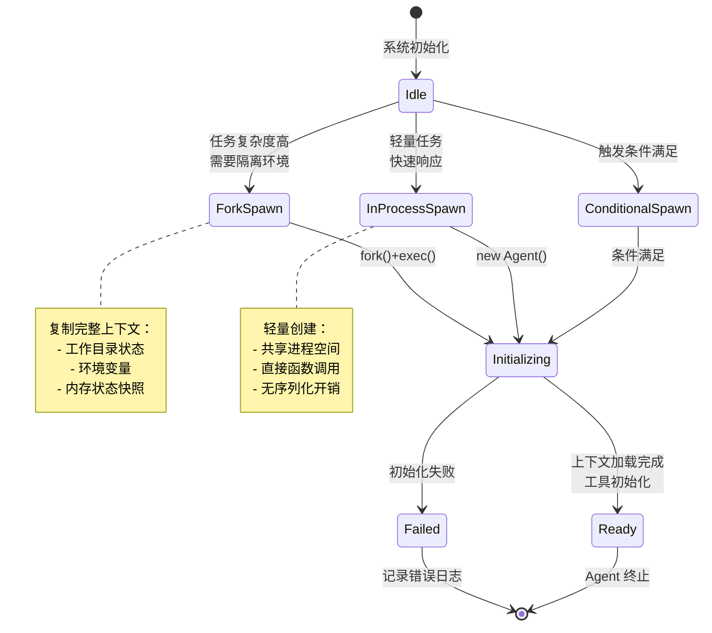
```mermaid
stateDiagram-v2
    [*] --> Idle: 系统初始化

    Idle --> ForkSpawn: 任务复杂度高<br/>需要隔离环境
    Idle --> InProcessSpawn: 轻量任务<br/>快速响应
    Idle --> ConditionalSpawn: 触发条件满足

    ForkSpawn --> Initializing: fork()+exec()
    InProcessSpawn --> Initializing: new Agent()
    ConditionalSpawn --> Initializing: 条件满足

    Initializing --> Ready: 上下文加载完成<br/>工具初始化
    Initializing --> Failed: 初始化失败

    Failed --> [*]: 记录错误日志
    Ready --> [*]: Agent 终止

    note right of ForkSpawn
        复制完整上下文：
        - 工作目录状态
        - 环境变量
        - 内存状态快照
    end note

    note right of InProcessSpawn
        轻量创建：
        - 共享进程空间
        - 直接函数调用
        - 无序列化开销
    end note
```

### 1.3 Spawn 序列图

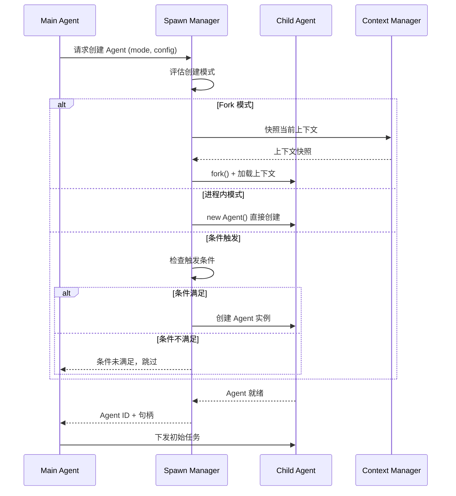
```mermaid
sequenceDiagram
    participant Main as Main Agent
    participant Spawner as Spawn Manager
    participant Child as Child Agent
    participant Context as Context Manager

    Main->>Spawner: 请求创建 Agent (mode, config)
    Spawner->>Spawner: 评估创建模式

    alt Fork 模式
        Spawner->>Context: 快照当前上下文
        Context-->>Spawner: 上下文快照
        Spawner->>Child: fork() + 加载上下文
    else 进程内模式
        Spawner->>Child: new Agent() 直接创建
    else 条件触发
        Spawner->>Spawner: 检查触发条件
        alt 条件满足
            Spawner->>Child: 创建 Agent 实例
        else 条件不满足
            Spawner-->>Main: 条件未满足，跳过
        end
    end

    Child-->>Spawner: Agent 就绪
    Spawner-->>Main: Agent ID + 句柄
    Main->>Child: 下发初始任务
```

---

## 2. Agent Execute（执行）

执行阶段是 Agent 真正发挥作用的核心阶段，涵盖任务分配、工具调用和状态监控三个关键环节。

### 2.1 执行流程概览

```mermaid
flowchart LR
    A[任务分配] --> B[规划分解]
    B --> C[工具选择]
    C --> D[工具调用]
    D --> E{成功?}
    E -->|是| F[结果验证]
    E -->|否| G[错误处理]
    F --> H{完成?}
    H -->|否| B
    H -->|是| I[执行完成]
    G --> D: 重试
    G --> J[上报异常]
```

### 2.2 任务分配

任务分配遵循 **Intent Gate → Task Definition → Routing** 三步流程：

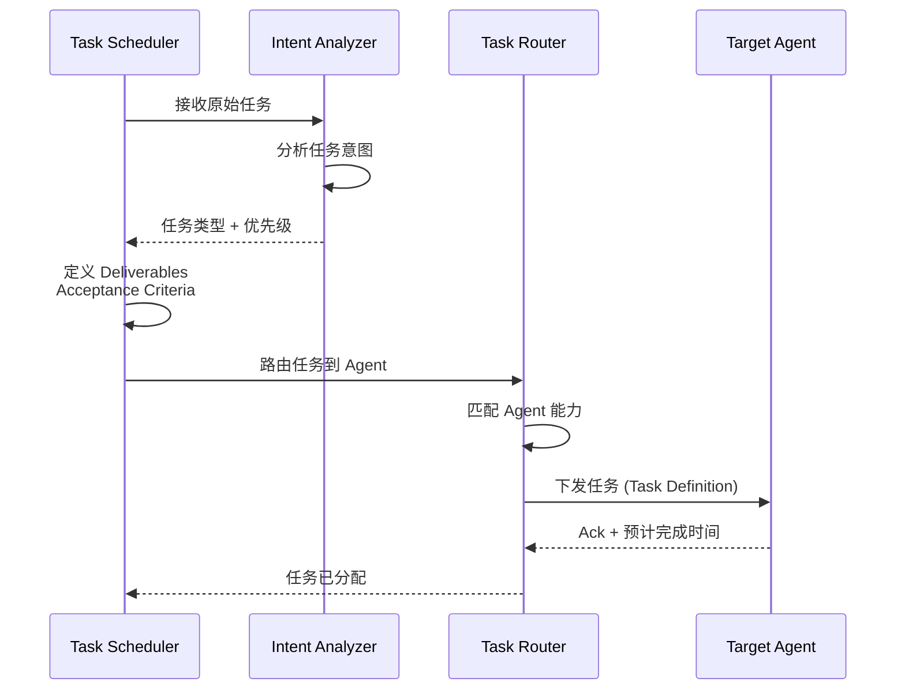
```mermaid
sequenceDiagram
    participant Scheduler as Task Scheduler
    participant Intent as Intent Analyzer
    participant Router as Task Router
    participant Agent as Target Agent

    Scheduler->>Intent: 接收原始任务
    Intent->>Intent: 分析任务意图
    Intent-->>Scheduler: 任务类型 + 优先级

    Scheduler->>Scheduler: 定义 Deliverables<br/>Acceptance Criteria
    Scheduler->>Router: 路由任务到 Agent

    Router->>Router: 匹配 Agent 能力
    Router->>Agent: 下发任务 (Task Definition)

    Agent-->>Router: Ack + 预计完成时间
    Router-->>Scheduler: 任务已分配
```

### 2.3 工具调用

Agent 通过工具调用实现具体操作，工具调用遵循标准协议：

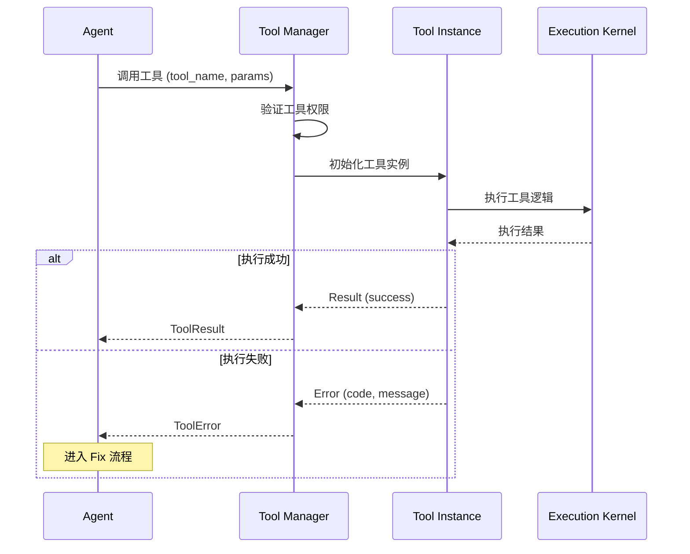
```mermaid
sequenceDiagram
    participant Agent as Agent
    participant ToolMgr as Tool Manager
    participant Tool as Tool Instance
    participant Kernel as Execution Kernel

    Agent->>ToolMgr: 调用工具 (tool_name, params)
    ToolMgr->>ToolMgr: 验证工具权限
    ToolMgr->>Tool: 初始化工具实例

    Tool->>Kernel: 执行工具逻辑
    Kernel-->>Tool: 执行结果

    alt 执行成功
        Tool-->>ToolMgr: Result (success)
        ToolMgr-->>Agent: ToolResult
    else 执行失败
        Tool-->>ToolMgr: Error (code, message)
        ToolMgr-->>Agent: ToolError
        Note over Agent: 进入 Fix 流程
    end
```

### 2.4 状态监控

执行过程中的状态监控贯穿整个执行阶段：

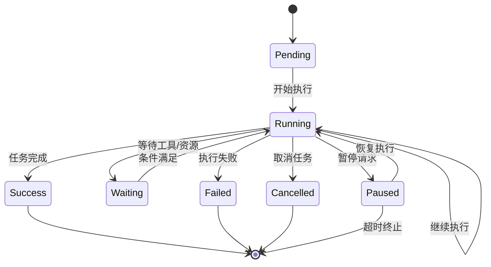
```mermaid
stateDiagram-v2
    [*] --> Pending

    Pending --> Running: 开始执行
    Running --> Paused: 暂停请求
    Running --> Waiting: 等待工具/资源
    Running --> Running: 继续执行

    Waiting --> Running: 条件满足
    Paused --> Running: 恢复执行

    Running --> Success: 任务完成
    Running --> Failed: 执行失败
    Running --> Cancelled: 取消任务

    Success --> [*]
    Failed --> [*]
    Cancelled --> [*]
    Paused --> [*]: 超时终止
```

---

## 3. Agent Review（审查）

审查阶段对执行结果进行系统性的验证和质量评估，是保证交付质量的关键环节。

### 3.1 审查流程

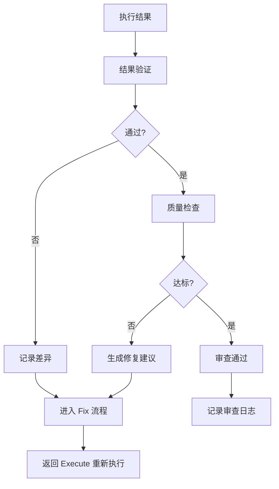
```mermaid
flowchart TD
    A[执行结果] --> B[结果验证]
    B --> C{通过?}
    C -->|否| D[记录差异]
    C -->|是| E[质量检查]

    E --> F{达标?}
    F -->|否| G[生成修复建议]
    F -->|是| H[审查通过]

    D --> I[进入 Fix 流程]
    G --> I

    H --> J[记录审查日志]
    I --> K[返回 Execute 重新执行]
```

### 3.2 结果验证

结果验证包含三个维度：

| 验证维度 | 检查内容 | 通过标准 |
|----------|----------|----------|
| **正确性** | 输出是否符合任务要求 | 结果匹配 Acceptance Criteria |
| **完整性** | 是否包含所有要求的交付物 | Deliverables 100% 覆盖 |
| **一致性** | 上下文是否连贯、逻辑是否自洽 | 无矛盾、无幻觉 |

### 3.3 质量检查清单

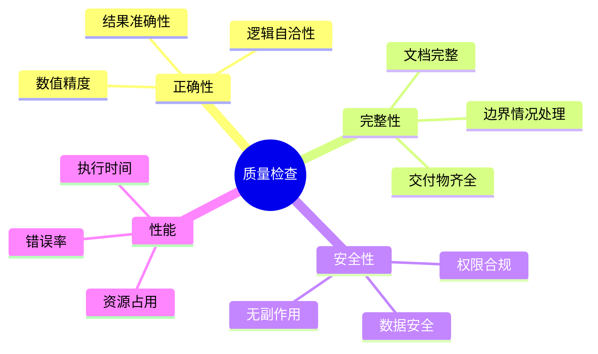
```mermaid
mindmap
    root((质量检查))
        正确性
            结果准确性
            逻辑自洽性
            数值精度
        完整性
            交付物齐全
            文档完整
            边界情况处理
        安全性
            权限合规
            数据安全
            无副作用
        性能
            执行时间
            资源占用
            错误率
```

---

## 4. Agent Fix（修复）

修复阶段处理执行中的错误和审查中发现的问题，通过错误修复和重试逻辑确保最终交付质量。

### 4.1 错误分类与处理策略

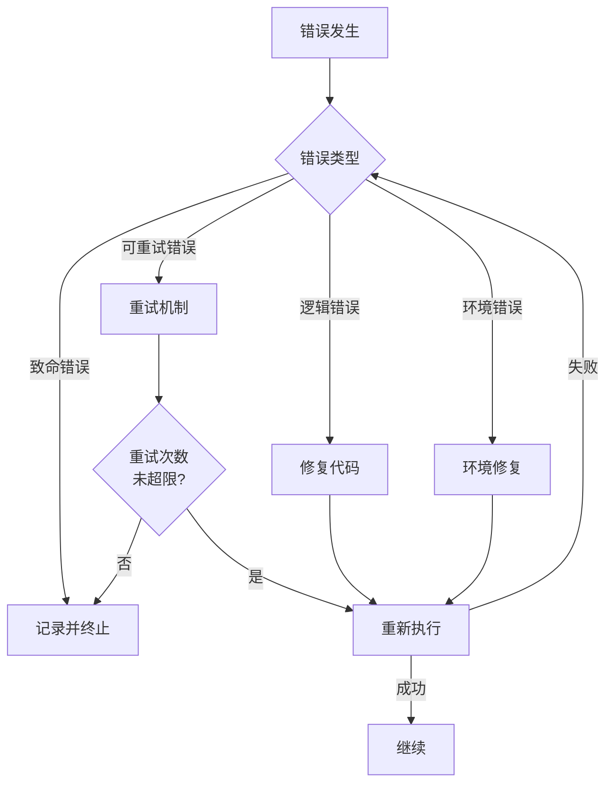
```mermaid
flowchart TD
    E[错误发生] --> C{错误类型}

    C -->|可重试错误| R[重试机制]
    C -->|逻辑错误| L[修复代码]
    C -->|环境错误| Env[环境修复]
    C -->|致命错误| F[记录并终止]

    R --> Retry{重试次数<br/>未超限?}
    Retry -->|是| E2[重新执行]
    Retry -->|否| F

    L --> E2
    Env --> E2

    E2 -->|成功| S[继续]
    E2 -->|失败| C
```

### 4.2 重试策略

Claude Code 采用 **指数退避 + 抖动** 的重试策略：

| 参数 | 说明 | 默认值 |
|------|------|--------|
| 最大重试次数 | 同一任务的最大尝试次数 | 3 |
| 基础延迟 | 首次重试等待时间 | 1s |
| 退避系数 | 每次重试延迟倍增系数 | 2 |
| 最大延迟 | 单次重试最大等待时间 | 30s |
| 抖动 | 随机抖动范围 | ±20% |

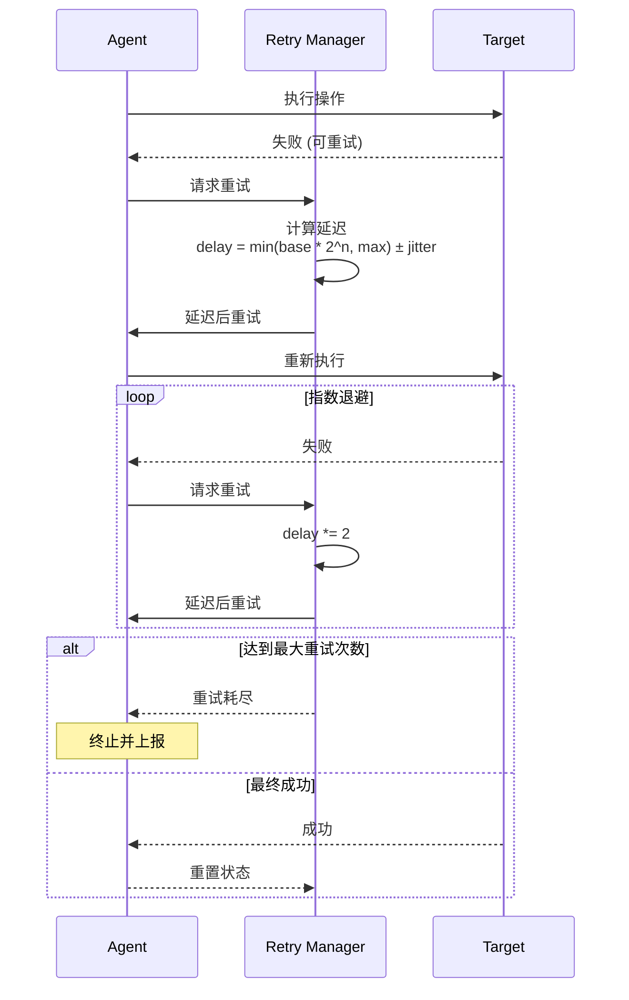
```mermaid
sequenceDiagram
    participant Agent as Agent
    participant RetryMgr as Retry Manager
    participant Target as Target

    Agent->>Target: 执行操作
    Target-->>Agent: 失败 (可重试)

    Agent->>RetryMgr: 请求重试
    RetryMgr->>RetryMgr: 计算延迟<br/>delay = min(base * 2^n, max) ± jitter

    RetryMgr->>Agent: 延迟后重试
    Agent->>Target: 重新执行

    loop 指数退避
        Target-->>Agent: 失败
        Agent->>RetryMgr: 请求重试
        RetryMgr->>RetryMgr: delay *= 2
        RetryMgr->>Agent: 延迟后重试
    end

    alt 达到最大重试次数
        RetryMgr-->>Agent: 重试耗尽
        Note over Agent: 终止并上报
    else 最终成功
        Target-->>Agent: 成功
        Agent-->>RetryMgr: 重置状态
    end
```

### 4.3 错误修复状态图

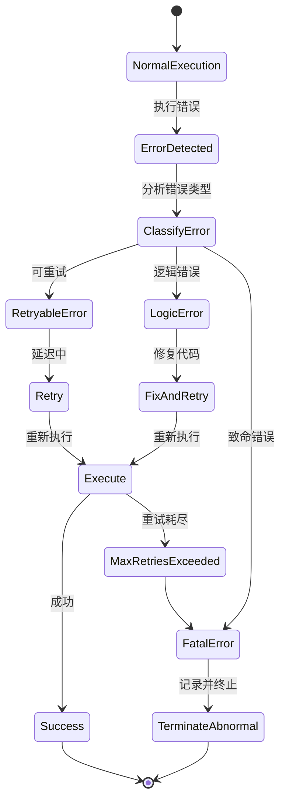
```mermaid
stateDiagram-v2
    [*] --> NormalExecution

    NormalExecution --> ErrorDetected: 执行错误

    ErrorDetected --> ClassifyError: 分析错误类型
    ClassifyError --> RetryableError: 可重试
    ClassifyError --> LogicError: 逻辑错误
    ClassifyError --> FatalError: 致命错误

    RetryableError --> Retry: 延迟中
    Retry --> Execute: 重新执行
    Execute --> Success: 成功
    Execute --> MaxRetriesExceeded: 重试耗尽
    MaxRetriesExceeded --> FatalError

    LogicError --> FixAndRetry: 修复代码
    FixAndRetry --> Execute: 重新执行

    FatalError --> TerminateAbnormal: 记录并终止
    Success --> [*]
    TerminateAbnormal --> [*]
```

---

## 5. Agent Terminate（终止）

终止阶段处理 Agent 的优雅退出，确保资源正确释放和状态正确持久化。

### 5.1 终止类型

| 类型 | 触发条件 | 处理方式 |
|------|----------|----------|
| **正常完成** | 任务达成，审查通过 | 资源清理 → 结果归档 → 状态持久化 |
| **异常终止** | 错误无法恢复、超时、致命异常 | 状态快照 → 错误日志 → 资源强制释放 |
| **主动终止** | 用户取消、调度器终止 | 优雅停止 → 部分结果保存 → 清理 |

### 5.2 终止流程

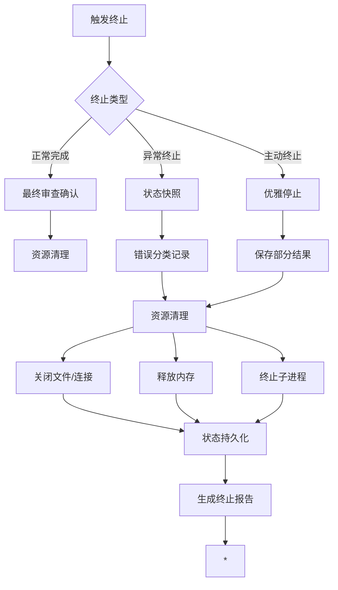
```mermaid
flowchart TD
    A[触发终止] --> B{终止类型}

    B -->|正常完成| C[最终审查确认]
    B -->|异常终止| D[状态快照]
    B -->|主动终止| E[优雅停止]

    C --> F[资源清理]
    D --> G[错误分类记录]
    E --> H[保存部分结果]

    G --> I[资源清理]
    H --> I

    I --> J[关闭文件/连接]
    I --> K[释放内存]
    I --> L[终止子进程]

    J --> M[状态持久化]
    K --> M
    L --> M

    M --> N[生成终止报告]
    N --> O[*]
```

### 5.3 资源清理清单

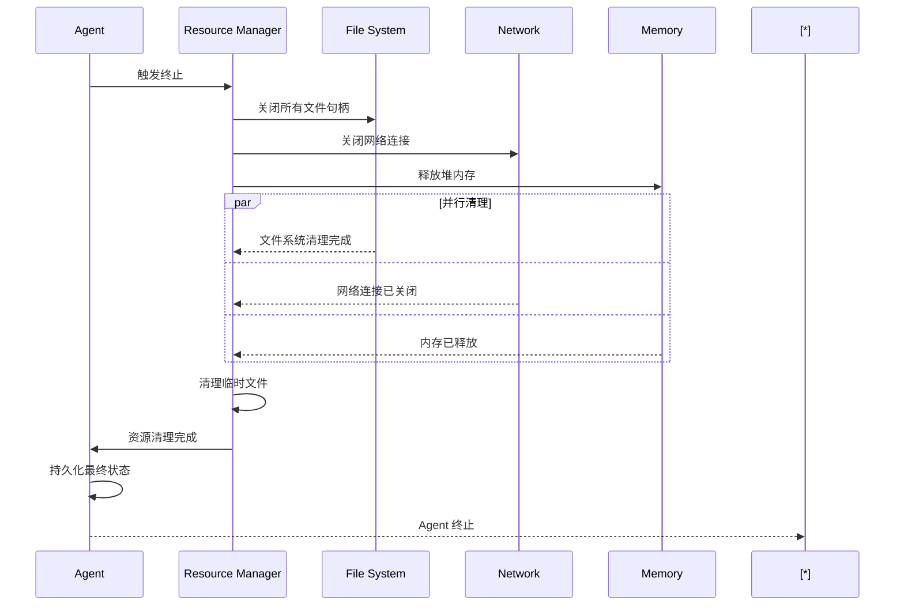
```mermaid
sequenceDiagram
    participant Agent as Agent
    participant ResMgr as Resource Manager
    participant FS as File System
    participant Net as Network
    participant Mem as Memory

    Agent->>ResMgr: 触发终止
    ResMgr->>FS: 关闭所有文件句柄
    ResMgr->>Net: 关闭网络连接
    ResMgr->>Mem: 释放堆内存

    par 并行清理
        FS-->>ResMgr: 文件系统清理完成
    and
        Net-->>ResMgr: 网络连接已关闭
    and
        Mem-->>ResMgr: 内存已释放
    end

    ResMgr->>ResMgr: 清理临时文件
    ResMgr->>Agent: 资源清理完成
    Agent->>Agent: 持久化最终状态
    Agent-->>[*]: Agent 终止
```

### 5.4 终止状态图

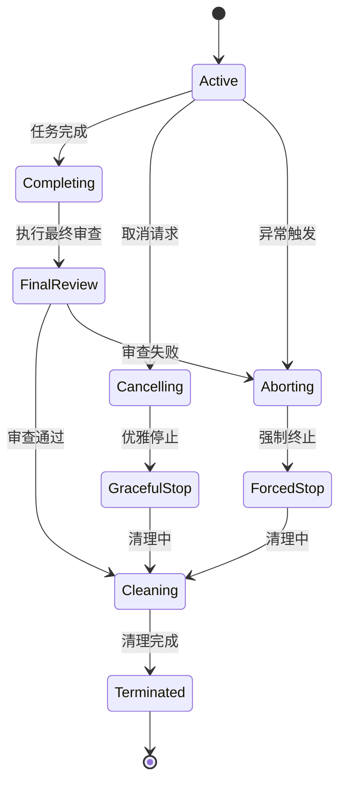
```mermaid
stateDiagram-v2
    [*] --> Active

    Active --> Completing: 任务完成
    Active --> Cancelling: 取消请求
    Active --> Aborting: 异常触发

    Completing --> FinalReview: 执行最终审查
    FinalReview --> Cleaning: 审查通过
    FinalReview --> Aborting: 审查失败

    Cancelling --> GracefulStop: 优雅停止
    Aborting --> ForcedStop: 强制终止

    GracefulStop --> Cleaning: 清理中
    ForcedStop --> Cleaning: 清理中

    Cleaning --> Terminated: 清理完成
    Terminated --> [*]
```

---

## 6. Agent Coordination（协作）

协作层贯穿 Agent 整个生命周期，支持多 Agent 调度、权限同步和消息传递。

### 6.1 协作架构

```mermaid
flowchart TB
    subgraph Main["Main Agent (协调者)"]
        Sched[任务调度器]
        Auth[权限管理器]
        Msg[消息中心]
    end

    subgraph Agents["子 Agent 群"]
        A1[Agent 1]
        A2[Agent 2]
        A3[Agent N]
    end

    Sched --> A1: 分配任务
    Sched --> A2: 分配任务
    Sched --> A3: 分配任务

    A1 --> Msg: 上报状态
    A2 --> Msg: 上报状态
    A3 --> Msg: 上报状态

    Msg --> Sched: 汇总反馈

    Auth --> Sched: 权限校验
    Auth --> A1: 同步权限
    Auth --> A2: 同步权限
    Auth --> A3: 同步权限

    A1 <--> A2: 消息传递
    A2 <--> A3: 消息传递
    A1 <--> A3: 消息传递
```

### 6.2 多 Agent 调度

多 Agent 调度采用 **主从模式**，Main Agent 负责任务分解和结果汇总：

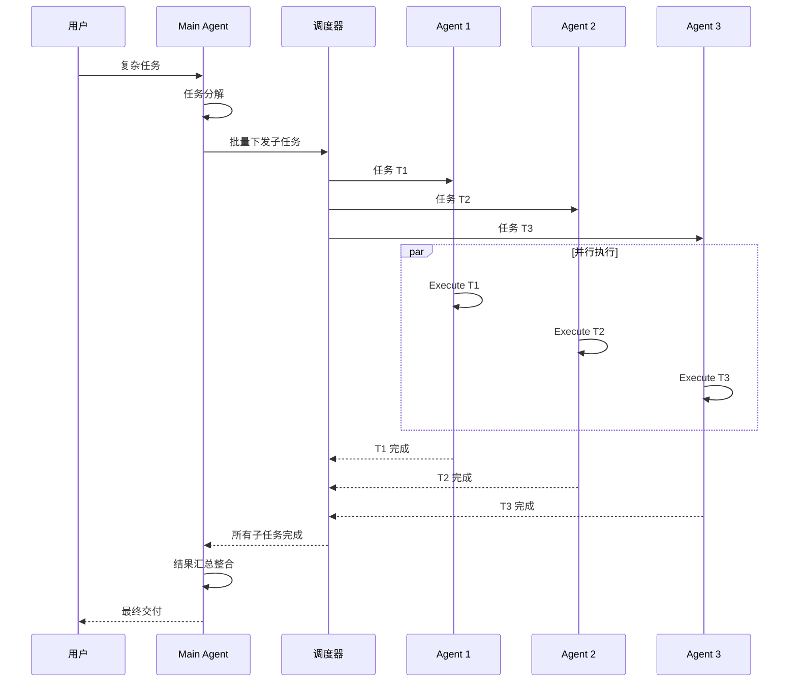
```mermaid
sequenceDiagram
    participant User as 用户
    participant Main as Main Agent
    participant Sched as 调度器
    participant A1 as Agent 1
    participant A2 as Agent 2
    participant A3 as Agent 3

    User->>Main: 复杂任务
    Main->>Main: 任务分解

    Main->>Sched: 批量下发子任务
    Sched->>A1: 任务 T1
    Sched->>A2: 任务 T2
    Sched->>A3: 任务 T3

    par 并行执行
        A1->>A1: Execute T1
        A2->>A2: Execute T2
        A3->>A3: Execute T3
    end

    A1-->>Sched: T1 完成
    A2-->>Sched: T2 完成
    A3-->>Sched: T3 完成

    Sched-->>Main: 所有子任务完成
    Main->>Main: 结果汇总整合
    Main-->>User: 最终交付
```

### 6.3 权限同步

权限管理确保子 Agent 只能访问授权范围内的资源：

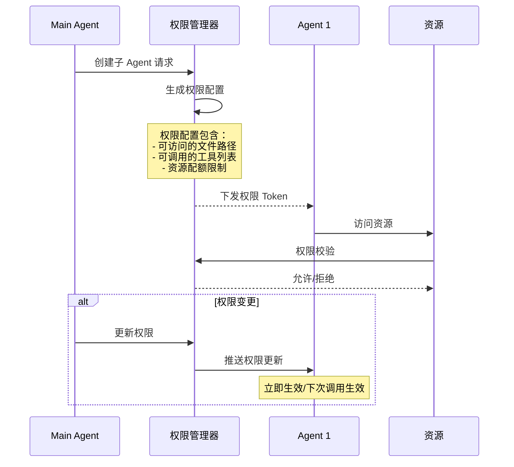
```mermaid
sequenceDiagram
    participant Main as Main Agent
    participant Auth as 权限管理器
    participant A1 as Agent 1
    participant Res as 资源

    Main->>Auth: 创建子 Agent 请求
    Auth->>Auth: 生成权限配置

    Note over Auth: 权限配置包含：<br/>- 可访问的文件路径<br/>- 可调用的工具列表<br/>- 资源配额限制

    Auth-->>A1: 下发权限 Token
    A1->>Res: 访问资源
    Res->>Auth: 权限校验
    Auth-->>Res: 允许/拒绝

    alt 权限变更
        Main->>Auth: 更新权限
        Auth->>A1: 推送权限更新
        Note over A1: 立即生效/下次调用生效
    end
```

### 6.4 消息传递机制

Agent 间消息传递支持同步和异步两种模式：

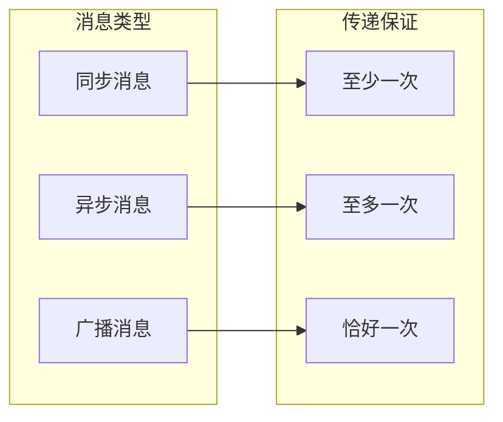
```mermaid
flowchart LR
    subgraph 消息类型
        Sync[同步消息]
        Async[异步消息]
        Broadcast[广播消息]
    end

    subgraph 传递保证
        AtLeast[至少一次]
        AtMost[至多一次]
        Exactly[恰好一次]
    end

    Sync --> AtLeast
    Async --> AtMost
    Broadcast --> Exactly
```

**消息格式规范：**

```
Message {
    from: Agent ID
    to: Agent ID | ALL
    type: REQUEST | RESPONSE | NOTIFICATION | ERROR
    payload: JSON
    correlation_id: UUID  // 消息关联追踪
    timestamp: ISO8601
    priority: HIGH | NORMAL | LOW
}
```

### 6.5 协作状态机

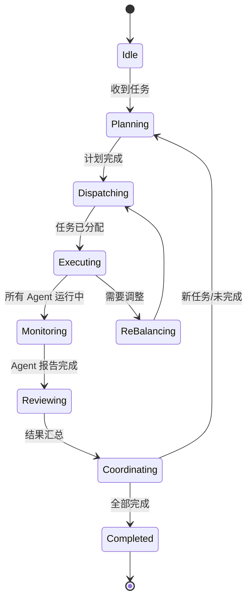
```mermaid
stateDiagram-v2
    [*] --> Idle

    Idle --> Planning: 收到任务
    Planning --> Dispatching: 计划完成
    Dispatching --> Executing: 任务已分配

    Executing --> Monitoring: 所有 Agent 运行中
    Monitoring --> Reviewing: Agent 报告完成
    Reviewing --> Coordinating: 结果汇总

    Coordinating --> Planning: 新任务/未完成
    Coordinating --> Completed: 全部完成

    Executing --> ReBalancing: 需要调整
    ReBalancing --> Dispatching

    Completed --> [*]
```

---

## 附录：完整生命周期时序图

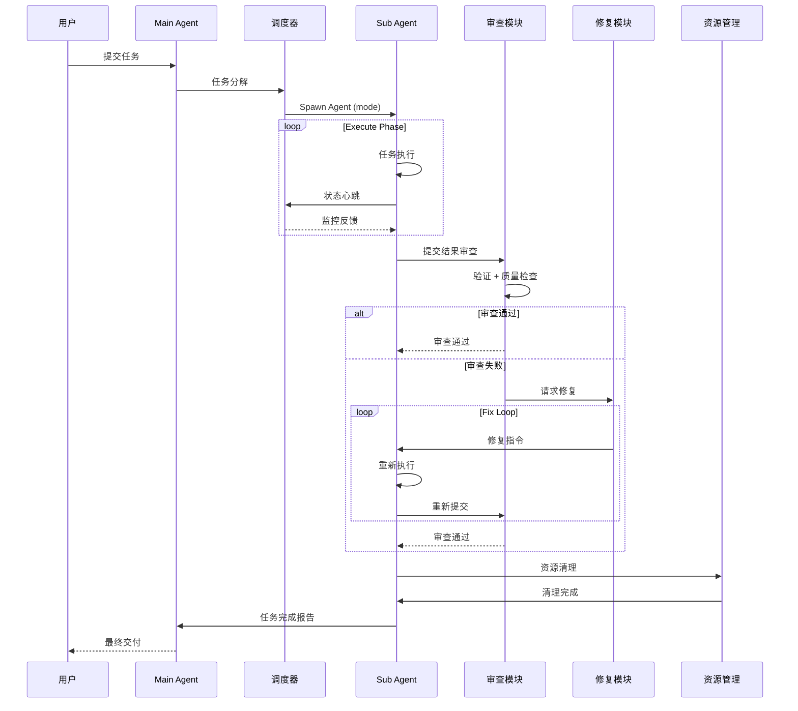
```mermaid
sequenceDiagram
    participant User as 用户
    participant Main as Main Agent
    participant Sched as 调度器
    participant Agent as Sub Agent
    participant Review as 审查模块
    participant Fix as 修复模块
    participant ResMgr as 资源管理

    User->>Main: 提交任务
    Main->>Sched: 任务分解

    Sched->>Agent: Spawn Agent (mode)

    loop Execute Phase
        Agent->>Agent: 任务执行
        Agent->>Sched: 状态心跳
        Sched-->>Agent: 监控反馈
    end

    Agent->>Review: 提交结果审查
    Review->>Review: 验证 + 质量检查

    alt 审查通过
        Review-->>Agent: 审查通过
    else 审查失败
        Review->>Fix: 请求修复
        loop Fix Loop
            Fix->>Agent: 修复指令
            Agent->>Agent: 重新执行
            Agent->>Review: 重新提交
        end
        Review-->>Agent: 审查通过
    end

    Agent->>ResMgr: 资源清理
    ResMgr->>Agent: 清理完成
    Agent->>Main: 任务完成报告

    Main-->>User: 最终交付
```

---

## 生命周期状态总览

```mermaid
stateDiagram-v2
    [*] --> Spawning

    Spawning --> Ready: 初始化完成
    Ready --> Executing: 接受任务

    Executing --> Reviewing: 执行完成
    Reviewing --> Executing: 审查失败<br/>进入修复

    Executing --> Waiting: 等待资源
    Waiting --> Executing: 资源就绪

    Reviewing --> Success: 审查通过

    Executing --> Retrying: 可重试错误
    Retrying --> Executing: 重试执行

    Executing --> Failed: 致命错误
    Success --> Terminating: 正常终止
    Failed --> Terminating: 异常终止

    Terminating --> [*]: 清理完成
```
