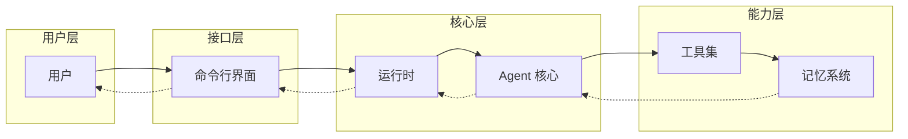
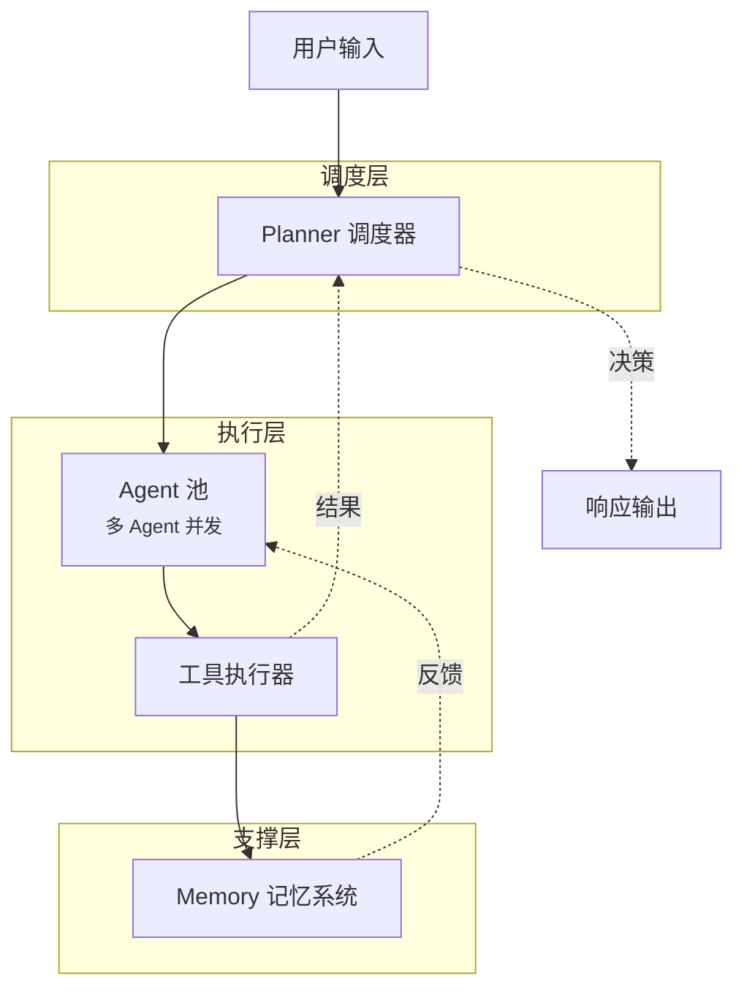
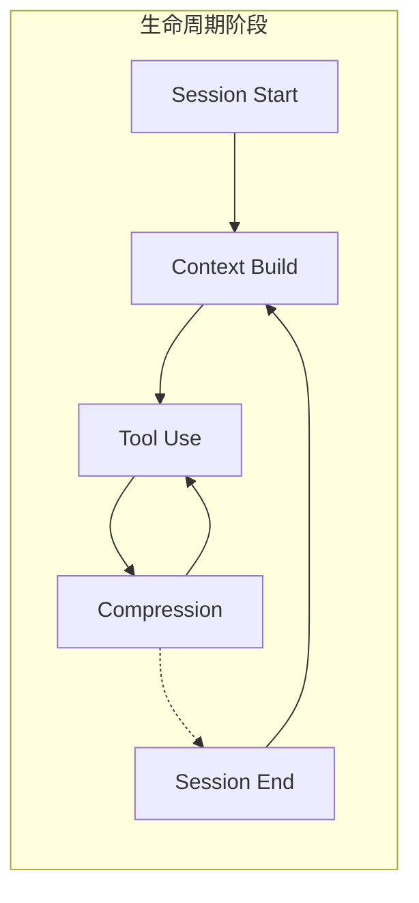
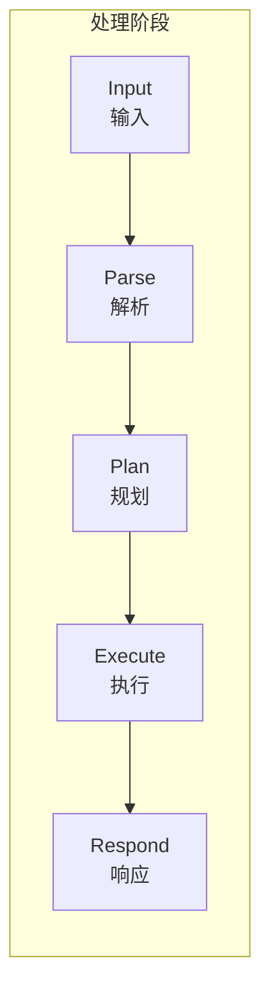
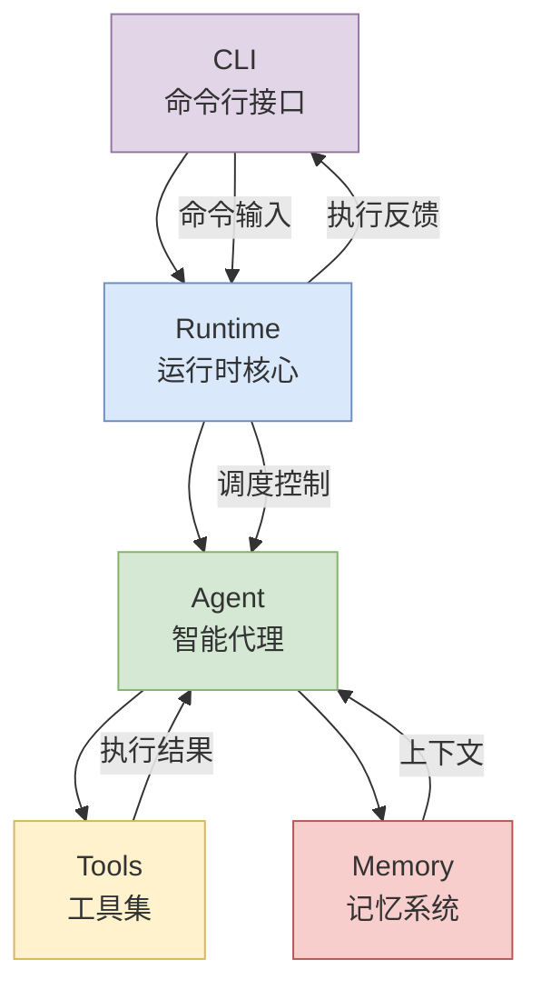

# Claude Code 系统架构总览

> 基于源码分析的系统架构全景图

---

## 1. 总体架构图

**说明：** 用户通过 CLI 与系统交互，请求经 Runtime 调度至 Agent 核心，Agent 调用 Tools 执行任务，Memory 管理上下文持久化。

---

## 2. Agent 调度图

**说明：** Planner 负责任务分解与 Agent 分派，多个 Agent 可并发处理子任务，结果汇总后由 Planner 决策最终响应。

---

## 3. Memory 生命周期图

**说明：** Memory 在会话期间持续管理上下文，Tool Use 产生的记忆触发 Compression 阶段，对冗长上下文进行摘要压缩，保证后续交互的效率。

---

## 4. 请求处理流程图

**说明：** 请求从用户输入开始，经解析（Parse）理解意图，规划（Plan）制定方案，执行（Execute）调用工具或生成内容，最后响应（Respond）返回结果。

---

## 架构组件关系

---

*文档版本：基于 Claude Code 源码分析生成*
