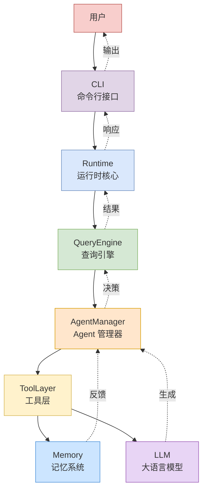
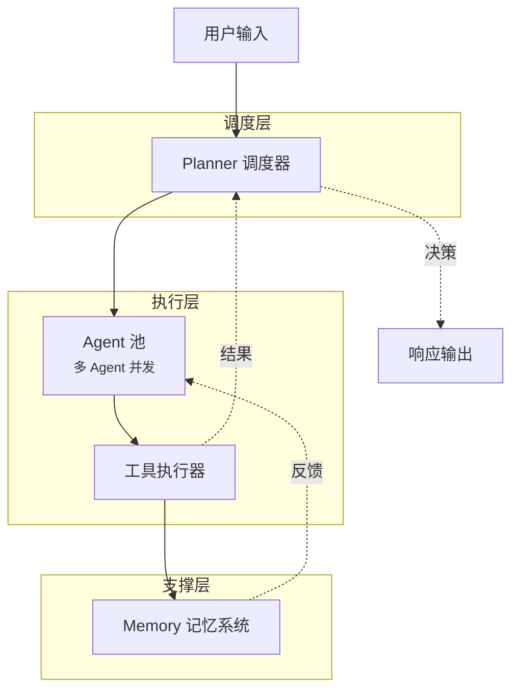
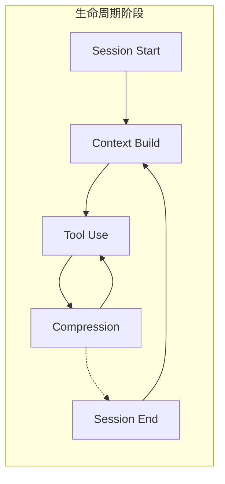
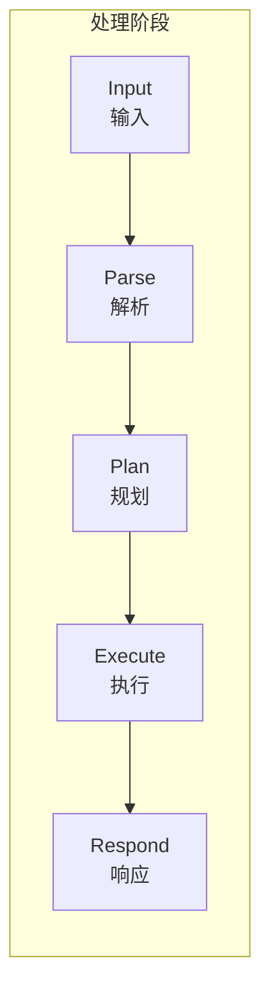
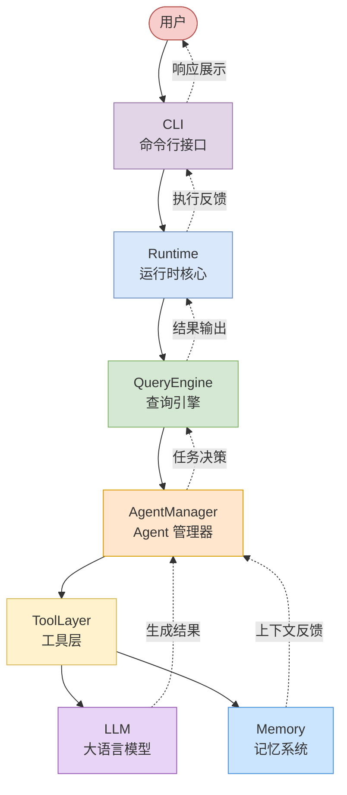

# Claude Code 系统架构总览

> 基于源码分析的系统架构全景图

**⚠️ 本项目为学习研究目的，不代表 Anthropic 官方立场。**

---

## 1. 全局系统架构总图（核心调用链）

**完整调用链说明：**

| 层级 | 组件 | 职责 |
|------|------|------|
| 用户层 | User | 发起请求、接收响应 |
| 接口层 | CLI | 命令解析、交互转发 |
| 核心层 | Runtime | 生命周期管理、会话控制 |
| 引擎层 | QueryEngine | 查询理解、路由分发 |
| 调度层 | AgentManager | Agent 创建/调度/回收 |
| 能力层 | ToolLayer | 工具注册、调用执行 |
| 支撑层 | Memory | 上下文存储、压缩摘要 |
| 支撑层 | LLM | 推理生成、工具调用编排 |

**数据流向：**
1. `CLI` 接收用户命令 → 传递给 `Runtime`
2. `Runtime` 初始化会话上下文 → 调用 `QueryEngine`
3. `QueryEngine` 解析意图 → 分发给 `AgentManager`
4. `AgentManager` 调度 Agent → 通过 `ToolLayer` 执行工具
5. `ToolLayer` 必要时查询 `Memory`（上下文）或调用 `LLM`（生成）
6. 结果逐层回传：`AgentManager → QueryEngine → Runtime → CLI → User`

---

## 2. Agent 调度图

**说明：** Planner 负责任务分解与 Agent 分派，多个 Agent 可并发处理子任务，结果汇总后由 Planner 决策最终响应。

---

## 3. Memory 生命周期图

**说明：** Memory 在会话期间持续管理上下文，Tool Use 产生的记忆触发 Compression 阶段，对冗长上下文进行摘要压缩，保证后续交互的效率。

---

## 4. 请求处理流程图

**说明：** 请求从用户输入开始，经解析（Parse）理解意图，规划（Plan）制定方案，执行（Execute）调用工具或生成内容，最后响应（Respond）返回结果。

---

## 5. 组件关系总图

**关系说明：**

| 关系 | 起点 | 终点 | 含义 |
|------|------|------|------|
| 命令输入 | CLI | Runtime | 用户命令下发 |
| 调度控制 | Runtime | QueryEngine | 会话上下文初始化 |
| 任务分发 | QueryEngine | AgentManager | 查询路由到 Agent 调度 |
| 工具执行 | AgentManager | ToolLayer | Agent 触发工具调用 |
| 上下文读取 | ToolLayer | Memory | 工具执行依赖历史上下文 |
| 推理生成 | ToolLayer | LLM | 需要 LLM 参与的工具调用 |
| 反馈回流 | Memory/LLM | AgentManager | 结果反馈给 Agent 决策 |
| 决策升级 | AgentManager | QueryEngine | Agent 决策影响查询路由 |
| 结果回传 | QueryEngine | Runtime | 最终结果注入运行时 |
| 响应输出 | Runtime | CLI | 执行结果转为 CLI 输出 |

---

*文档版本：v2.0 — 增强全局系统架构总图（核心调用链 + 组件关系总图）*
