# Claude Code 系统行为分析

> 本章分析 Claude Code 运行时各子系统的行为触发机制

---

## 1. Agent Spawn 行为

Agent Spawn 是 Claude Code 实现多代理协作的核心机制。

### 1.1 何时 Spawn 子 Agent

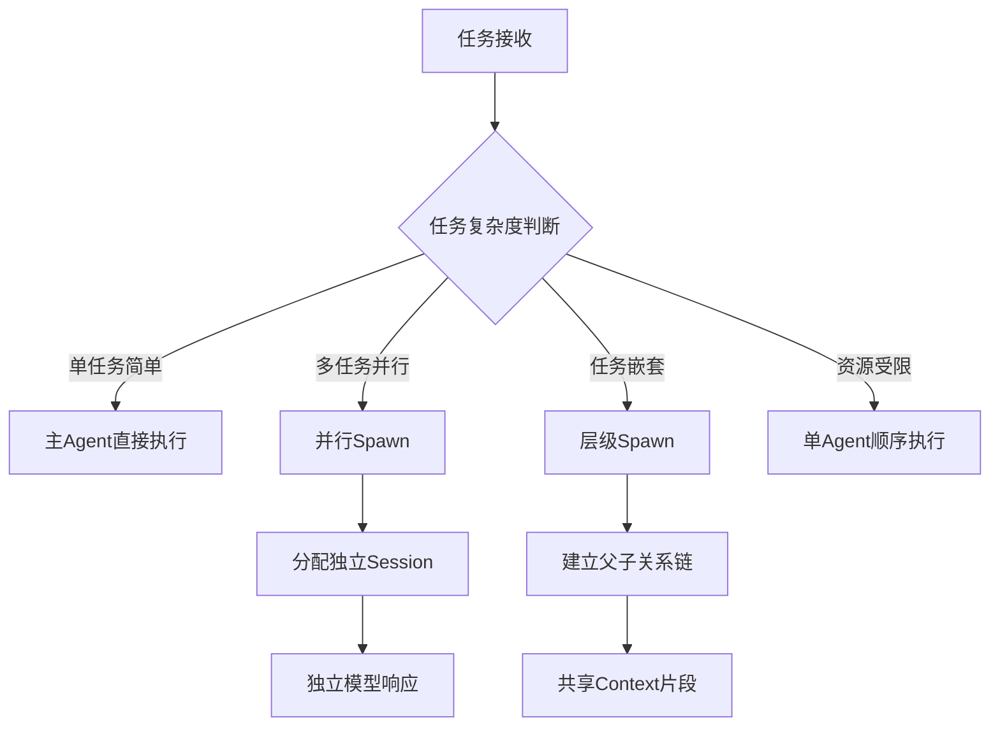

**触发条件：**

| 条件类型 | 触发标准 | 行为 |
|---------|---------|------|
| 显式调用 | 用户/系统明确请求 | 立即Spawn |
| 隐式推断 | 任务含多独立子目标 | 按需Spawn |
| 溢出检测 | 单一Context超阈值 | Fork新Agent |
| 负载均衡 | 检测到长任务 | Spawn分担 |

### 1.2 Fork 模式

Fork 模式创建独立运行的 Agent 副本：

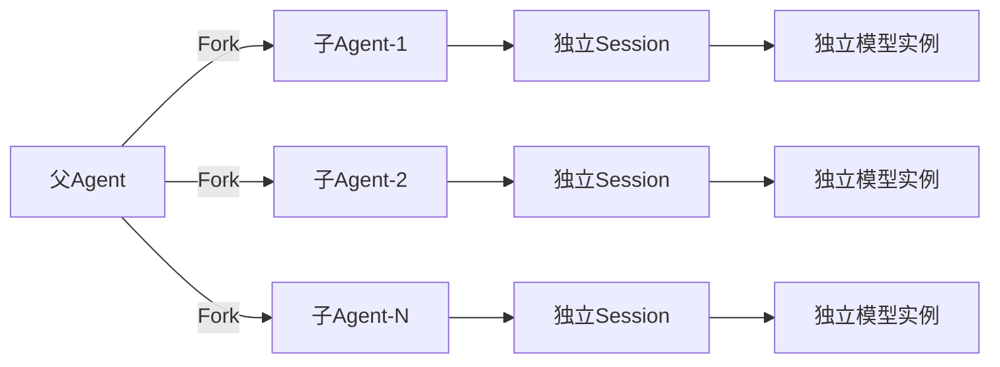

**Fork 触发场景：**
- 多文件并行处理（每个文件一个Agent）
- A/B 测试同一任务的两种方案
- 独立工具链验证

### 1.3 进程内模式

进程内模式在同一进程内共享状态：

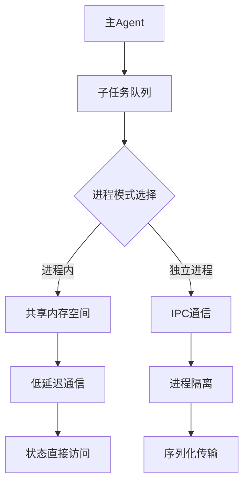

**进程内优势：** 零序列化开销，适合高频交互任务

---

## 2. Context 压缩行为

### 2.1 何时压缩上下文

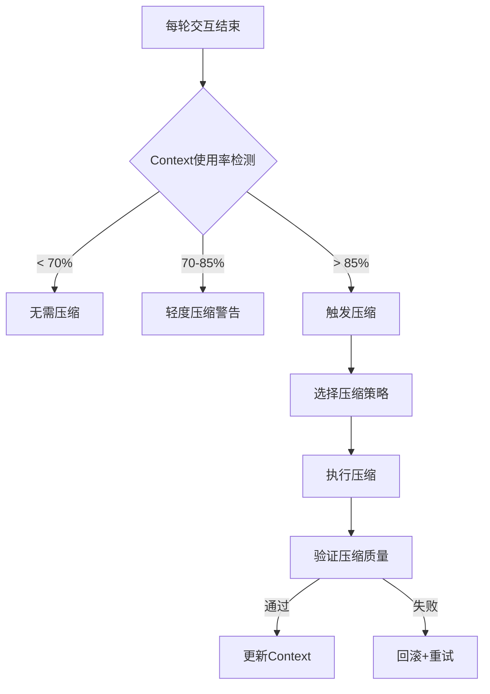

### 2.2 阈值触发机制

| 层级 | 阈值 | 压缩强度 | 影响 |
|------|------|---------|------|
| 安全区 | < 70% | 无 | 正常响应 |
| 警戒区 | 70-85% | 选择性 | 优化非关键消息 |
| 危险区 | 85-95% | 强制性 | 删除低价值内容 |
| 紧急区 | > 95% | 激进 | 保留核心指令 |

### 2.3 压缩算法

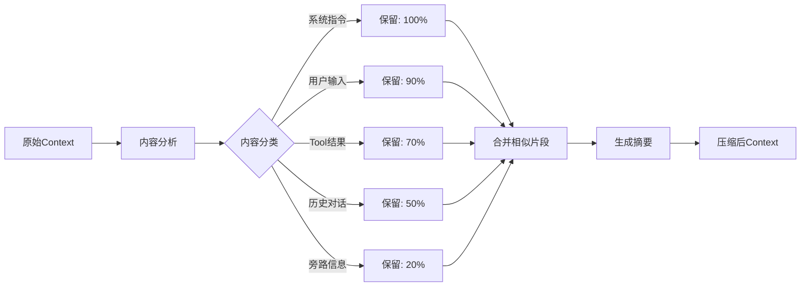

**压缩策略优先级：**
1. 保留系统级关键指令（AGENTS.md、SOUL.md）
2. 保留用户最近 3-5 轮核心输入
3. 保留 Tool 调用结果（压缩非关键参数）
4. 合并相似主题的历史对话
5. 删除已被替代的中间结果

### 2.4 恢复机制

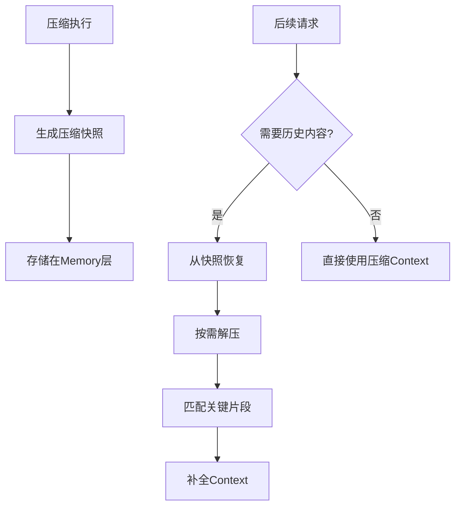

**恢复触发：**
- 用户明确请求历史内容
- 任务依赖之前中间结果
- 调试/复盘场景

---

## 3. Tool 调用行为

### 3.1 何时调用 Tool

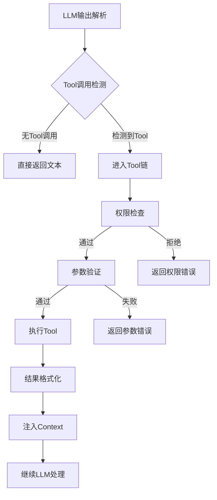

### 3.2 权限检查流程

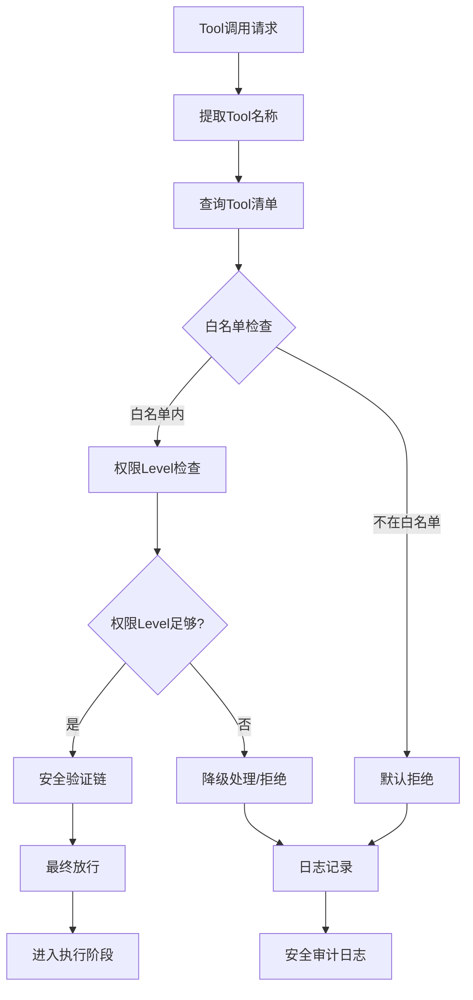

**权限Level定义：**

| Level | 类型 | 说明 |
|-------|------|------|
| 0 | 禁用 | 完全不可用 |
| 1 | 只读 | 仅查询类Tool |
| 2 | 读写 | 基础文件/网络操作 |
| 3 | 敏感 | 系统配置修改 |
| 4 | 危险 | 破坏性操作 |

### 3.3 安全验证链

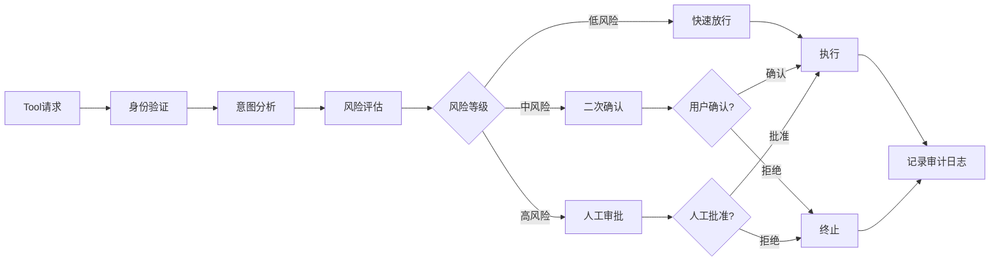

---

## 4. Memory 管理行为

### 4.1 何时读写记忆

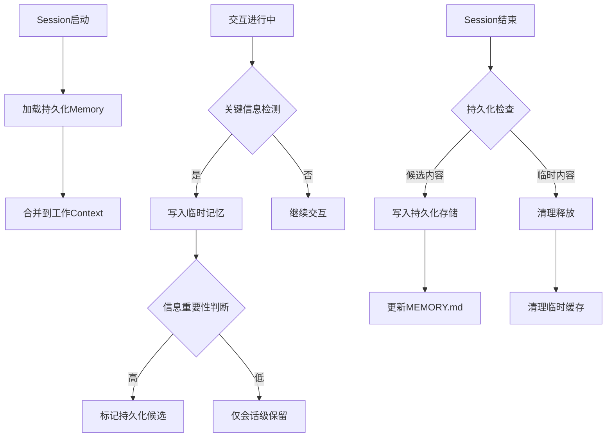

### 4.2 会话级 vs 持久化

| 存储类型 | 时机 | 内容 | 生命周期 |
|---------|------|------|---------|
| **会话级** | 实时写入 | 当前任务中间结果 | Session结束 |
| **持久化** | Session结束 | 决策、教训、重要上下文 | 长期保留 |

**会话级记忆触发写入：**
- Tool 调用结果（特别是网络/文件类）
- 任务进度节点完成
- 用户提供的临时偏好

**持久化记忆触发写入：**
- 明确决策点（"用户选择方案A"）
- 错误教训（"上次这样做的坑"）
- 跨任务模式（"用户通常在周末工作"）

### 4.3 自动提取时机

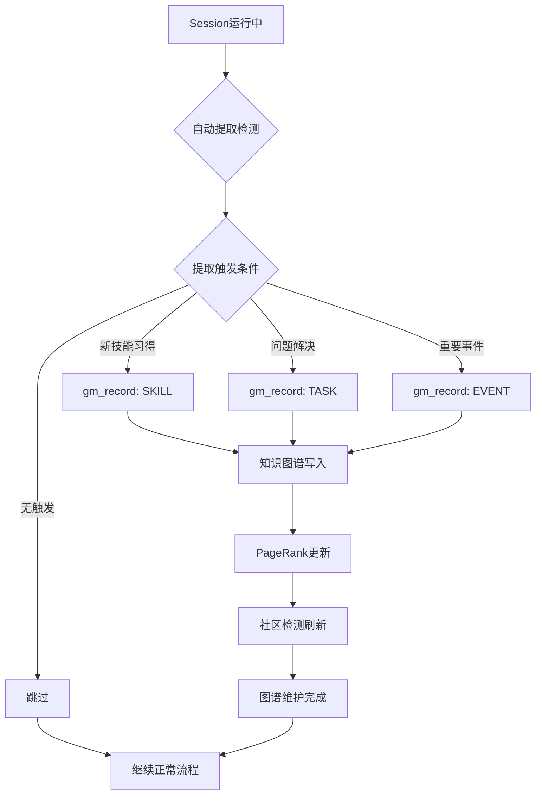

**自动提取规则：**

```
触发条件：
├── Tool调用成功 → 记录为已掌握技能
├── 错误恢复成功 → 记录为解决方案
├── 用户纠正 → 记录为踩坑教训
└── 任务完成 → 记录为成功模式
```

---

## 5. 行为联动关系

### 5.1 核心行为交互

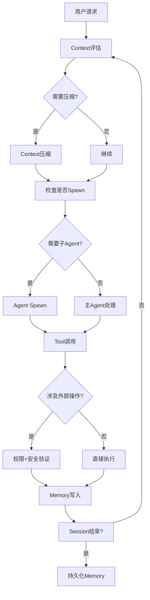

### 5.2 行为优先级

```
1. [最高] 安全验证 → 任何操作前必须通过
2. [高] Context管理 → 保证响应能力
3. [中] Tool调用 → 任务执行核心
4. [低] Memory持久化 → 可延迟处理
5. [最低] Agent Spawn → 按需触发
```

---

## 6. 小结

| 行为系统 | 核心触发 | 关键机制 |
|---------|---------|---------|
| Agent Spawn | 任务并行/复杂度 | Fork/进程内双模式 |
| Context压缩 | 使用率阈值 | 分层压缩+快照恢复 |
| Tool调用 | LLM输出解析 | 多级权限+安全链 |
| Memory管理 | 关键信息检测 | 会话级临时+持久化双层 |

> 行为级分析揭示了 Claude Code 各子系统如何协同工作。理解这些触发机制和交互关系，是进行系统调优和异常排查的基础。
