# Claude Code 数据流分析

> 本章分析 Claude Code 核心系统的数据流动路径

---

## 1. Prompt Flow（提示词流）

Prompt Flow 描述从用户输入到 LLM 调用的完整数据变换路径。

### 1.1 System Prompt 构建流程

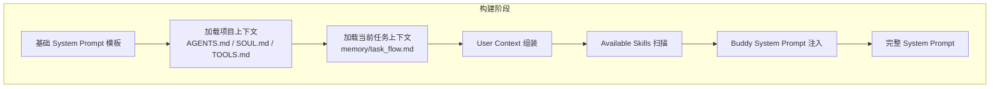

### 1.2 用户输入 → 上下文组装 → LLM 调用

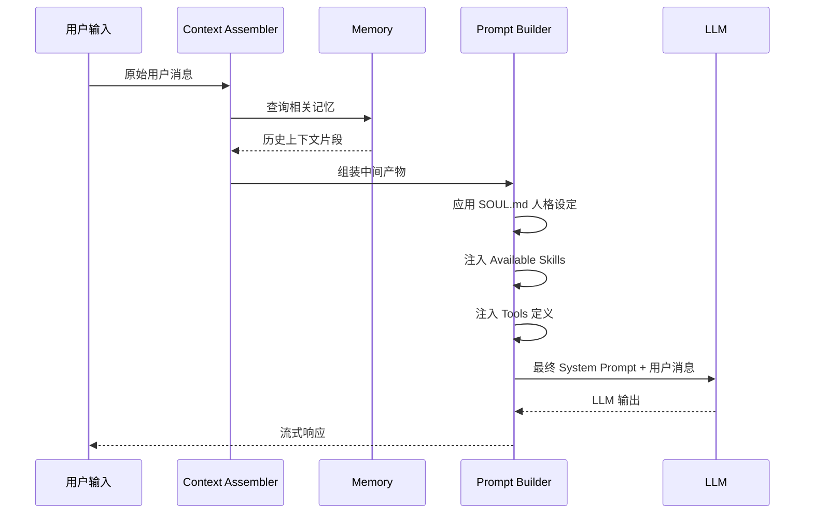

### 1.3 Buddy System Prompt 注入机制

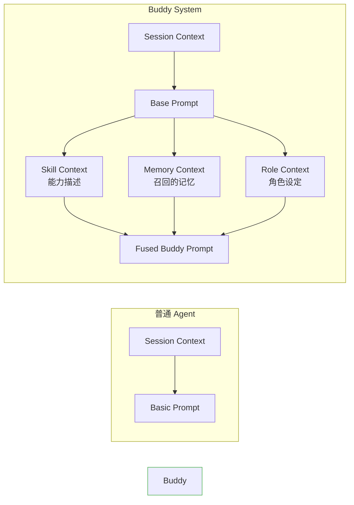

---

## 2. Tool Flow（工具调用流）

Tool Flow 描述从工具匹配到结果返回的完整调用链路。

### 2.1 工具调用总览

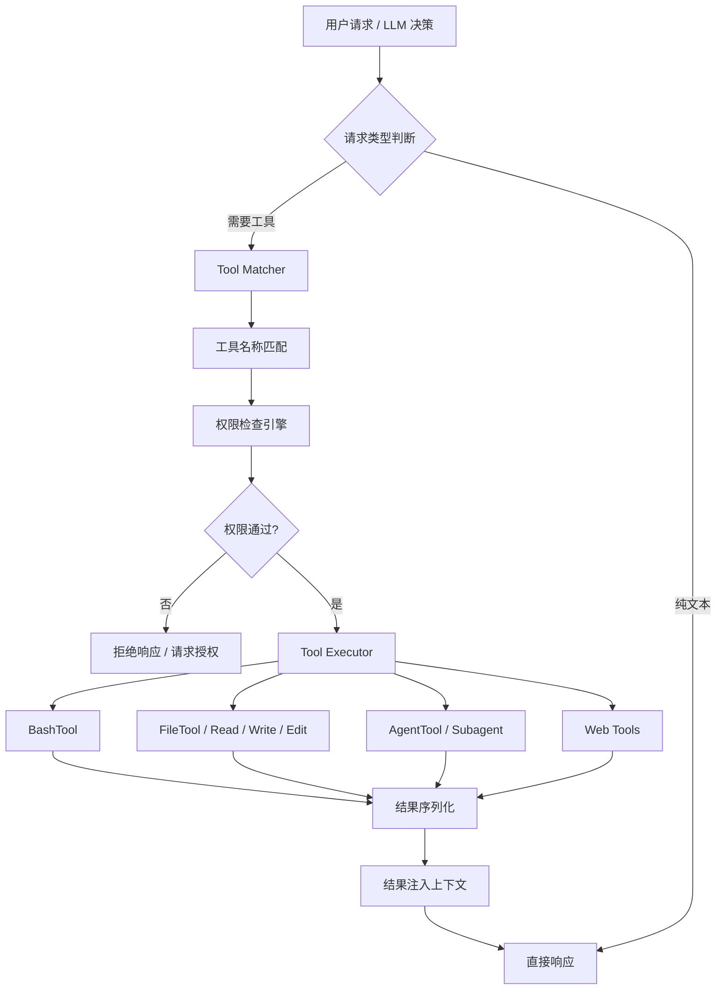

### 2.2 BashTool 调用链

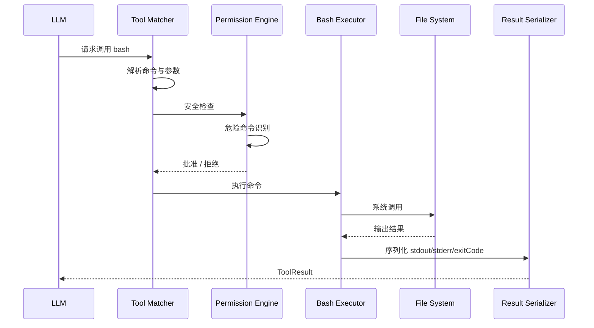

### 2.3 FileTool 调用链

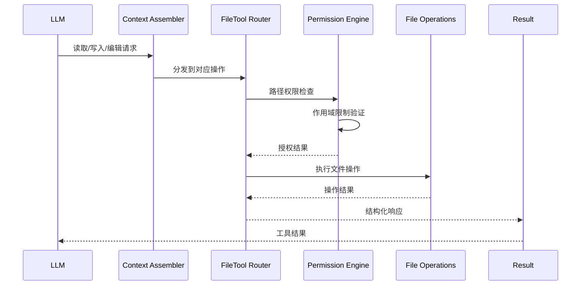

### 2.4 AgentTool / Subagent 调用链

```mermaid
flowchart TD
    A[LLM 请求 spawn subagent] --> B[Agent Registry]
    B --> C[创建子 Agent 实例]
    C --> D[独立 Session 分配]
    D --> E[Task 上下文传递]
    E --> F[Subagent 执行]
    F --> G[结果 push 回调]
    G --> H[主 Agent 上下文注入]
    H --> I[继续主流程]

    style Subagent 执行 fill:#fff3e0,stroke:#ff9800
```

---

## 3. Memory Flow（记忆数据流）

Memory Flow 描述会话记忆的生成、压缩、持久化与召回过程。

### 3.1 记忆全生命周期

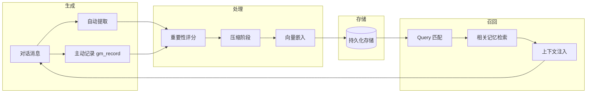

### 3.2 记忆召回与遗忘

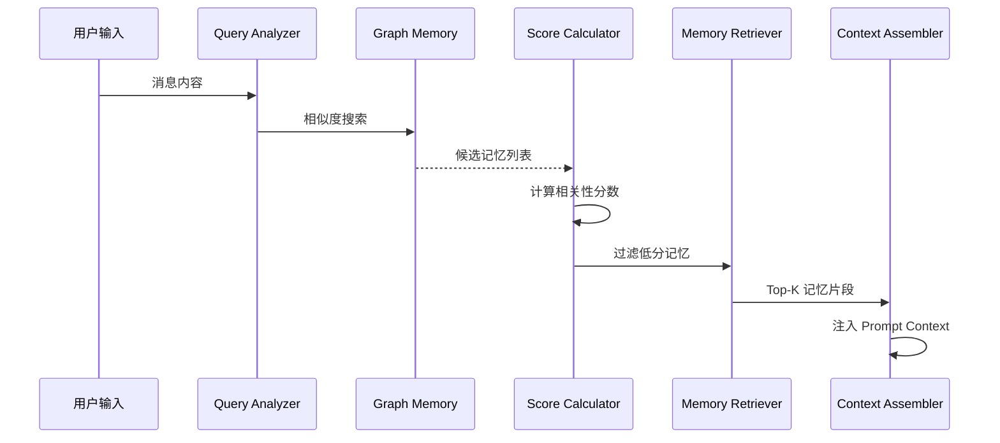

### 3.3 自动记忆提取流程

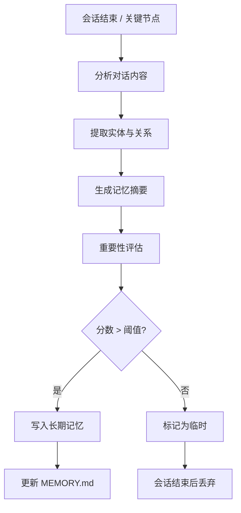

---

## 4. Agent Communication Flow（Agent 通信流）

Agent Communication Flow 描述多 Agent 环境下的消息传递、权限同步与状态同步。

### 4.1 Agent 间消息传递

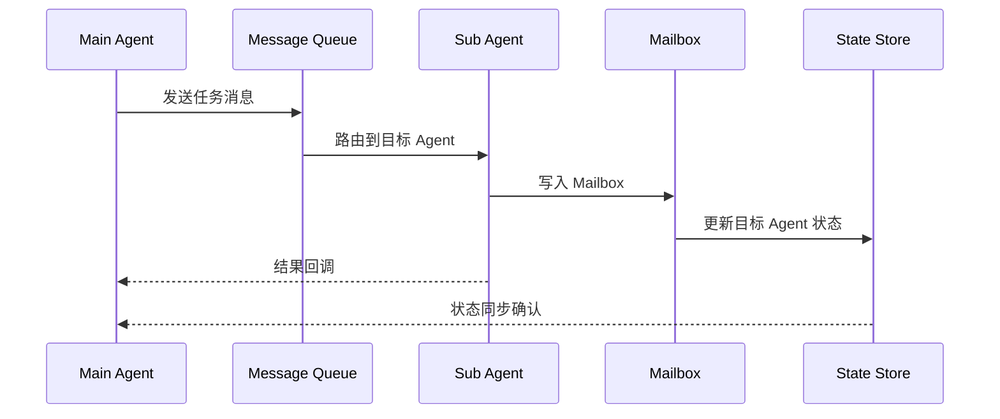

### 4.2 权限同步机制

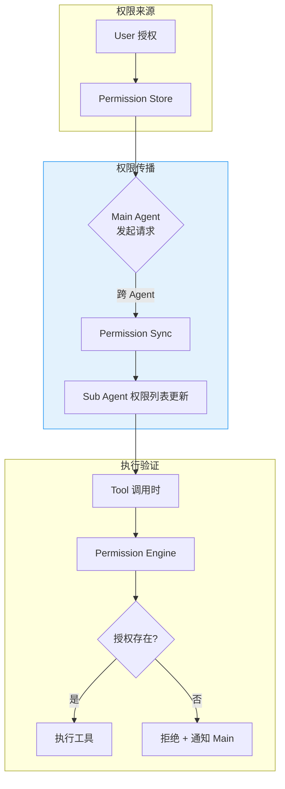

### 4.3 状态同步与 Mailbox 机制

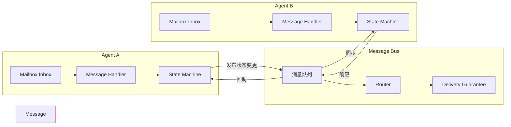

### 4.4 Multi-Agent Routing 架构

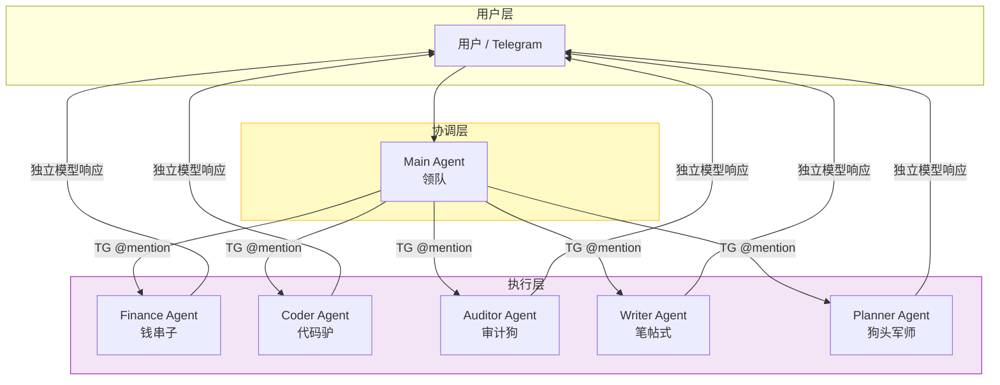

---

## 5. 综合数据流总图

```mermaid
flowchart TD
    subgraph 用户层
        U[用户消息]
    end

    subgraph Prompt 层
        PC[Prompt Constructor]
        SYS[System Prompt Builder]
    end

    subgraph LLM 层
        LLM[LLM Engine]
    end

    subgraph 工具层
        TM[Tool Matcher]
        PE[Permission Engine]
        EX[Tool Executor]
    end

    subgraph 记忆层
        GM[Graph Memory]
        ST[Session Store]
    end

    subgraph Agent 层
        MQ[Message Queue]
        MB[Mailbox]
    end

    U --> PC
    PC --> SYS
    SYS --> LLM
    LLM -->|决策| TM
    TM --> PE
    PE -->|通过| EX
    EX -->|结果| LLM
    LLM -->|输出| U

    GM -.->|召回| SYS
    ST -.->|会话上下文| SYS
    MQ -.->|Agent 通信| MB

    style 记忆层 fill:#e0f7fa,stroke:#00bcd4
    style Agent 层 fill:#e8f5e9,stroke:#4caf50
```

---

## 6. 数据流关键设计点

| 模块 | 数据类型 | 关键挑战 |
|------|---------|---------|
| Prompt Flow | 文本 Token | 上下文窗口管理、Token 预算 |
| Tool Flow | 结构化 JSON | 权限隔离、危险命令识别 |
| Memory Flow | 向量 + 图结构 | 遗忘阈值、准确召回 |
| Agent Flow | 异步消息 | 消息顺序保证、状态一致性 |
