# QueryEngine 深度分析

> Claude Code 核心引擎的详细剖析

---

## 目录

1. [QueryEngine 概述](#1-queryengine-概述)
2. [Prompt 构建流程](#2-prompt-构建流程)
3. [Tool 调用机制](#3-tool-调用机制)
4. [Retry 与自愈逻辑](#4-retry-与自愈逻辑)
5. [Cost Tracking（成本追踪）](#5-cost-tracking成本追踪)
6. [总结](#6-总结)

---

## 1. QueryEngine 概述

### 1.1 代码规模

| 模块 | 文件 | 代码行数 |
|------|------|----------|
| QueryEngine 主类 | `src/QueryEngine.ts` | ~1,295 行 |
| Query 循环 | `src/query.ts` | ~1,200+ 行 |
| Token 预算 | `src/query/tokenBudget.ts` | ~93 行 |
| 重试逻辑 | `src/services/api/withRetry.ts` | ~600+ 行 |
| **核心引擎总计** | | **~4,200+ 行** |

> **注意**：46K 行代码是整个 Claude Code 的规模，QueryEngine 及其直接依赖构成了核心部分。

### 1.2 核心职责

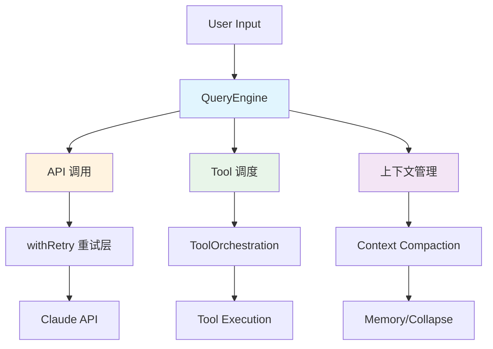

### 1.3 QueryEngine 在架构中的位置

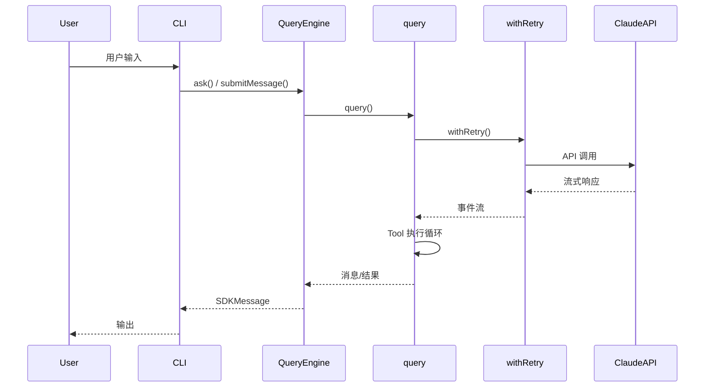

### 1.4 核心设计模式

QueryEngine 采用 **AsyncGenerator** 模式实现流式处理：

```typescript
// QueryEngine 是 AsyncGenerator，不断 yield SDKMessage
async *submitMessage(
  prompt: string | ContentBlockParam[],
): AsyncGenerator<SDKMessage, void> {
  // yield 各种消息类型：assistant, user, system, progress...
  yield* normalizeMessage(message)
}
```

---

## 2. Prompt 构建流程

### 2.1 System Prompt 组装

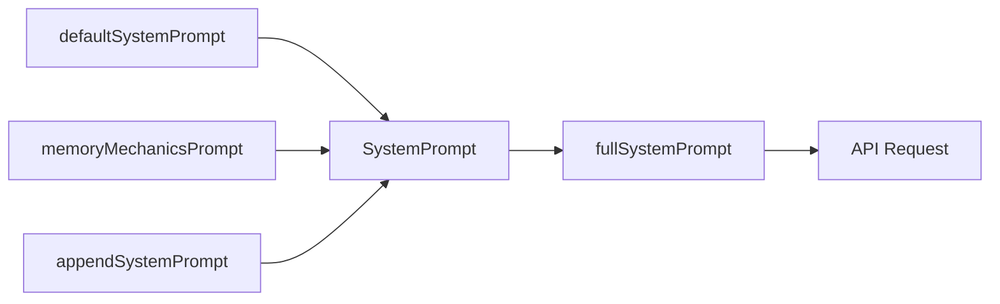

**Prompt 构建完整时序：**

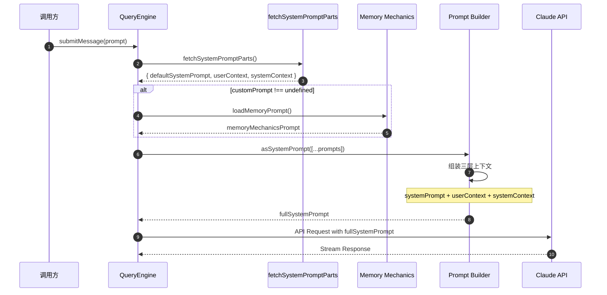

#### 关键代码路径

```typescript
// QueryEngine.ts 中：
const { defaultSystemPrompt, userContext, systemContext } = 
  await fetchSystemPromptParts({ ... })

const systemPrompt = asSystemPrompt([
  ...(customPrompt !== undefined ? [customPrompt] : defaultSystemPrompt),
  ...(memoryMechanicsPrompt ? [memoryMechanicsPrompt] : []),
  ...(appendSystemPrompt ? [appendSystemPrompt] : []),
])
```

### 2.2 上下文注入

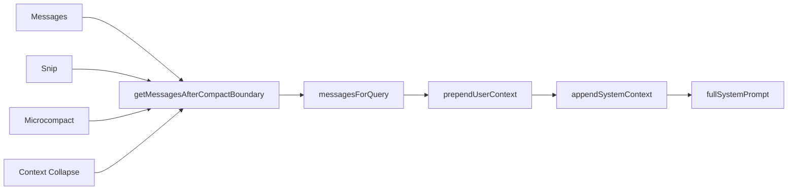

#### 三层上下文结构

| 层级 | 来源 | 用途 |
|------|------|------|
| `systemPrompt` | `fetchSystemPromptParts` | 角色定义、工具描述 |
| `userContext` | `getUserContext()` | 用户环境信息（OS、Shell 等） |
| `systemContext` | `getSystemContext()` | 系统级状态（CPU、内存等） |

### 2.3 Buddy Prompt

Buddy Prompt 是 Claude Code 的"贴心提示"机制：

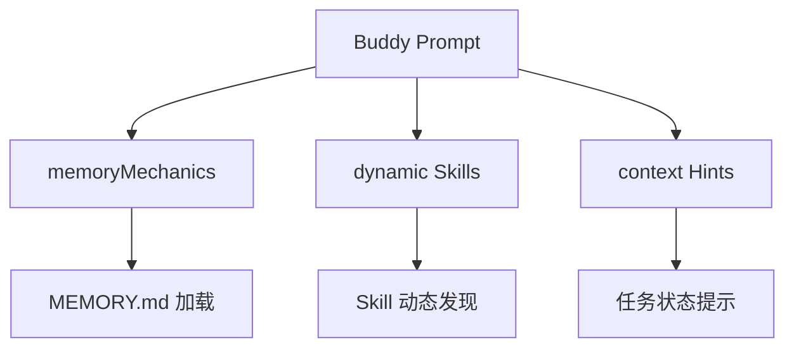

```typescript
// Memory Mechanics 注入条件
const memoryMechanicsPrompt =
  customPrompt !== undefined && hasAutoMemPathOverride()
    ? await loadMemoryPrompt()
    : null
```

---

## 3. Tool 调用机制

### 3.1 工具匹配流程

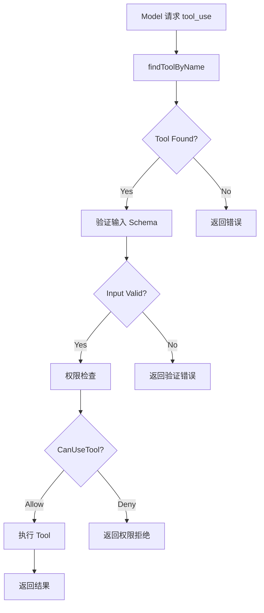

**Tool 调用完整时序：**

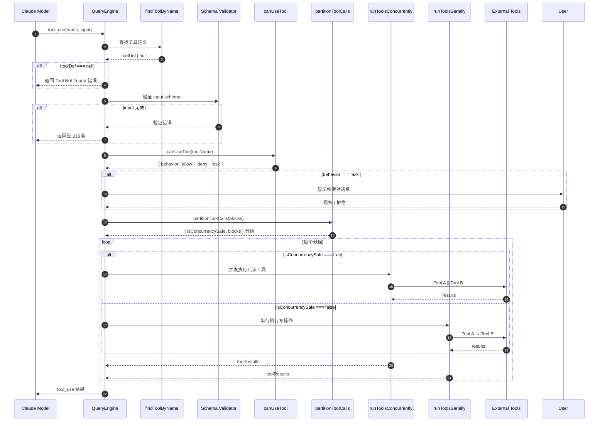

### 3.2 权限检查

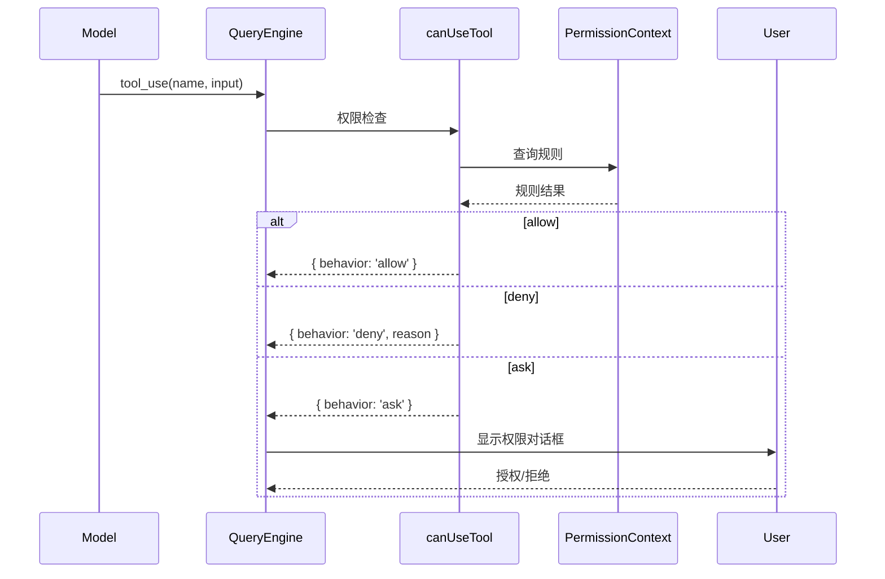

#### 权限模式

| 模式 | 描述 |
|------|------|
| `default` | 标准权限检查 |
| `bypass` | 跳过权限检查（自动允许） |
| `plan` | 计划模式（只读操作） |
| `容器隔离` | MCP 服务器权限 |

### 3.3 工具执行与结果处理

#### 核心执行入口

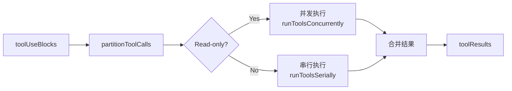

#### 关键代码

```typescript
// toolOrchestration.ts
async function* runTools(...) {
  for (const { isConcurrencySafe, blocks } of partitionToolCalls(...)) {
    if (isConcurrencySafe) {
      // 并发执行只读工具
      for await (const update of runToolsConcurrently(...)) {
        yield update
      }
    } else {
      // 串行执行写操作工具
      for await (const update of runToolsSerially(...)) {
        yield update
      }
    }
  }
}
```

#### 并发安全策略

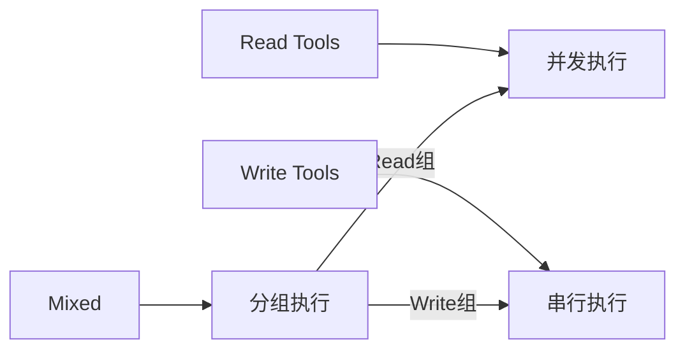

---

## 4. Retry 与自愈逻辑

### 4.1 错误检测与分类

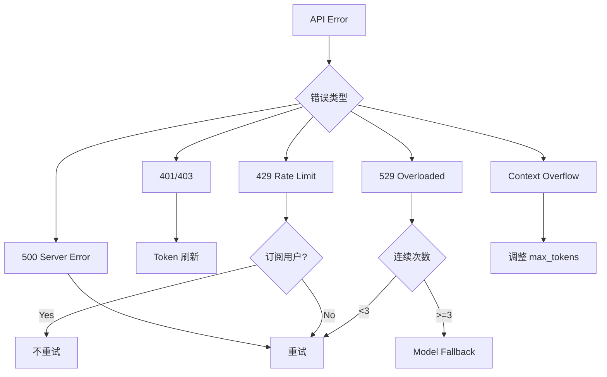

**Retry 决策完整时序：**

```mermaid
sequenceDiagram
    autonumber
    participant Caller as 调用方
    participant WR as withRetry
    participant API as Claude API
    participant Fallback as Fallback Model
    participant SelfHeal as Self-Heal

    Caller->>WR: operation()
    WR->>WR: 初始化重试参数
    Note over WR: maxRetries=10, baseDelay=500ms
    loop attempt <= maxRetries
        WR->>API: API Request (attempt N)
        API-->>WR: 响应 / 错误
        alt 成功响应
            API-->>Caller: 返回结果
            break 流程结束
        end
        alt 401 认证失败
            WR->>WR: 刷新 Token
            WR->>WR: 重试
        end
        alt 429 Rate Limit
            alt 非订阅用户
                WR->>WR: 计算 delay (jitter)
                WR->>WR: await delay
            end
        end
        alt 529 Overloaded
            WR->>WR: consecutive529Errors++
            alt consecutive529Errors >= 3
                WR->>Fallback: 触发 FallbackTriggeredError
                Fallback-->>Caller: 降级模型响应
                break 流程结束
            end
            WR->>WR: delay = BASE_DELAY * 2^(attempt-1) + jitter
            WR->>WR: await delay
        end
        alt 400 Context Overflow
            WR->>SelfHeal: context_overflow 恢复
            SelfHeal->>SelfHeal: 计算可用空间
            SelfHeal->>SelfHeal: 调整 max_tokens
            WR->>WR: 重试
        end
        alt 其他 5xx 错误
            WR->>WR: delay = BASE_DELAY * 2^(attempt-1) + jitter
            WR->>WR: await delay
        end
    end
    alt 达到最大重试次数
        WR-->>Caller: 抛出最终错误
    end
```

#### 错误类型映射

| 错误代码 | 类型 | 处理策略 |
|----------|------|----------|
| 401 | 认证失败 | 刷新 Token 后重试 |
| 403 | 权限拒绝/OAuth 撤销 | 刷新认证后重试 |
| 408 | 请求超时 | 重试 |
| 409 | 锁超时 | 重试 |
| 429 | 速率限制 | 非订阅用户重试 |
| 529 | 服务过载 | 前台源重试 |
| 500+ | 服务器错误 | 重试 |

### 4.2 重试策略

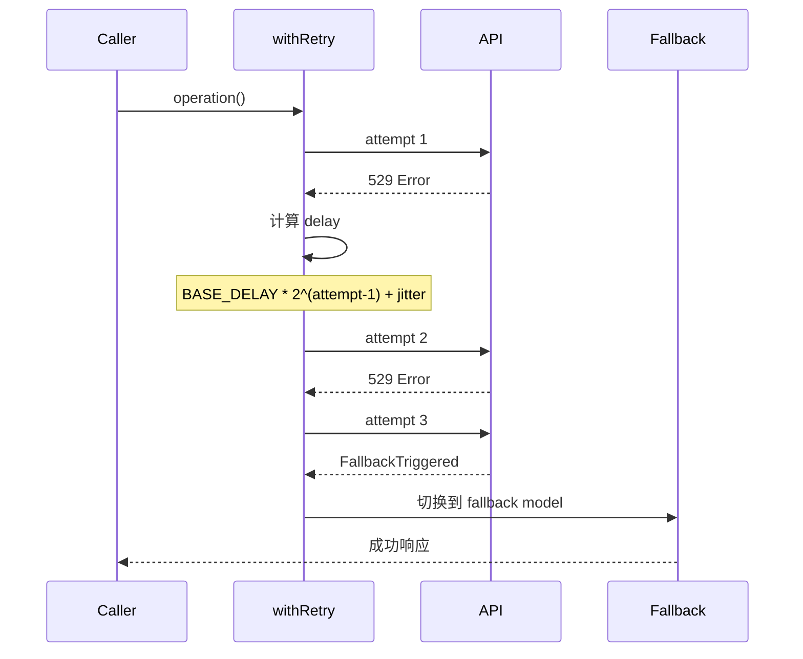

#### 关键参数

| 参数 | 值 | 说明 |
|------|-----|------|
| `DEFAULT_MAX_RETRIES` | 10 | 最大重试次数 |
| `MAX_529_RETRIES` | 3 | 529 专用重试上限 |
| `BASE_DELAY_MS` | 500 | 基础延迟（ms） |
| `MAX_DELAY_MS` | 32000 | 最大延迟（ms） |
| `SHORT_RETRY_THRESHOLD` | 20000 | 短延迟阈值 |

### 4.3 降级处理

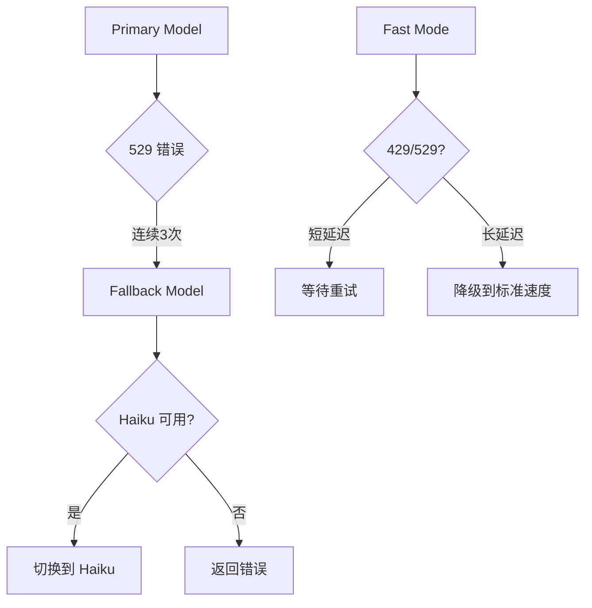

#### Fallback 触发条件

```typescript
// 满足以下任一条件触发 fallback：
// 1. FALLBACK_FOR_ALL_PRIMARY_MODELS 已设置
// 2. 非 ClaudeAI 订阅用户 AND 非自定义 Opus 模型
if (
  process.env.FALLBACK_FOR_ALL_PRIMARY_MODELS ||
  (!isClaudeAISubscriber() && isNonCustomOpusModel(options.model))
) {
  consecutive529Errors++
  if (consecutive529Errors >= MAX_529_RETRIES) {
    throw new FallbackTriggeredError(originalModel, fallbackModel)
  }
}
```

### 4.4 自愈机制

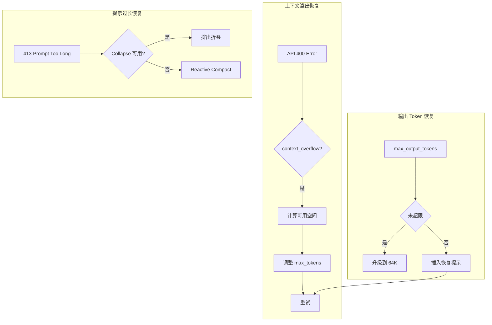

---

## 5. Cost Tracking（成本追踪）

### 5.1 Token 计数机制

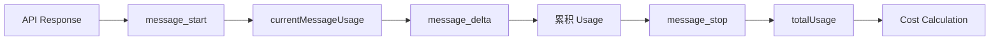

#### 使用量追踪

```typescript
// QueryEngine.ts 中：
let currentMessageUsage: NonNullableUsage = EMPTY_USAGE

// message_start: 重置当前消息使用量
if (message.event.type === 'message_start') {
  currentMessageUsage = updateUsage(currentMessageUsage, message.event.message.usage)
}

// message_delta: 累积增量
if (message.event.type === 'message_delta') {
  currentMessageUsage = updateUsage(currentMessageUsage, message.event.usage)
}

// message_stop: 汇总到总使用量
if (message.event.type === 'message_stop') {
  this.totalUsage = accumulateUsage(this.totalUsage, currentMessageUsage)
}
```

### 5.2 成本计算

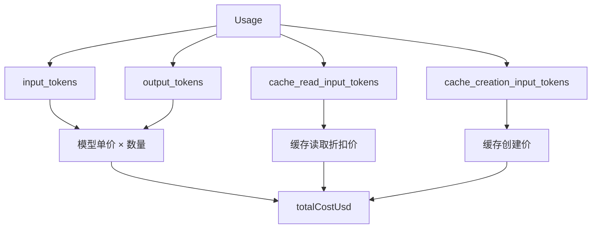

### 5.3 预算控制

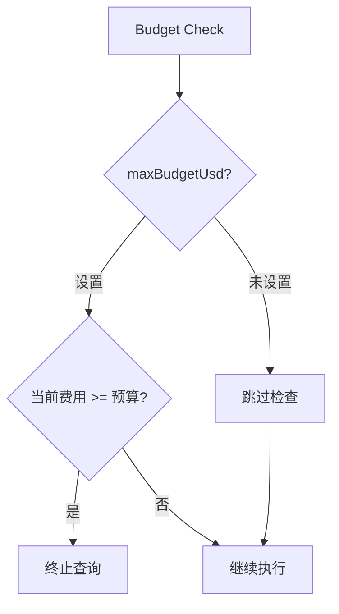

#### Token Budget 追踪

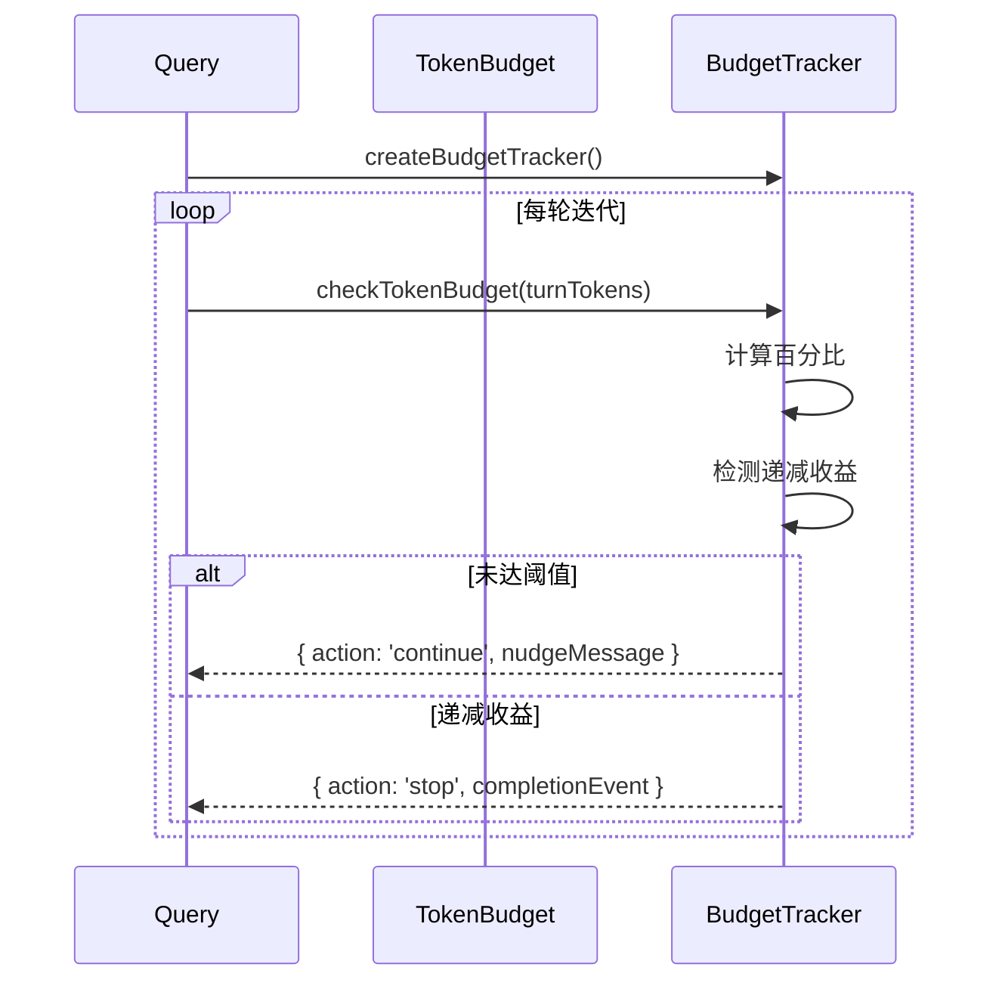

#### Budget 检查核心逻辑

```typescript
// tokenBudget.ts
export function checkTokenBudget(
  tracker: BudgetTracker,
  agentId: string | undefined,
  budget: number | null,
  globalTurnTokens: number,
): TokenBudgetDecision {
  const turnTokens = globalTurnTokens
  const pct = Math.round((turnTokens / budget) * 100)
  
  // 检测递减收益：连续3次 + 增量 < 500 + 上次 < 500
  const isDiminishing =
    tracker.continuationCount >= 3 &&
    deltaSinceLastCheck < DIMINISHING_THRESHOLD &&
    tracker.lastDeltaTokens < DIMINISHING_THRESHOLD
  
  if (!isDiminishing && turnTokens < budget * COMPLETION_THRESHOLD) {
    return {
      action: 'continue',
      nudgeMessage: getBudgetContinuationMessage(pct, turnTokens, budget),
      ...
    }
  }
  
  return { action: 'stop', completionEvent: { diminishingReturns: isDiminishing, ... } }
}
```

### 5.4 成本报告

```typescript
// QueryEngine 返回的结果包含完整成本信息
yield {
  type: 'result',
  subtype: 'success',
  total_cost_usd: getTotalCost(),      // 总费用（美元）
  usage: this.totalUsage,               // 详细使用量
  modelUsage: getModelUsage(),          // 按模型分类
  permission_denials: this.permissionDenials, // 权限拒绝记录
  fast_mode_state: getFastModeState(),  // Fast Mode 状态
}
```

---

## 6. 总结

### 6.1 架构亮点

```mermaid
mindmap
  root((QueryEngine))
    流式处理
      AsyncGenerator
      增量输出
      实时反馈
    错误恢复
      多层重试
      模型降级
      上下文溢出修复
    成本控制
      Token 追踪
      预算监控
      递减检测
    工具编排
      并发/串行混合
      权限抽象
      MCP 集成
    上下文管理
      Snip
      Microcompact
      Context Collapse
```

### 6.2 关键设计原则

| 原则 | 实现 |
|------|------|
| **容错性** | 多层重试 + 模型降级确保任务完成 |
| **资源控制** | Token Budget + USD Budget 双重保护 |
| **性能优化** | 工具并发执行、缓存优化 |
| **可观测性** | 详细的事件日志和错误追踪 |
| **灵活性** | 支持自定义 System Prompt、插件、Skill |

### 6.3 核心流程总览

```mermaid
flowchart TD
    A[submitMessage] --> B[fetchSystemPromptParts]
    B --> C[processUserInput]
    C --> D[构建 ToolUseContext]
    D --> E[query Loop]
    
    E --> F[Snip / Microcompact]
    F --> G[AutoCompact]
    G --> H{Check Budget}
    H -->|OK| I[API Call]
    H -->|Over| J[Stop]
    
    I --> J
    J --> K[Tool Execution]
    K --> L{More Tools?}
    L -->|Yes| E
    L -->|No| M[Stop Hooks]
    M --> N[返回结果]
```

---

*文档版本：1.0 | Claude Code 源码分析*
