# Agent 生命周期分析

> Claude Code 中 Agent 的完整生命周期管理

---

## 概述

Agent 在 Claude Code 中经历完整的生命周期：**Spawn → Execute → Review → Fix → Terminate**，各阶段可循环迭代，并通过 Coordination 层实现多 Agent 协作。

```
┌─────────────────────────────────────────────────────────────────┐
│                        Agent Lifecycle                          │
│                                                                 │
│   ┌──────────┐    ┌──────────┐    ┌──────────┐    ┌──────────┐ │
│   │  Spawn   │───▶│ Execute  │───▶│  Review  │───▶│ Terminate│ │
│   └──────────┘    └──────────┘    └────┬─────┘    └──────────┘ │
│                           │           │                       │
│                           │    ┌──────▼──────┐                │
│                           └───▶│    Fix      │◀───┘           │
│                                └─────────────┘  (retry loop)  │
│                                                                 │
│   ┌──────────────────────────────────────────────────────────┐ │
│   │              Coordination Layer (全周期)                  │ │
│   └──────────────────────────────────────────────────────────┘ │
└─────────────────────────────────────────────────────────────────┘
```

---

## 1. Agent Spawn（创建）

Agent 的创建是整个生命周期的起点。Claude Code 支持多种创建模式，适应不同的任务规模和性能需求。

### 1.1 创建模式对比

| 模式 | 机制 | 适用场景 | 开销 |
|------|------|----------|------|
| **Fork 模式** | 从当前 Agent 复制完整上下文后启动子 Agent | 复杂子任务、独立执行环境 | 高（完整上下文复制） |
| **进程内模式** | 在同一进程/线程内创建执行单元 | 轻量任务、快速迭代 | 低（共享进程空间） |
| **条件触发** | 满足预设条件时自动创建 | 事件驱动、自动化流程 | 按需 |

### 1.2 Agent 创建状态图

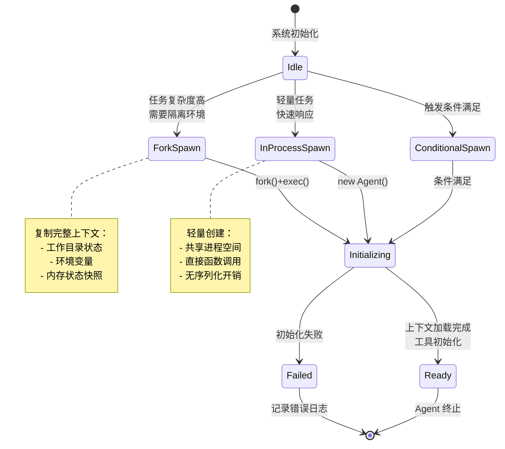
```mermaid
stateDiagram-v2
    [*] --> Idle: 系统初始化

    Idle --> ForkSpawn: 任务复杂度高<br/>需要隔离环境
    Idle --> InProcessSpawn: 轻量任务<br/>快速响应
    Idle --> ConditionalSpawn: 触发条件满足

    ForkSpawn --> Initializing: fork()+exec()
    InProcessSpawn --> Initializing: new Agent()
    ConditionalSpawn --> Initializing: 条件满足

    Initializing --> Ready: 上下文加载完成<br/>工具初始化
    Initializing --> Failed: 初始化失败

    Failed --> [*]: 记录错误日志
    Ready --> [*]: Agent 终止

    note right of ForkSpawn
        复制完整上下文：
        - 工作目录状态
        - 环境变量
        - 内存状态快照
    end note

    note right of InProcessSpawn
        轻量创建：
        - 共享进程空间
        - 直接函数调用
        - 无序列化开销
    end note
```

### 1.3 Spawn 序列图

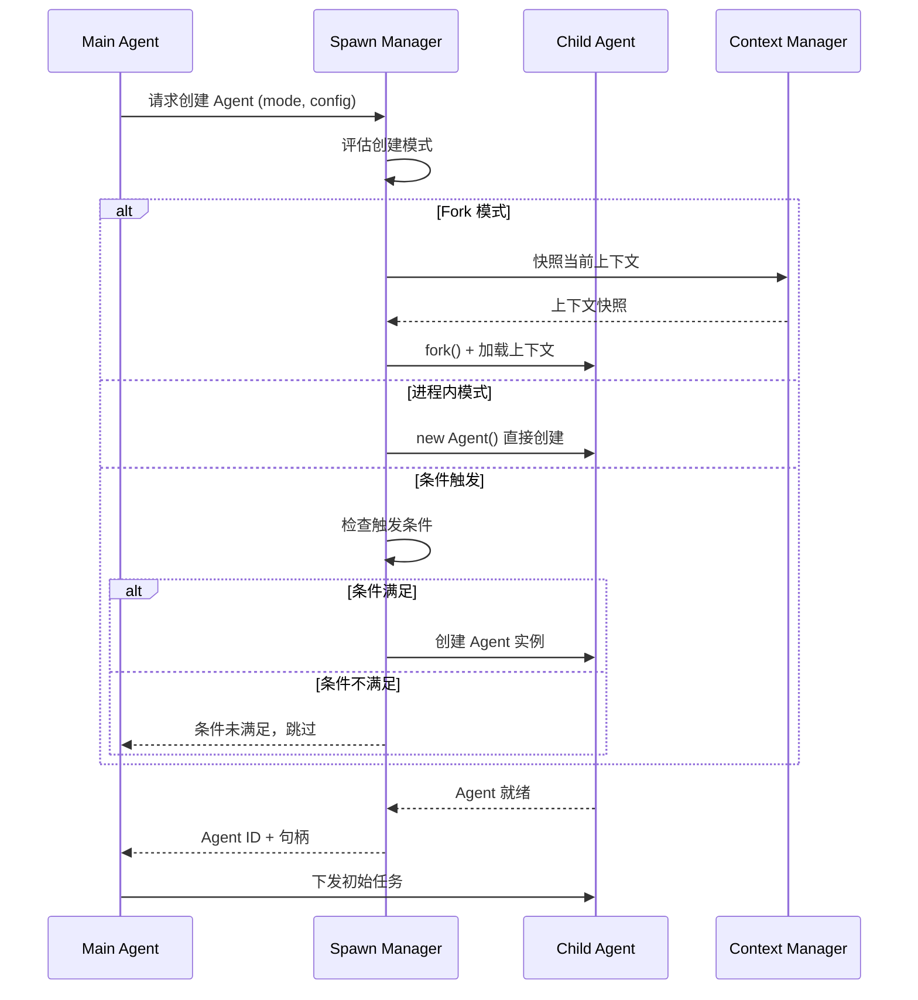
```mermaid
sequenceDiagram
    participant Main as Main Agent
    participant Spawner as Spawn Manager
    participant Child as Child Agent
    participant Context as Context Manager

    Main->>Spawner: 请求创建 Agent (mode, config)
    Spawner->>Spawner: 评估创建模式

    alt Fork 模式
        Spawner->>Context: 快照当前上下文
        Context-->>Spawner: 上下文快照
        Spawner->>Child: fork() + 加载上下文
    else 进程内模式
        Spawner->>Child: new Agent() 直接创建
    else 条件触发
        Spawner->>Spawner: 检查触发条件
        alt 条件满足
            Spawner->>Child: 创建 Agent 实例
        else 条件不满足
            Spawner-->>Main: 条件未满足，跳过
        end
    end

    Child-->>Spawner: Agent 就绪
    Spawner-->>Main: Agent ID + 句柄
    Main->>Child: 下发初始任务
```

---

## 2. Agent Execute（执行）

执行阶段是 Agent 真正发挥作用的核心阶段，涵盖任务分配、工具调用和状态监控三个关键环节。

### 2.1 执行流程概览

```mermaid
flowchart LR
    A[任务分配] --> B[规划分解]
    B --> C[工具选择]
    C --> D[工具调用]
    D --> E{成功?}
    E -->|是| F[结果验证]
    E -->|否| G[错误处理]
    F --> H{完成?}
    H -->|否| B
    H -->|是| I[执行完成]
    G --> D: 重试
    G --> J[上报异常]
```

### 2.2 任务分配

任务分配遵循 **Intent Gate → Task Definition → Routing** 三步流程：

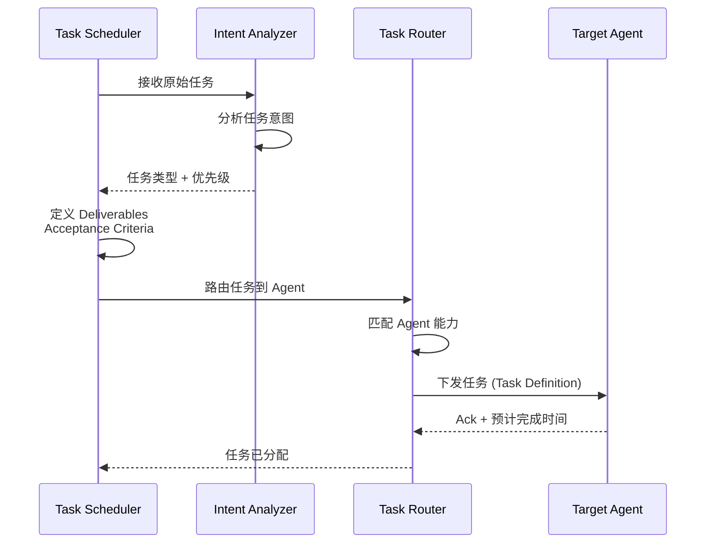
```mermaid
sequenceDiagram
    participant Scheduler as Task Scheduler
    participant Intent as Intent Analyzer
    participant Router as Task Router
    participant Agent as Target Agent

    Scheduler->>Intent: 接收原始任务
    Intent->>Intent: 分析任务意图
    Intent-->>Scheduler: 任务类型 + 优先级

    Scheduler->>Scheduler: 定义 Deliverables<br/>Acceptance Criteria
    Scheduler->>Router: 路由任务到 Agent

    Router->>Router: 匹配 Agent 能力
    Router->>Agent: 下发任务 (Task Definition)

    Agent-->>Router: Ack + 预计完成时间
    Router-->>Scheduler: 任务已分配
```

### 2.3 工具调用

Agent 通过工具调用实现具体操作，工具调用遵循标准协议：

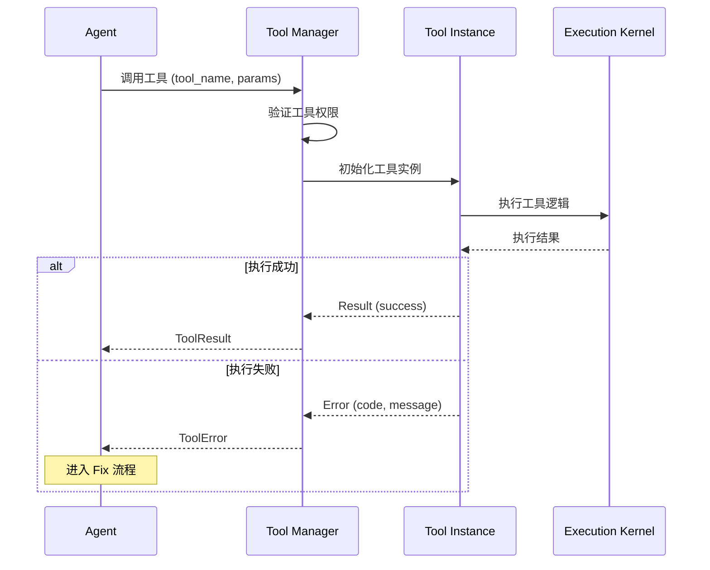
```mermaid
sequenceDiagram
    participant Agent as Agent
    participant ToolMgr as Tool Manager
    participant Tool as Tool Instance
    participant Kernel as Execution Kernel

    Agent->>ToolMgr: 调用工具 (tool_name, params)
    ToolMgr->>ToolMgr: 验证工具权限
    ToolMgr->>Tool: 初始化工具实例

    Tool->>Kernel: 执行工具逻辑
    Kernel-->>Tool: 执行结果

    alt 执行成功
        Tool-->>ToolMgr: Result (success)
        ToolMgr-->>Agent: ToolResult
    else 执行失败
        Tool-->>ToolMgr: Error (code, message)
        ToolMgr-->>Agent: ToolError
        Note over Agent: 进入 Fix 流程
    end
```

### 2.4 状态监控

执行过程中的状态监控贯穿整个执行阶段：

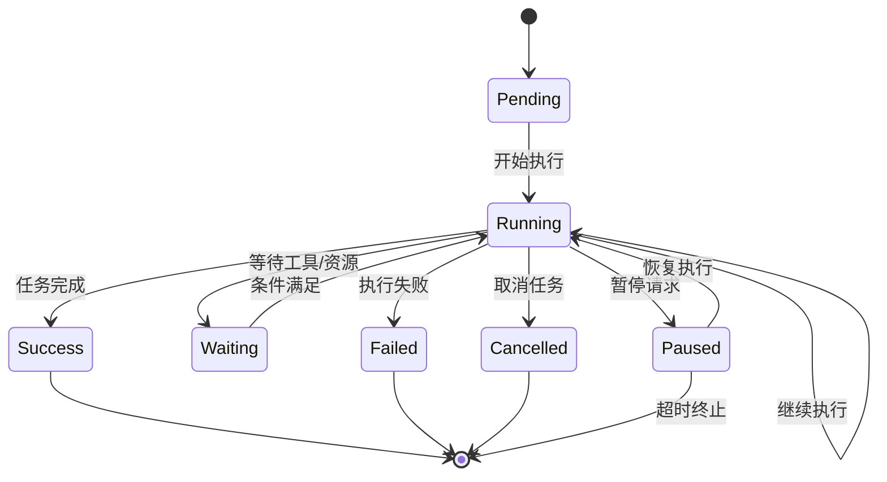
```mermaid
stateDiagram-v2
    [*] --> Pending

    Pending --> Running: 开始执行
    Running --> Paused: 暂停请求
    Running --> Waiting: 等待工具/资源
    Running --> Running: 继续执行

    Waiting --> Running: 条件满足
    Paused --> Running: 恢复执行

    Running --> Success: 任务完成
    Running --> Failed: 执行失败
    Running --> Cancelled: 取消任务

    Success --> [*]
    Failed --> [*]
    Cancelled --> [*]
    Paused --> [*]: 超时终止
```

---

## 3. Agent Review（审查）

审查阶段对执行结果进行系统性的验证和质量评估，是保证交付质量的关键环节。

### 3.1 审查流程

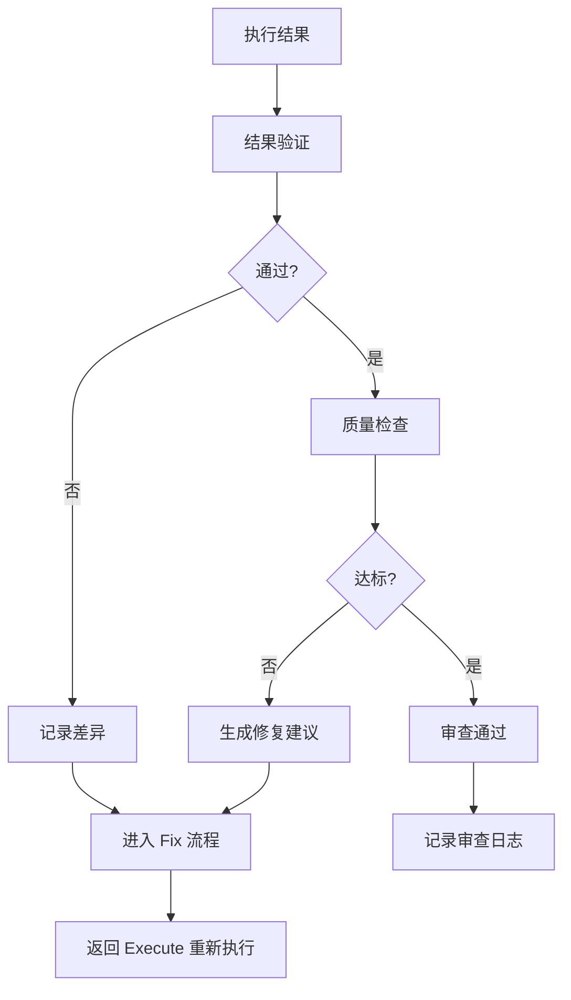
```mermaid
flowchart TD
    A[执行结果] --> B[结果验证]
    B --> C{通过?}
    C -->|否| D[记录差异]
    C -->|是| E[质量检查]

    E --> F{达标?}
    F -->|否| G[生成修复建议]
    F -->|是| H[审查通过]

    D --> I[进入 Fix 流程]
    G --> I

    H --> J[记录审查日志]
    I --> K[返回 Execute 重新执行]
```

### 3.2 结果验证

结果验证包含三个维度：

| 验证维度 | 检查内容 | 通过标准 |
|----------|----------|----------|
| **正确性** | 输出是否符合任务要求 | 结果匹配 Acceptance Criteria |
| **完整性** | 是否包含所有要求的交付物 | Deliverables 100% 覆盖 |
| **一致性** | 上下文是否连贯、逻辑是否自洽 | 无矛盾、无幻觉 |

### 3.3 质量检查清单

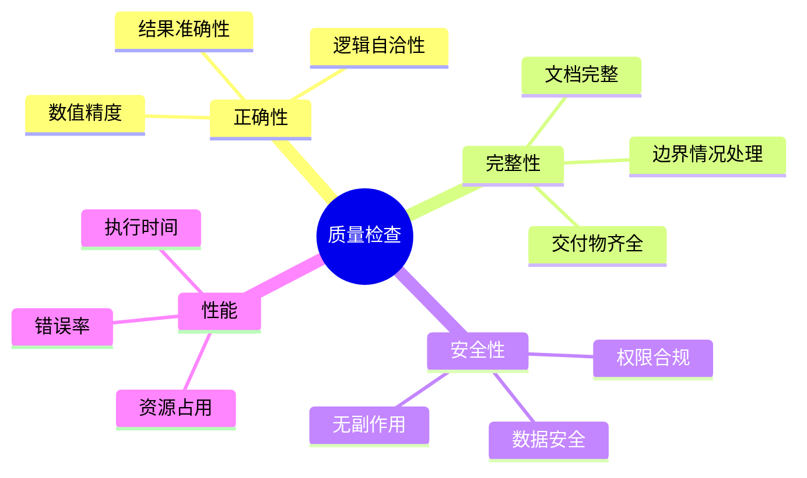
```mermaid
mindmap
    root((质量检查))
        正确性
            结果准确性
            逻辑自洽性
            数值精度
        完整性
            交付物齐全
            文档完整
            边界情况处理
        安全性
            权限合规
            数据安全
            无副作用
        性能
            执行时间
            资源占用
            错误率
```

---

## 4. Agent Fix（修复）

修复阶段处理执行中的错误和审查中发现的问题，通过错误修复和重试逻辑确保最终交付质量。

### 4.1 错误分类与处理策略

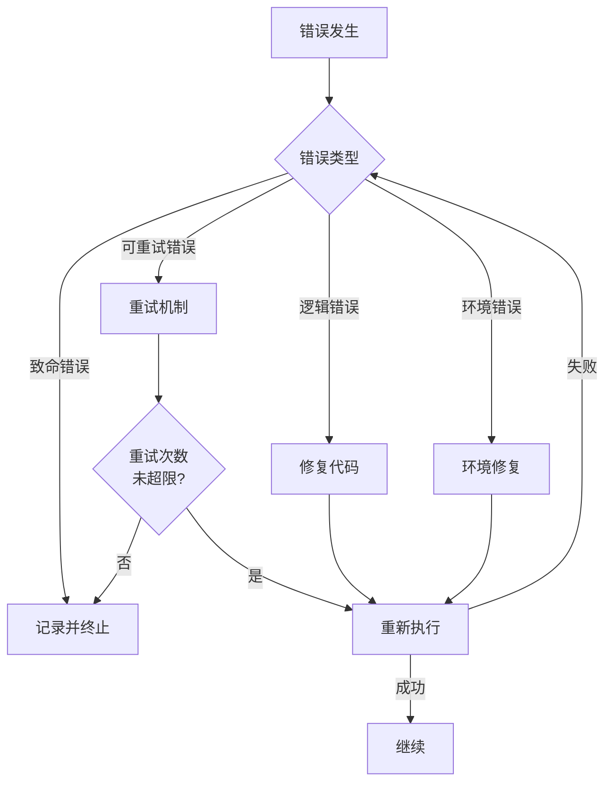
```mermaid
flowchart TD
    E[错误发生] --> C{错误类型}

    C -->|可重试错误| R[重试机制]
    C -->|逻辑错误| L[修复代码]
    C -->|环境错误| Env[环境修复]
    C -->|致命错误| F[记录并终止]

    R --> Retry{重试次数<br/>未超限?}
    Retry -->|是| E2[重新执行]
    Retry -->|否| F

    L --> E2
    Env --> E2

    E2 -->|成功| S[继续]
    E2 -->|失败| C
```

### 4.2 重试策略

Claude Code 采用 **指数退避 + 抖动** 的重试策略：

| 参数 | 说明 | 默认值 |
|------|------|--------|
| 最大重试次数 | 同一任务的最大尝试次数 | 3 |
| 基础延迟 | 首次重试等待时间 | 1s |
| 退避系数 | 每次重试延迟倍增系数 | 2 |
| 最大延迟 | 单次重试最大等待时间 | 30s |
| 抖动 | 随机抖动范围 | ±20% |

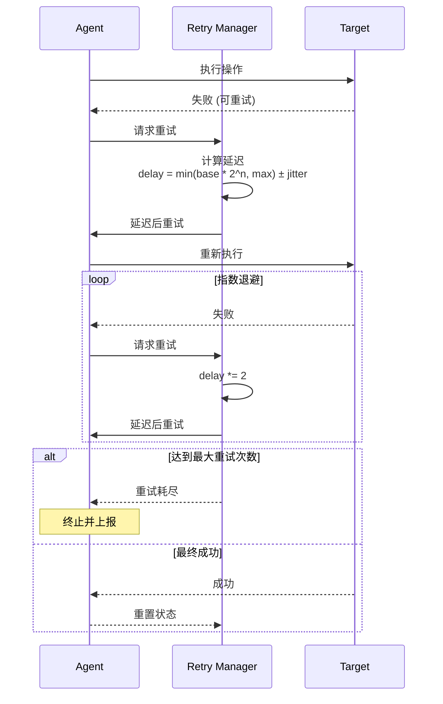
```mermaid
sequenceDiagram
    participant Agent as Agent
    participant RetryMgr as Retry Manager
    participant Target as Target

    Agent->>Target: 执行操作
    Target-->>Agent: 失败 (可重试)

    Agent->>RetryMgr: 请求重试
    RetryMgr->>RetryMgr: 计算延迟<br/>delay = min(base * 2^n, max) ± jitter

    RetryMgr->>Agent: 延迟后重试
    Agent->>Target: 重新执行

    loop 指数退避
        Target-->>Agent: 失败
        Agent->>RetryMgr: 请求重试
        RetryMgr->>RetryMgr: delay *= 2
        RetryMgr->>Agent: 延迟后重试
    end

    alt 达到最大重试次数
        RetryMgr-->>Agent: 重试耗尽
        Note over Agent: 终止并上报
    else 最终成功
        Target-->>Agent: 成功
        Agent-->>RetryMgr: 重置状态
    end
```

### 4.3 错误修复状态图

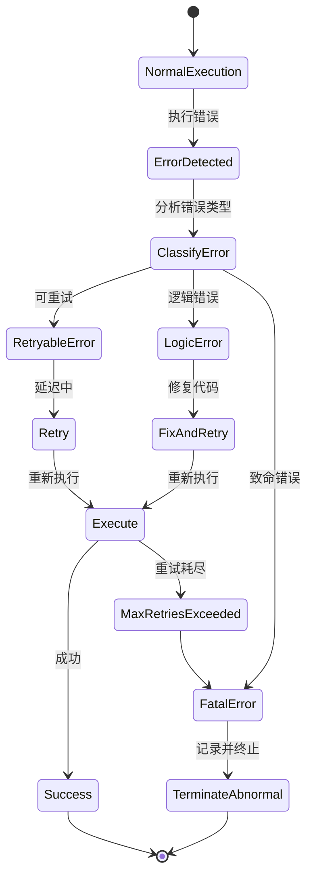
```mermaid
stateDiagram-v2
    [*] --> NormalExecution

    NormalExecution --> ErrorDetected: 执行错误

    ErrorDetected --> ClassifyError: 分析错误类型
    ClassifyError --> RetryableError: 可重试
    ClassifyError --> LogicError: 逻辑错误
    ClassifyError --> FatalError: 致命错误

    RetryableError --> Retry: 延迟中
    Retry --> Execute: 重新执行
    Execute --> Success: 成功
    Execute --> MaxRetriesExceeded: 重试耗尽
    MaxRetriesExceeded --> FatalError

    LogicError --> FixAndRetry: 修复代码
    FixAndRetry --> Execute: 重新执行

    FatalError --> TerminateAbnormal: 记录并终止
    Success --> [*]
    TerminateAbnormal --> [*]
```

---

## 5. Agent Terminate（终止）

终止阶段处理 Agent 的优雅退出，确保资源正确释放和状态正确持久化。

### 5.1 终止类型

| 类型 | 触发条件 | 处理方式 |
|------|----------|----------|
| **正常完成** | 任务达成，审查通过 | 资源清理 → 结果归档 → 状态持久化 |
| **异常终止** | 错误无法恢复、超时、致命异常 | 状态快照 → 错误日志 → 资源强制释放 |
| **主动终止** | 用户取消、调度器终止 | 优雅停止 → 部分结果保存 → 清理 |

### 5.2 终止流程

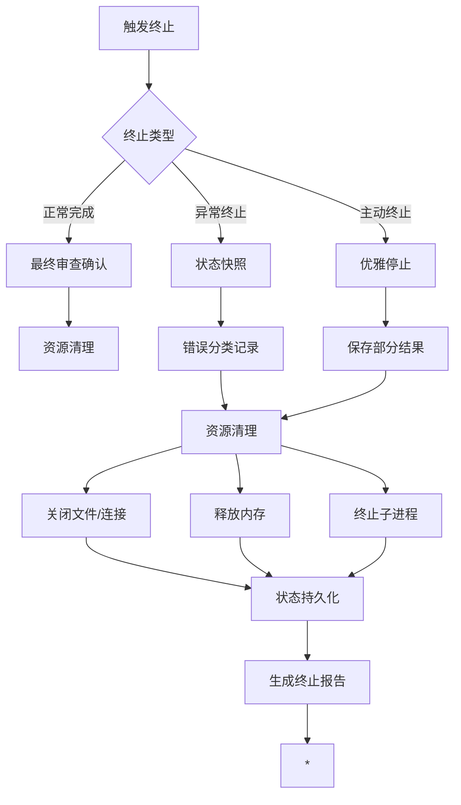
```mermaid
flowchart TD
    A[触发终止] --> B{终止类型}

    B -->|正常完成| C[最终审查确认]
    B -->|异常终止| D[状态快照]
    B -->|主动终止| E[优雅停止]

    C --> F[资源清理]
    D --> G[错误分类记录]
    E --> H[保存部分结果]

    G --> I[资源清理]
    H --> I

    I --> J[关闭文件/连接]
    I --> K[释放内存]
    I --> L[终止子进程]

    J --> M[状态持久化]
    K --> M
    L --> M

    M --> N[生成终止报告]
    N --> O[*]
```

### 5.3 资源清理清单

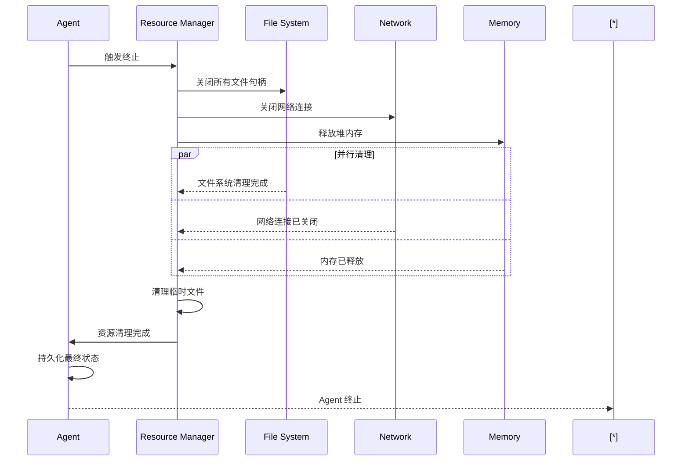
```mermaid
sequenceDiagram
    participant Agent as Agent
    participant ResMgr as Resource Manager
    participant FS as File System
    participant Net as Network
    participant Mem as Memory

    Agent->>ResMgr: 触发终止
    ResMgr->>FS: 关闭所有文件句柄
    ResMgr->>Net: 关闭网络连接
    ResMgr->>Mem: 释放堆内存

    par 并行清理
        FS-->>ResMgr: 文件系统清理完成
    and
        Net-->>ResMgr: 网络连接已关闭
    and
        Mem-->>ResMgr: 内存已释放
    end

    ResMgr->>ResMgr: 清理临时文件
    ResMgr->>Agent: 资源清理完成
    Agent->>Agent: 持久化最终状态
    Agent-->>[*]: Agent 终止
```

### 5.4 终止状态图

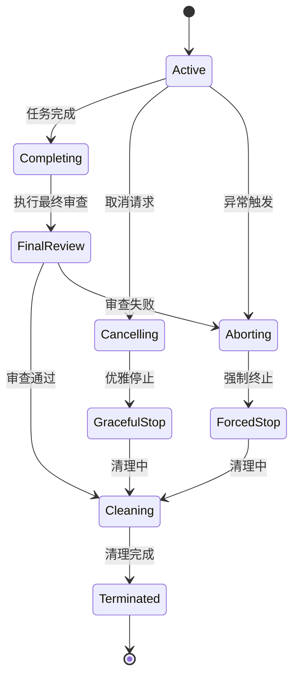
```mermaid
stateDiagram-v2
    [*] --> Active

    Active --> Completing: 任务完成
    Active --> Cancelling: 取消请求
    Active --> Aborting: 异常触发

    Completing --> FinalReview: 执行最终审查
    FinalReview --> Cleaning: 审查通过
    FinalReview --> Aborting: 审查失败

    Cancelling --> GracefulStop: 优雅停止
    Aborting --> ForcedStop: 强制终止

    GracefulStop --> Cleaning: 清理中
    ForcedStop --> Cleaning: 清理中

    Cleaning --> Terminated: 清理完成
    Terminated --> [*]
```

---

## 6. Agent Coordination（协作）

协作层贯穿 Agent 整个生命周期，支持多 Agent 调度、权限同步和消息传递。

### 6.1 协作架构

```mermaid
flowchart TB
    subgraph Main["Main Agent (协调者)"]
        Sched[任务调度器]
        Auth[权限管理器]
        Msg[消息中心]
    end

    subgraph Agents["子 Agent 群"]
        A1[Agent 1]
        A2[Agent 2]
        A3[Agent N]
    end

    Sched --> A1: 分配任务
    Sched --> A2: 分配任务
    Sched --> A3: 分配任务

    A1 --> Msg: 上报状态
    A2 --> Msg: 上报状态
    A3 --> Msg: 上报状态

    Msg --> Sched: 汇总反馈

    Auth --> Sched: 权限校验
    Auth --> A1: 同步权限
    Auth --> A2: 同步权限
    Auth --> A3: 同步权限

    A1 <--> A2: 消息传递
    A2 <--> A3: 消息传递
    A1 <--> A3: 消息传递
```

### 6.2 多 Agent 调度

多 Agent 调度采用 **主从模式**，Main Agent 负责任务分解和结果汇总：

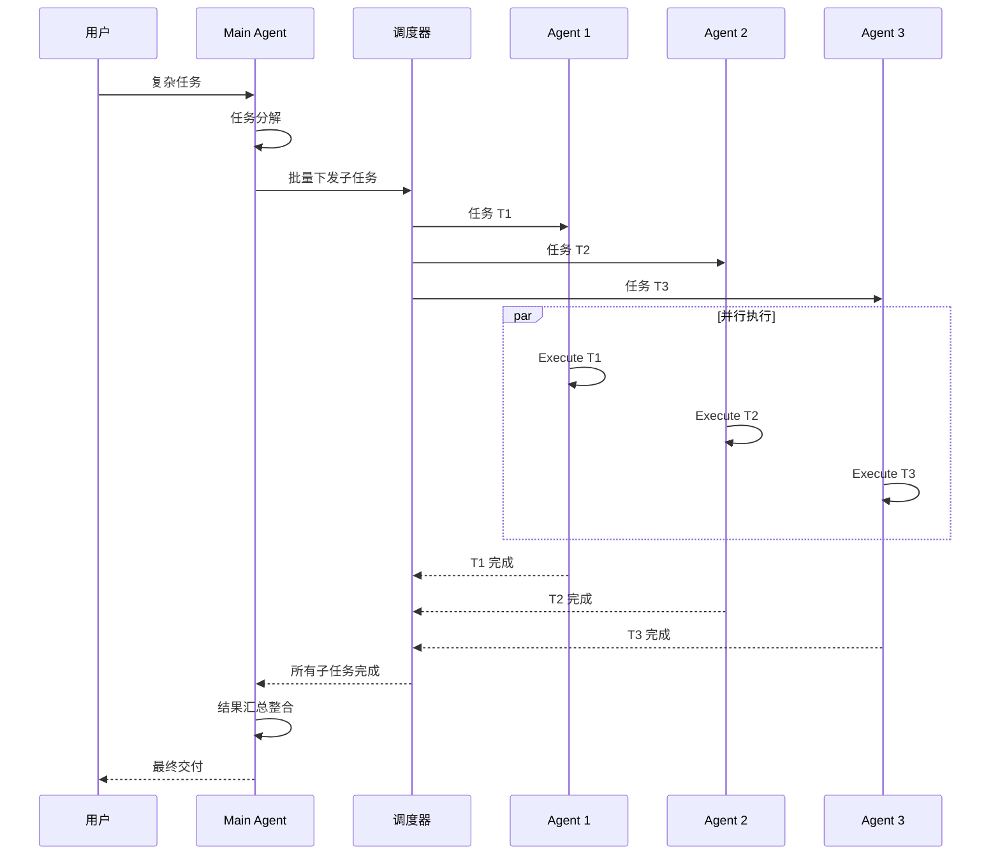
```mermaid
sequenceDiagram
    participant User as 用户
    participant Main as Main Agent
    participant Sched as 调度器
    participant A1 as Agent 1
    participant A2 as Agent 2
    participant A3 as Agent 3

    User->>Main: 复杂任务
    Main->>Main: 任务分解

    Main->>Sched: 批量下发子任务
    Sched->>A1: 任务 T1
    Sched->>A2: 任务 T2
    Sched->>A3: 任务 T3

    par 并行执行
        A1->>A1: Execute T1
        A2->>A2: Execute T2
        A3->>A3: Execute T3
    end

    A1-->>Sched: T1 完成
    A2-->>Sched: T2 完成
    A3-->>Sched: T3 完成

    Sched-->>Main: 所有子任务完成
    Main->>Main: 结果汇总整合
    Main-->>User: 最终交付
```

### 6.3 权限同步

权限管理确保子 Agent 只能访问授权范围内的资源：

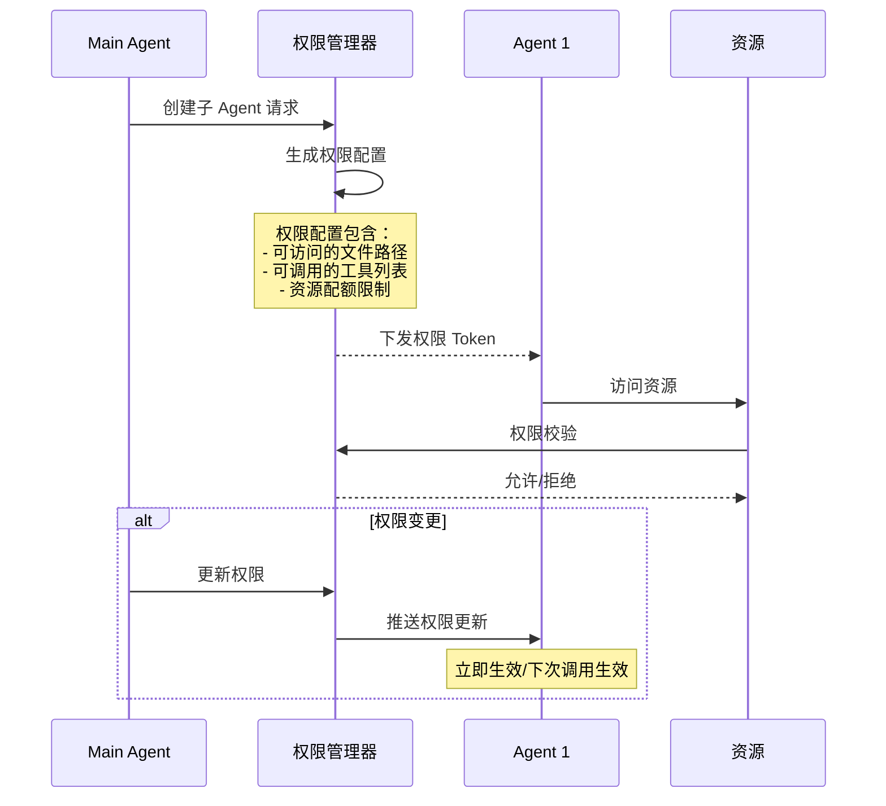
```mermaid
sequenceDiagram
    participant Main as Main Agent
    participant Auth as 权限管理器
    participant A1 as Agent 1
    participant Res as 资源

    Main->>Auth: 创建子 Agent 请求
    Auth->>Auth: 生成权限配置

    Note over Auth: 权限配置包含：<br/>- 可访问的文件路径<br/>- 可调用的工具列表<br/>- 资源配额限制

    Auth-->>A1: 下发权限 Token
    A1->>Res: 访问资源
    Res->>Auth: 权限校验
    Auth-->>Res: 允许/拒绝

    alt 权限变更
        Main->>Auth: 更新权限
        Auth->>A1: 推送权限更新
        Note over A1: 立即生效/下次调用生效
    end
```

### 6.4 消息传递机制

Agent 间消息传递支持同步和异步两种模式：

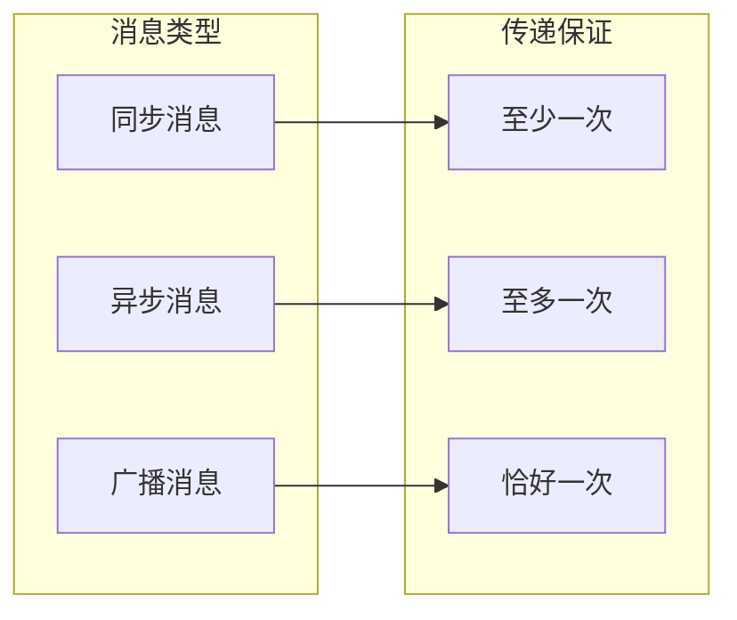
```mermaid
flowchart LR
    subgraph 消息类型
        Sync[同步消息]
        Async[异步消息]
        Broadcast[广播消息]
    end

    subgraph 传递保证
        AtLeast[至少一次]
        AtMost[至多一次]
        Exactly[恰好一次]
    end

    Sync --> AtLeast
    Async --> AtMost
    Broadcast --> Exactly
```

**消息格式规范：**

```
Message {
    from: Agent ID
    to: Agent ID | ALL
    type: REQUEST | RESPONSE | NOTIFICATION | ERROR
    payload: JSON
    correlation_id: UUID  // 消息关联追踪
    timestamp: ISO8601
    priority: HIGH | NORMAL | LOW
}
```

### 6.5 协作状态机

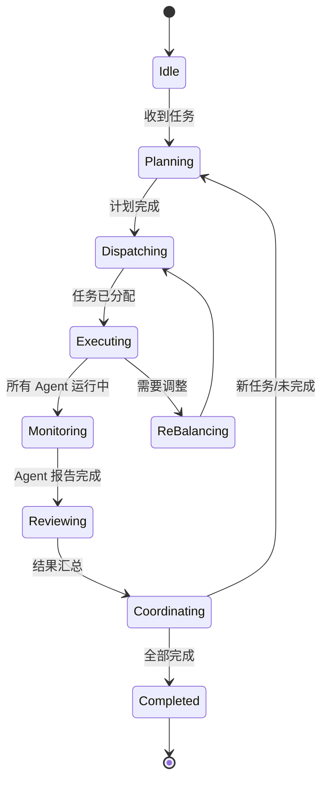
```mermaid
stateDiagram-v2
    [*] --> Idle

    Idle --> Planning: 收到任务
    Planning --> Dispatching: 计划完成
    Dispatching --> Executing: 任务已分配

    Executing --> Monitoring: 所有 Agent 运行中
    Monitoring --> Reviewing: Agent 报告完成
    Reviewing --> Coordinating: 结果汇总

    Coordinating --> Planning: 新任务/未完成
    Coordinating --> Completed: 全部完成

    Executing --> ReBalancing: 需要调整
    ReBalancing --> Dispatching

    Completed --> [*]
```

---

## 7. 断点续传设计（Checkpoint & Resume）

断点续传是长时任务的关键可靠性机制，通过将执行状态持久化到稳定存储，使得 Agent 进程意外中断后能够从上一次快照点恢复执行，而非从头开始。

### 7.1 为什么需要断点续传

| 场景 | 无断点续传 | 有断点续传 |
|------|------------|------------|
| 网络中断 | 任务完全失败，需从头重来 | 从上一个快照恢复 |
| 进程崩溃 | 上下文全部丢失 | 状态完整恢复 |
| 超时中断 | 已完成的工作全部丢失 | 已完成部分保留 |
| 资源抢占 | 被迫终止，无任何产出 | 保存检查点，可下次继续 |

### 7.2 Context 快照机制

#### 7.2.1 Token Context 序列化

Context 快照的核心是将 LLM 对话上下文（包括系统提示、历史消息、工具定义）转换为可持久化的二进制或文本格式：

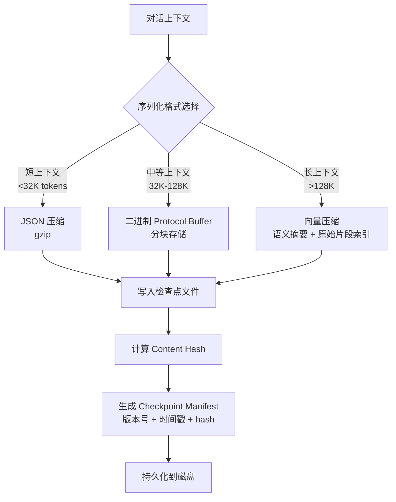
```mermaid
flowchart TD
    A[对话上下文] --> B{序列化格式选择}

    B -->|短上下文<br/>&lt;32K tokens| C[JSON 压缩<br/>gzip]
    B -->|中等上下文<br/>32K-128K| D[二进制 Protocol Buffer<br/>分块存储]
    B -->|长上下文<br/>>128K| E[向量压缩<br/>语义摘要 + 原始片段索引]

    C --> F[写入检查点文件]
    D --> F
    E --> F

    F --> G[计算 Content Hash]
    G --> H[生成 Checkpoint Manifest<br/>版本号 + 时间戳 + hash]
    H --> I[持久化到磁盘]
```

**序列化字段：**

```
CheckpointManifest {
    version: string          // 快照格式版本
    timestamp: ISO8601       // 快照时间
    content_hash: string     // 内容完整性校验
    model: string            // LLM 模型标识
    total_tokens: int        // 当前 token 总数
    messages: Message[]      // 对话历史
    tool_definitions: Tool[] // 当前工具定义
    system_prompt: string     // 系统提示（可选截断）
    metadata: JSON            // 附加元数据
}
```

#### 7.2.2 存储位置

| 存储后端 | 适用场景 | 优点 | 缺点 |
|----------|----------|------|------|
| **SQLite** | 单机、中等规模 | 轻量、事务保证、零配置 | 并发写入受限 |
| **向量库 (Qdrant/Pinecone)** | 超长上下文、语义检索 | 支持语义相似度查询 | 额外依赖 |
| **文件系统** | 临时检查点、快速恢复 | 简单直接 | 无查询能力 |
| **对象存储 (S3)** | 分布式、跨机器恢复 | 持久化、高可用 | 延迟较高 |

**SQLite 存储设计：**

```sql
CREATE TABLE checkpoints (
    id              TEXT PRIMARY KEY,    -- checkpoint UUID
    agent_id        TEXT NOT NULL,       -- 所属 Agent ID
    session_id      TEXT NOT NULL,       -- 会话 ID
    version         INTEGER NOT NULL,    -- 版本号（递增）
    created_at      DATETIME DEFAULT CURRENT_TIMESTAMP,

    -- 核心快照数据
    context_blob    BLOB NOT NULL,       -- 压缩后的上下文
    context_hash    TEXT NOT NULL,       -- SHA-256 校验
    token_count     INTEGER NOT NULL,

    -- 关联状态
    tool_stack      TEXT,                -- JSON: 工具调用栈
    execution_index INTEGER DEFAULT 0,  -- 已完成执行步骤索引
    pending_queue   TEXT,                -- JSON: 待执行任务队列

    -- 元数据
    metadata        JSON,
    parent_checkpoint_id TEXT            -- 上一个检查点（链式）
);

CREATE INDEX idx_agent_session ON checkpoints(agent_id, session_id);
CREATE INDEX idx_created ON checkpoints(created_at);
```

#### 7.2.3 快照触发条件

```mermaid
flowchart TD
    A[执行循环] --> B{触发条件检测}

    B -->|T1: 固定间隔| C[每 N 个执行步骤]
    C --> D[创建快照]
    B -->|T2: 关键节点| E[工具调用前/后]
    E --> D
    B -->|T3: 资源阈值| F[Token 接近上限<br/>内存使用过高]
    F --> D
    B -->|T4: 外部信号| G[用户主动保存<br/>调度器暂停]
    G --> D

    D --> E2[序列化 Context]
    E2 --> F2[写入存储]
    F2 --> G2[生成 Manifest]
    G2 --> H[快照完成]

    B -->|无触发| I[继续执行]
```

| 触发类型 | 条件 | 理由 |
|----------|------|------|
| **步骤间隔** | 每 5-20 个工具调用 | 平衡恢复粒度与存储开销 |
| **Token 阈值** | context 达到模型上限的 80% | 防止上下文溢出，必须压缩或快照 |
| **关键操作前** | 执行文件写入、网络请求前 | 确保关键操作的原子性 |
| **用户主动** | 用户发送中断/保存信号 | 立即响应用户意图 |
| **异常检测** | 连续错误次数达到阈值 | 保留失败前的完整状态供分析 |

### 7.3 执行堆栈持久化

#### 7.3.1 工具调用链状态保存

Agent 的执行堆栈包含多个层次的运行时状态：

```mermaid
flowchart LR
    subgraph Stack["执行堆栈"]
        direction TB
        L1[外层 Agent<br/>会话级状态]
        L2[中层 任务分解器<br/>子任务队列]
        L3[内层 工具调用<br/>函数调用栈]
        L4[最内 工具内部状态<br/>临时变量]
    end

    L1 --> L2
    L2 --> L3
    L3 --> L4
```

**堆栈持久化结构：**

```
ExecutionStack {
    depth: int                    // 调用深度
    frames: Frame[]               // 调用帧数组

    Frame {
        frame_id: UUID
        agent_id: string          // 对应 Agent
        task_description: string   // 当前任务描述
        pending_tools: ToolCall[] // 待执行工具队列
        completed_tools: ToolCall[]// 已完成工具记录

        local_vars: JSON          // 局部变量快照
        call_history: CallRecord[]// 调用历史

        checkpoint_ref: string    // 关联的 Context 快照 ID
    }
}
```

#### 7.3.2 重启后恢复流程

```mermaid
sequenceDiagram
    participant Agent as Agent进程
    participant Checkpoint as Checkpoint Manager
    participant Storage as 持久化存储
    participant LLM as LLM Engine

    Note over Agent: 进程启动 / 中断恢复
    Agent->>Checkpoint: 请求恢复
    Checkpoint->>Storage: 查询最新有效检查点

    Storage-->>Checkpoint: 返回 Checkpoint Manifest
    Checkpoint->>Checkpoint: 校验 hash 完整性

    alt 检查点有效
        Checkpoint->>Storage: 读取 context_blob
        Storage-->>Checkpoint: 返回压缩上下文
        Checkpoint->>Checkpoint: 解压缩反序列化

        Checkpoint->>Agent: 恢复 ExecutionStack
        Agent->>Agent: 重建运行时状态

        Checkpoint->>Agent: 恢复 pending_tools 队列
        Agent->>Agent: 重置任务游标

        Note over Agent: 从上一次工具调用点继续执行
        Agent->>LLM: 发送恢复提示词
        LLM-->>Agent: 确认恢复上下文

        Agent->>Agent: 继续执行 pending_tools
    else 检查点损坏 / 不存在
        Checkpoint-->>Agent: 恢复失败
        Note over Agent: 回退到任务起点或提示用户
    end
```

### 7.4 断点续传流程图

```mermaid
flowchart TD
    A[Agent 启动] --> B{存在有效检查点?}

    B -->|是| C[加载最新检查点]
    B -->|否| D[从头开始新会话]

    C --> E[校验快照完整性]
    E -->|有效| F[恢复 Context + Stack]
    E -->|损坏| G[提示用户<br/>选择重试或放弃]

    F --> H[重建执行状态]
    H --> I[获取 pending_tools 队列]
    I --> J[继续执行下一个工具]

    D --> K[初始化新上下文]
    K --> L[开始正常执行]

    J --> L

    L --> M{执行中}

    M -->|每 N 步| N[创建快照]
    M -->|Token 接近上限| N
    M -->|关键操作前| N
    M -->|用户中断| N

    N --> O[序列化 Context]
    O --> P[持久化到存储]
    P --> Q[更新 Manifest]

    M -->|正常完成| R[标记会话完成<br/>删除旧检查点]
    M -->|致命错误| S[保存最终状态<br/>记录错误日志]

    Q --> L
    R --> [*]
    S --> [*]
```

### 7.5 状态机持久化图

```mermaid
stateDiagram-v2
    [*] --> Active

    Active --> Checkpointing: 触发快照
    Checkpointing --> Active: 快照完成

    Active --> Paused: 暂停信号
    Paused --> Restoring: 恢复信号
    Restoring --> Active: 状态恢复完成

    Active --> Running: 正常执行
    Running --> Checkpointing: 快照触发

    Running --> WaitingTool: 等待工具返回
    WaitingTool --> Running: 工具返回

    Running --> Success: 任务完成
    Running --> Failed: 不可恢复错误

    Active --> Crashed: 进程异常终止
    Crashed --> Restoring: 重启后恢复

    Paused --> Crashed: 意外中断
    WaitingTool --> Crashed: 超时/崩溃

    Success --> [*]
    Failed --> [*]

    note right of Checkpointing
        持久化：
        - Context → SQLite
        - Stack → Checkpoint
        - Manifest → 存储
    end note

    note right of Restoring
        恢复：
        - 读取快照
        - 校验 hash
        - 反序列化
        - 重置游标
    end note
```

### 7.6 与 Claude Code 架构对比

#### 7.6.1 mini-claude-code 的简化实现

mini-claude-code 作为教学性质的简化实现，断点续传采用极简方案：

```mermaid
flowchart TD
    subgraph mini["mini-claude-code 断点设计"]
        A[单 JSON 文件<br/>checkpoint.json] --> B[每次工具调用后覆盖写入]
        B --> C[存储内容：<br/>messages + pending + step_count]
        C --> D[无版本管理<br/>无压缩<br/>无 hash 校验]
    end
```

**简化实现代码结构：**

```javascript
// mini-claude-code 断点续传（伪代码）
class CheckpointManager {
    save(agentState) {
        const checkpoint = {
            messages: agentState.messages,
            pending: agentState.pendingTools,
            step: agentState.currentStep,
            timestamp: Date.now()
        };
        fs.writeFileSync('checkpoint.json', JSON.stringify(checkpoint));
    }

    load() {
        if (!fs.existsSync('checkpoint.json')) return null;
        return JSON.parse(fs.readFileSync('checkpoint.json', 'utf8'));
    }
}
```

**简化代价：**
- 无并发安全（覆盖写）
- 无完整性校验（损坏不自知）
- 无增量快照（每次全量）
- 无跨会话恢复（只能恢复同一进程）

#### 7.6.2 真实 Claude Code 的设计推测

基于 Claude Code 的实际表现和行业最佳实践，真实实现应具备以下特性：

| 维度 | mini 简化版 | 真实 Claude Code（推测） |
|------|-------------|--------------------------|
| **存储后端** | 单文件 JSON | SQLite + 文件系统混合 |
| **快照策略** | 每次调用后全量写 | 增量 + 定期全量 + 关键节点 |
| **完整性校验** | 无 | SHA-256 / BLAKE3 hash |
| **版本管理** | 无 | 链式检查点 + GC 清理 |
| **压缩** | 无 | LZ4 / zstd 压缩 |
| **并发安全** | 无 | 事务锁 / Write-Ahead Log |
| **恢复确认** | 直接加载 | LLM 确认恢复上下文正确 |
| **容灾** | 仅本地 | 可选云端同步（S3） |

**推测的 Claude Code 断点架构：**

```mermaid
flowchart TB
    subgraph Storage["持久化层"]
        WAL[Write-Ahead Log<br/>append-only]
        Snap[Snapshot Store<br/>分块压缩]
        Meta[Metadata DB<br/>SQLite]
    end

    subgraph Core["Checkpoint Engine"]
        S1[快照触发器]
        S2[差异计算器]
        S3[压缩器]
        S4[完整性校验器]
    end

    subgraph Recovery["恢复引擎"]
        R1[检查点选择器]
        R2[校验器]
        R3[状态重建器]
    end

    S1 --> S2
    S2 --> S3
    S3 --> S4
    S4 --> WAL
    S4 --> Snap
    S4 --> Meta

    R1 --> R2
    R2 --> R3

    Meta --> R1
    Snap --> R2
```

---

## 附录：完整生命周期时序图

```mermaid
sequenceDiagram
    participant User as 用户
    participant Main as Main Agent
    participant Sched as 调度器
    participant Agent as Sub Agent
    participant Review as 审查模块
    participant Fix as 修复模块
    participant ResMgr as 资源管理

    User->>Main: 提交任务
    Main->>Sched: 任务分解

    Sched->>Agent: Spawn Agent (mode)

    loop Execute Phase
        Agent->>Agent: 任务执行
        Agent->>Sched: 状态心跳
        Sched-->>Agent: 监控反馈
    end

    Agent->>Review: 提交结果审查
    Review->>Review: 验证 + 质量检查

    alt 审查通过
        Review-->>Agent: 审查通过
    else 审查失败
        Review->>Fix: 请求修复
        loop Fix Loop
            Fix->>Agent: 修复指令
            Agent->>Agent: 重新执行
            Agent->>Review: 重新提交
        end
        Review-->>Agent: 审查通过
    end

    Agent->>ResMgr: 资源清理
    ResMgr->>Agent: 清理完成
    Agent->>Main: 任务完成报告

    Main-->>User: 最终交付
```

---

## 生命周期状态总览

```mermaid
stateDiagram-v2
    [*] --> Spawning

    Spawning --> Ready: 初始化完成
    Ready --> Executing: 接受任务

    Executing --> Reviewing: 执行完成
    Reviewing --> Executing: 审查失败<br/>进入修复

    Executing --> Waiting: 等待资源
    Waiting --> Executing: 资源就绪

    Reviewing --> Success: 审查通过

    Executing --> Retrying: 可重试错误
    Retrying --> Executing: 重试执行

    Executing --> Failed: 致命错误
    Success --> Terminating: 正常终止
    Failed --> Terminating: 异常终止

    Terminating --> [*]: 清理完成
```
