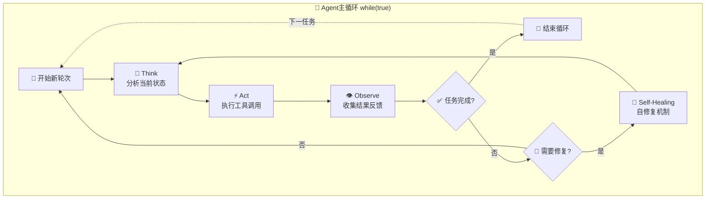
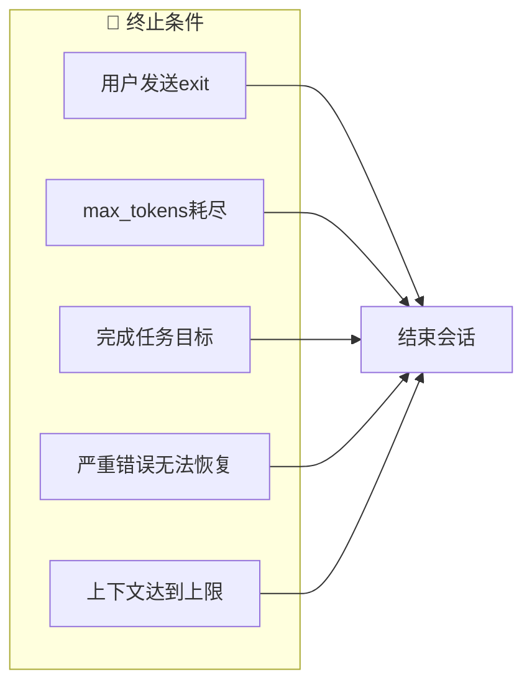
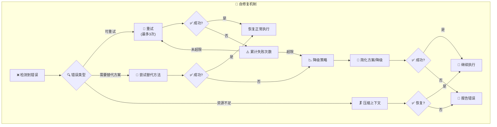
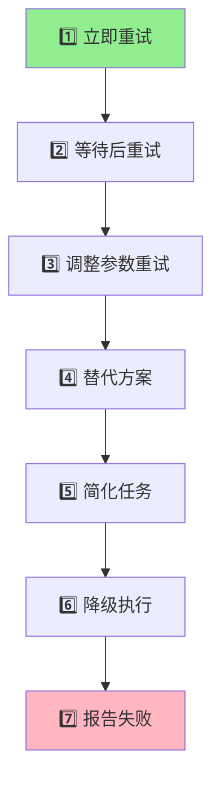
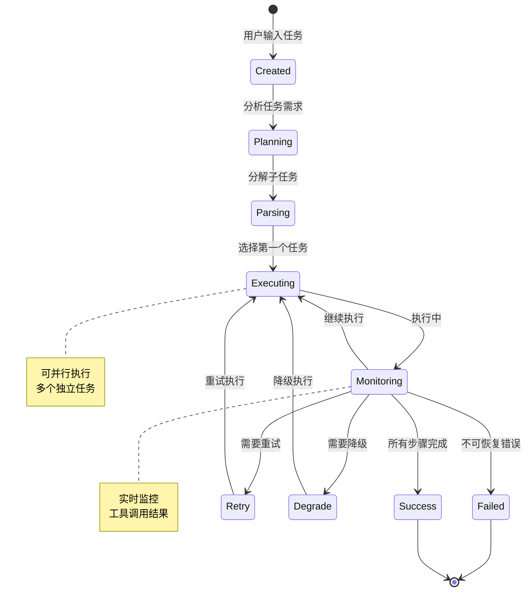
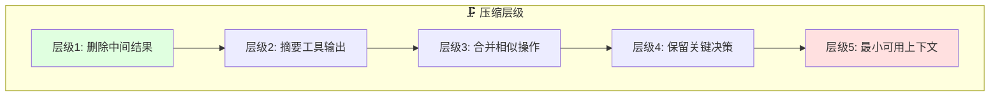
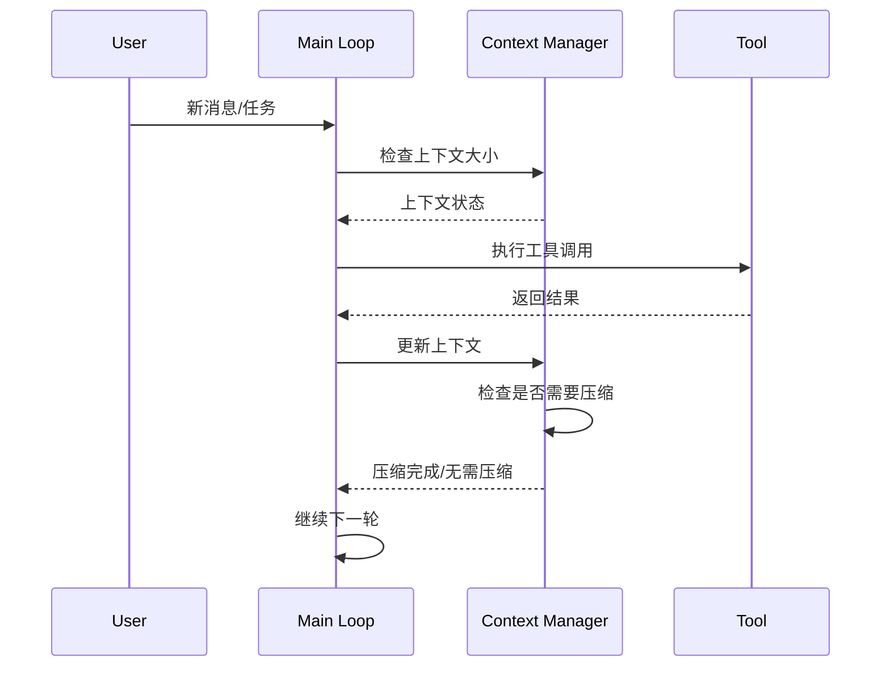
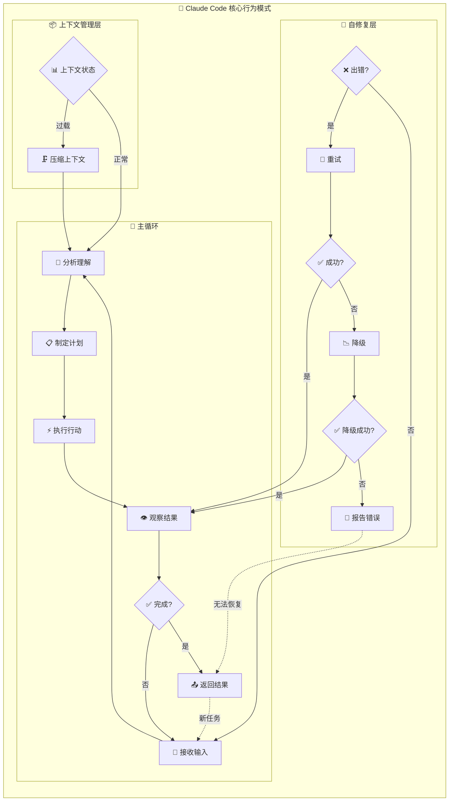
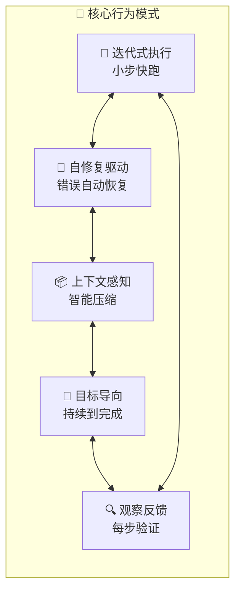

# Claude Code 系统行为总结

> 本章总结Claude Code的整体行为模式和核心机制

---

## 1. Agent Loop（Agent主循环）

Claude Code的核心是运行在一个持续的while循环中，不断地思考、行动、观察。



### 1.1 循环核心三阶段

| 阶段 | 功能 | 关键行为 |
|------|------|----------|
| **Think** | 分析当前上下文 | 理解任务、规划下一步、检查已有信息 |
| **Act** | 执行工具调用 | Read/Write/Exec等操作 |
| **Observe** | 观察执行结果 | 解析输出、检测错误、更新状态 |

### 1.2 循环终止条件



---

## 2. Self-Healing Mechanism（自修复机制）

当执行过程中遇到错误时，Claude Code会启动自修复机制。



### 2.1 自修复策略层级



### 2.2 常见错误与修复

| 错误类型 | 修复策略 | 示例 |
|----------|----------|------|
| 网络超时 | 重试+等待 | API调用失败后等1秒重试 |
| 文件不存在 | 替代路径/创建 | 尝试./src或创建文件 |
| 权限不足 | 提升权限/更改路径 | sudo或切换目录 |
| 上下文溢出 | 压缩/摘要 | 压缩历史消息 |
| 命令失败 | 检查命令/替代 | `rm`失败用`trash` |

---

## 3. Task Lifecycle（任务生命周期）

每个任务从创建到完成经历完整的生命周期。



### 3.1 任务状态流转

```mermaid
flowchart LR
    subgraph States["📊 任务状态"]
        P["⏳ Pending<br/>待处理"]
        R["🏃 Running<br/>执行中"]
        W["⏸️ Waiting<br/>等待中"]
        S["✅ Success<br/>成功"]
        F["❌ Failed<br/>失败"]
        D["📉 Degraded<br/>降级完成"]
    end
    
    P --> R
    R --> W
    W --> R
    R --> S
    R --> F
    F --> R: "重试"
    R --> D: "降级"
    D --> S
    S --> [*]
    F --> [*]
    D --> [*]
```

### 3.2 任务检查点

| 检查点 | 内容 | 失败处理 |
|--------|------|----------|
| Intent | 确认理解用户意图 | 请求澄清 |
| Plan | 验证执行计划 | 调整方案 |
| Execute | 工具调用成功 | 自修复 |
| Verify | 结果符合预期 | 重试/降级 |
| Complete | 任务真正完成 | 报告状态 |

---

## 4. Context Management Loop（上下文管理循环）

Claude Code持续监控和管理对话上下文，以避免溢出。

```mermaid
flowchart TD
    subgraph Context_Loop["📦 上下文管理循环"]
        C1["📊 监控上下文大小"] --> C2{"⚖️ 负载状态"}
        
        C2 -->|正常<br/>&lt;80%"| C3["✅ 继续使用"]
        C2 -->|警告<br/>80-95%"| C4["⚠️ 触发压缩"]
        C2 -->|危险<br/>>95%"| C5["🚨 强制压缩"]
        
        C4 --> C6["🗜️ 上下文压缩"]
        C5 --> C6
        
        C6 --> C7{"📝 压缩效果"}
        C7 -->|不足| C6
        C7 -->|足够| C8["🔄 恢复正常"]
        
        C3 --> C9{"需要恢复?"}
        C9 -->|是| C10["📜 恢复历史"]
        C10 --> C1
        C9 -->|否| C1
        C8 --> C1
    end
```

### 4.1 压缩策略



### 4.2 上下文更新流程



---

## 5. 整体行为总结

Claude Code的核心行为模式可以总结为一个完整的while循环系统。



### 5.1 核心行为模式一览



### 5.2 行为原则总结

| 原则 | 描述 | 实现方式 |
|------|------|----------|
| **持续运行** | while(true)不间断 | 循环直到任务完成或显式退出 |
| **自我修复** | 出错自动恢复 | 重试→降级→报告 三层策略 |
| **上下文管理** | 避免上下文溢出 | 监控→压缩→恢复 自动管理 |
| **目标导向** | 持续朝目标前进 | 每步检查进度，适时调整 |
| **观察反馈** | 每步验证结果 | tool输出立即观察分析 |

---

## 总结

Claude Code的行为模式可以用一句话概括：

> **"持续思考-执行-观察的循环，结合自修复和上下文管理，直到任务完成。"**

这种设计使得Claude Code能够：
- ✅ 处理复杂的长时任务
- ✅ 自动从错误中恢复
- ✅ 高效管理有限上下文
- ✅ 灵活应对各种执行环境
