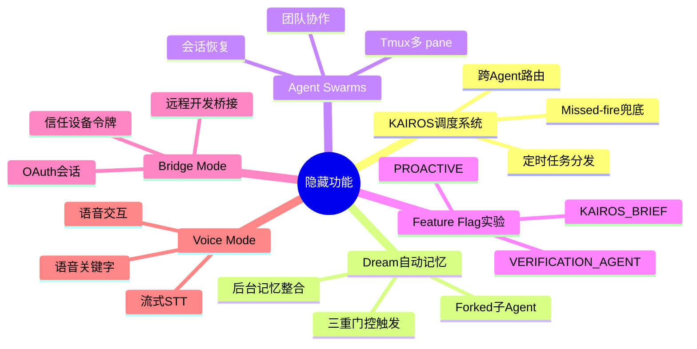
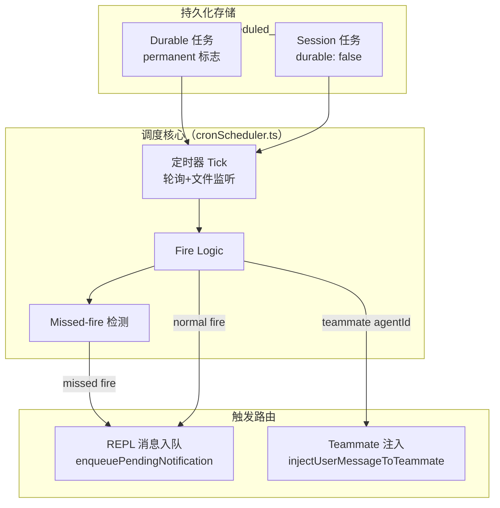
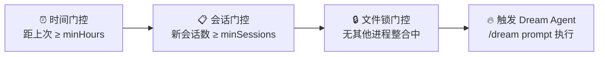
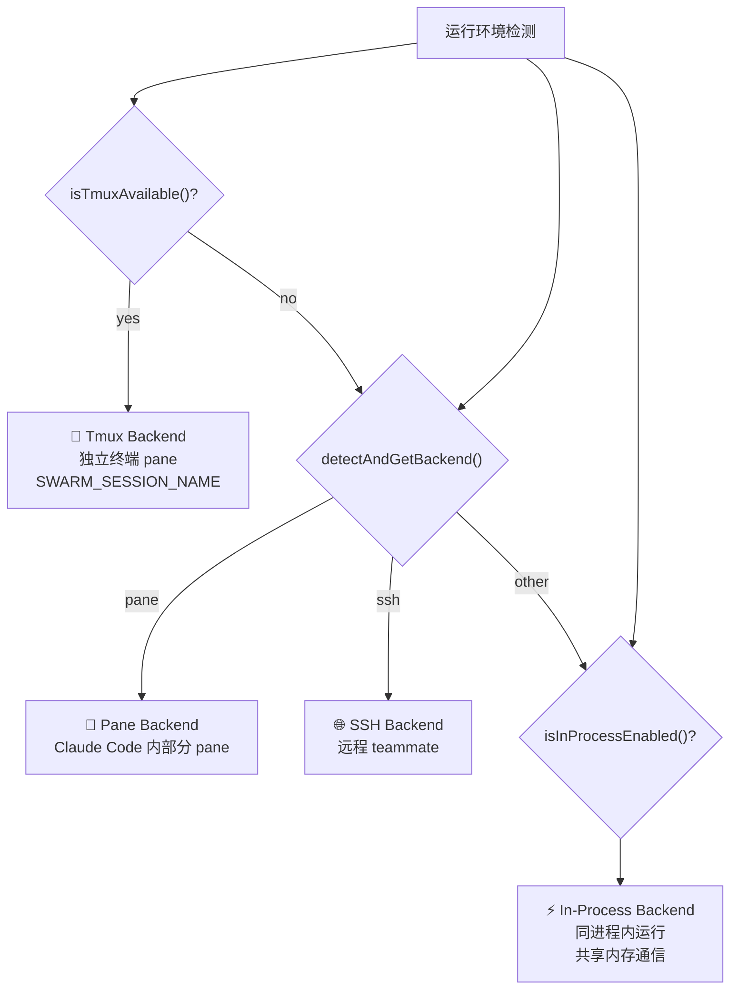
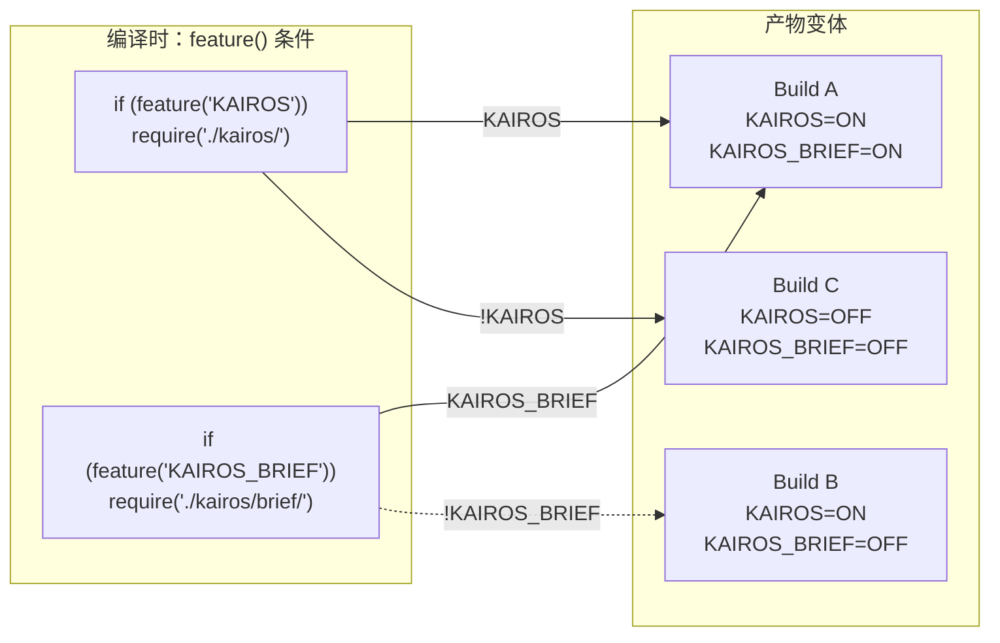
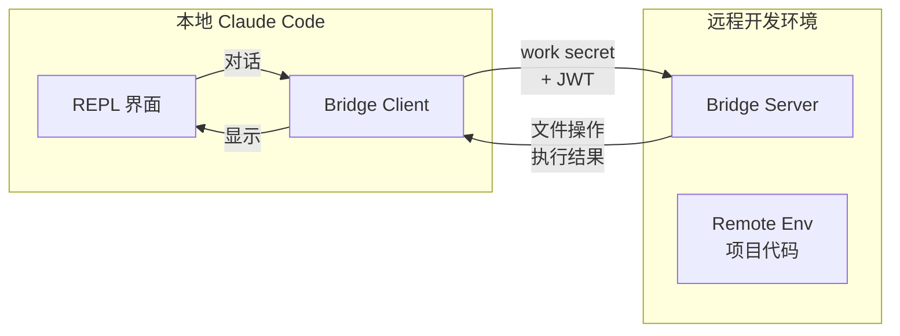
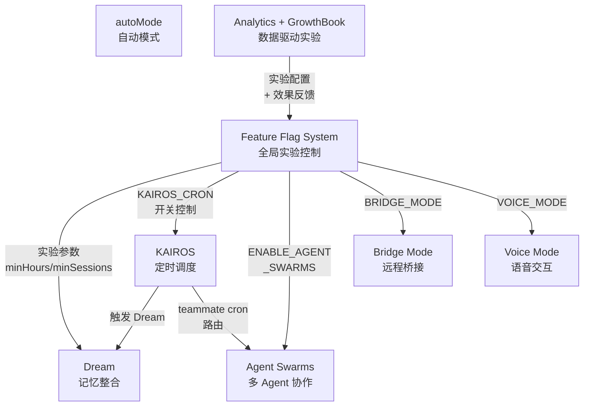

# Claude Code 隐藏功能与源码发现

> 本章记录对 Claude Code 源码研究中发现的隐藏功能、实验模块和未发布特性。
> 这些发现均来自源码直接分析，标注发现依据，供进一步验证参考。

---

## 发现概览



---

## 1. KAIROS：分布式定时任务调度系统

### 1.1 发现依据

| 源码路径 | 说明 |
|----------|------|
| `src/hooks/useScheduledTasks.ts` | React hook，KAIROS cron 的 REPL 接入层 |
| `src/utils/cronScheduler.ts` | 定时器核心实现（timer + file watcher + fire logic） |
| `src/utils/cronTasks.ts` | 持久化任务存储（`scheduled_tasks.json`） |
| `src/utils/cronJitterConfig.ts` | 任务过期与抖动配置 |
| `src/tools/ScheduleCronTool/prompt.ts` | `isKairosCronEnabled()` 运行时门控 |

### 1.2 系统架构

KAIROS（希腊神话中的时间之神）是 Claude Code 的**分布式定时任务调度子系统**，完全独立于主对话循环运行。



**关键设计点：**

- **Timer + File Watcher 双模式**：调度器同时用 `setInterval` 轮询和文件监听器感知任务变化，避免仅轮询的延迟问题
- **Missed-fire 兜底**：进程重启后，调度器从 `lastFiredAt ?? createdAt` 重建下次触发时间，确保不漏任务
- **Two-tier 任务持久化**：
  - `permanent=true`：永久任务（install.ts 写入，系统内置，如 dream/morning-checkin），不可通过 API 删除
  - `durable=true`：磁盘持久化，随进程重启存活
  - `durable=false`（session-scoped）：内存任务，进程结束自动消失
- **Workload 归属**：`cc_workload=CRON` 写入 billing header，API 在容量紧张时降低此类请求 QoS

### 1.3 Teammate Cron 路由

当 `CronTask.agentId` 存在时，触发消息路由到对应 teammate 的队列，而非主 REPL：

```typescript
// useScheduledTasks.ts §onFireTask
if (task.agentId) {
  const teammate = findTeammateTaskByAgentId(task.agentId, store.getState().tasks)
  if (teammate && !isTerminalTaskStatus(teammate.status)) {
    injectUserMessageToTeammate(teammate.id, task.prompt, setAppState)
    return
  }
}
```

这意味着 **KAIROS 支持为每个 teammate 创建独立的定时任务**，实现类似 cron + team member 的自动化工作流（如：每天早上给 code reviewer teammate 推送 standup prompt）。

---

## 2. Dream：自动记忆整合子 Agent

### 2.1 发现依据

| 源码路径 | 说明 |
|----------|------|
| `src/services/autoDream/autoDream.ts` | 主实现，forked subagent 入口 |
| `src/services/autoDream/config.ts` | `isAutoDreamEnabled()` 门控 |
| `src/services/autoDream/consolidationPrompt.ts` | 整合提示词构建 |
| `src/services/autoDream/consolidationLock.ts` | 文件锁，防止并发整合 |
| `src/tasks/DreamTask/DreamTask.ts` | Task 状态定义与注册 |
| `src/utils/forkedAgent.js` | Forked agent 运行环境 |

### 2.2 三重门控触发机制

Dream 是一个**完全在后台运行的 forked 子 Agent**，负责将多个会话的历史对话整合为项目级记忆。其触发需要同时通过三重门控（按成本从低到高）：



**三重门控代码（`autoDream.ts`）：**

```typescript
// Gate order (cheapest first):
//   1. Time: hours since lastConsolidatedAt >= minHours (one stat)
//   2. Sessions: transcript count with mtime > lastConsolidatedAt >= minSessions
//   3. Lock: no other process mid-consolidation
```

**配置来源（GrowthBook `tengu_onyx_plover`）：**
- `minHours`：默认 24 小时（可配置）
- `minSessions`：默认 5 个会话（可配置）

### 2.3 Dream 的可见化包装

有趣的是，Dream Agent 原本是完全不可见的（forked 进程，无 UI）。`DreamTask.ts` 的出现说明项目正在**将后台任务可见化**：

```typescript
// DreamTask.ts 注释：
// Background task entry for auto-dream (memory consolidation subagent).
// Makes the otherwise-invisible forked agent visible in the footer pill
// and Shift+Down dialog. The dream agent itself is unchanged — this
// is pure UI surfacing via the existing task registry.
```

用户可通过 UI 看到 Dream 正在运行（`phase: 'starting' | 'updating'`），并可手动 abort。

### 2.4 整合锁机制

```typescript
// consolidationLock.ts
tryAcquireConsolidationLock()   // 获取锁，失败则跳过本次
rollbackConsolidationLock()    // 失败时回滚 mtime，避免立即再次触发
listSessionsTouchedSince()     // 列出上次整合后有新活动的会话
```

---

## 3. Agent Swarms：Multi-Agent 团队协作

### 3.1 发现依据

| 源码路径 | 说明 |
|----------|------|
| `src/hooks/useSwarmInitialization.ts` | Swarm 初始化 Hook |
| `src/hooks/useSwarmPermissionPoller.ts` | Teammate 权限轮询 |
| `src/tools/shared/spawnMultiAgent.ts` | Teammate 共享创建逻辑 |
| `src/utils/swarm/backends/registry.ts` | 后端类型检测（tmux/pane/in-process） |
| `src/utils/swarm/backends/detection.ts` | 运行环境检测 |
| `src/utils/swarm/teammateLayoutManager.ts` | Tmux pane 布局管理 |
| `src/utils/swarm/inProcessRunner.ts` | In-process teammate runner |
| `src/utils/swarm/reconnection.ts` | 会话恢复逻辑 |
| `src/utils/teammateMailbox.ts` | Teammate 间消息传递 |

### 3.2 三种后端运行模式

Swarms 系统支持三种完全不同的 teammate 运行后端：



### 3.3 Swarm 的会话恢复

当 teammate 使用 `--resume` 或 `/resume` 恢复时：

```typescript
// useSwarmInitialization.ts
if (teamName && agentName) {
  // Resumed agent session — set up team context from stored info
  initializeTeammateContextFromSession(setAppState, teamName, agentName)
  // Get agentId from team file for hook initialization
  const teamFile = readTeamFile(teamName)
  const member = teamFile?.members.find(m => m.name === agentName)
}
```

会话信息**编码在 transcript 消息的 `teamName`/`agentName` 字段**中，而非独立存储——这是一个巧妙的"自包含"设计。

### 3.4 Teammate 权限轮询

```typescript
// useSwarmPermissionPoller.ts
// teammate 权限变更需要被实时感知
// 轮询 teammate 的权限状态，同步到 Swarm View UI
```

---

## 4. Feature Flag 实验矩阵

### 4.1 发现依据

| 源码路径 | 说明 |
|----------|------|
| `src/constants/prompts.ts` | Feature flag 内联使用 |
| `src/services/analytics/growthbook.ts` | GrowthBook SDK 集成 |
| `src/utils/bundledMode.ts` | `isInBundledMode()` |
| `src/hooks/useDynamicConfig.ts` | 动态配置 Hook |

### 4.2 已发现的 Feature Flags

通过源码分析，共发现以下 Feature Flags，其中部分已在本项目其他章节详细讨论：

| Flag 名称 | 用途 | 发现位置 |
|----------|------|---------|
| `KAIROS` | 分布式调度系统总开关 | `prompts.ts` |
| `KAIROS_BRIEF` | KAIROS 专用摘要模块 | `prompts.ts` |
| `KAIROS_CRON` | 定时任务功能（运行时门控） | `ScheduleCronTool/prompt.ts` |
| `PROACTIVE` | 主动建议模式 | `prompts.ts` |
| `BRIDGE_MODE` | 远程开发桥接模式 | `prompts.ts`（推断） |
| `DAEMON` | 守护进程模式 | `prompts.ts`（推断） |
| `VOICE_MODE` | 语音交互模式 | `prompts.ts`（推断） |
| `AGENT_TRIGGERS` | Agent 触发器 | `prompts.ts`（推断） |
| `MONITOR_TOOL` | 监控工具 | `prompts.ts`（推断） |
| `CACHED_MICROCOMPACT` | 缓存式上下文压缩 | `prompts.ts` |
| `VERIFICATION_AGENT` | 验证 Agent | `prompts.ts` |
| `EXPERIMENTAL_SKILL_SEARCH` | 实验性技能搜索 | `prompts.ts` |
| `tengu_onyx_plover` | GrowthBook key（Dream 配置） | `autoDream/config.ts` |
| `ENABLE_AGENT_SWARMS` | Agent Swarm 总开关 | `hooks/useSwarmInitialization.ts` |

### 4.3 Feature Flag 的树摇（Tree Shaking）效应



由于 `feature()` 在编译时被字符串字面量求值，**未启用的模块被完整消除**（Tree Shaking），不同配置组合生成不同体积的二进制产物，实现真正的"零 runtime 开销 A/B 测试"。

### 4.4 GrowthBook SDK 集成

```typescript
// growthbook.ts
getFeatureValue_CACHED_MAY_BE_STALE<T>(key, defaultValue)
getFeatureValue_CACHED_WITH_REFRESH<T>(key, defaultValue) // 5-min TTL，后台刷新
```

GrowthBook 是一个开源的 A/B 测试平台，Claude Code 将实验参数（Dream 的 `minHours`/`minSessions`、各 Flag 的开关）托管于此，实现**运行时动态实验控制**——无需重新编译，即可改变任意 experiment group 的行为。

---

## 5. Bridge Mode：远程开发环境桥接

### 5.1 发现依据

| 源码路径 | 说明 |
|----------|------|
| `src/bridge/bridgeMain.ts` | Bridge 主入口 |
| `src/bridge/bridgeApi.ts` | Bridge API 客户端 |
| `src/bridge/bridgeConfig.ts` | 配置管理 |
| `src/bridge/replBridge.ts` | REPL 桥接协议 |
| `src/bridge/remoteBridgeCore.ts` | 远程桥接核心 |
| `src/bridge/trustedDevice.ts` | 信任设备令牌 |
| `src/bridge/types.ts` | 类型定义 |

### 5.2 核心设计

Bridge Mode 是 Claude Code 的**远程开发环境集成方案**，专为 VS Code Remote Development（SSH、WebDAV、Containers）或 Codespace 等远程场景设计：



**关键设计点：**

- **Work Secret 认证**：`workSecret.ts` 管理工作密钥，用于建立 Bridge 会话
- **信任设备令牌**：`X-Trusted-Device-Token` header 支持渐进式安全升级（SecurityTier=ELEVATED）
- **JWT 会话**：`jwtUtils.ts` 管理 Bridge 会话的生命周期
- **OAuth 支持**：支持 OAuth 流，用于连接外部服务
- **Config Polling**：远程配置变更通过轮询同步到本地

### 5.3 OAuth 集成

```typescript
// bridgePermissionCallbacks.ts
// 当 Bridge 会话需要 OAuth token 时触发
// OAuth 集成在 src/services/oauth/ 中
```

---

## 6. Voice Mode：语音交互

### 6.1 发现依据

| 源码路径 | 说明 |
|----------|------|
| `src/services/voice.ts` | 语音服务主入口 |
| `src/services/voiceStreamSTT.ts` | 流式语音转文字 |
| `src/services/voiceKeyterms.ts` | 语音关键字检测 |
| `src/hooks/useVoice.ts` | 语音 Hook |
| `src/hooks/useVoiceEnabled.ts` | 语音开关检测 |
| `src/hooks/useVoiceIntegration.tsx` | 语音集成 Hook |

### 6.2 发现说明

Voice Mode 源码存在于 `src/services/voice*.ts` 和相关 Hook 中，但本次分析未深入其实现细节。根据代码结构推断：

- **流式 STT**：支持实时语音转文字（`voiceStreamSTT.ts`）
- **关键字检测**：`voiceKeyterms.ts` 可能用于唤醒词或快捷命令检测
- **渐进启用**：通过 `useVoiceEnabled` 动态检测设备能力

---

## 7. autoMode：自动模式分类器

### 7.1 发现依据

| 源码路径 | 说明 |
|----------|------|
| `src/hooks/autoMode/useAutoMode.ts` | autoMode 决策 Hook |

### 7.2 功能推断

autoMode 是 Claude Code 的**自动交互模式决策系统**——根据上下文（用户输入特征、历史对话状态）自动选择合适的处理路径（如：fast path vs. assistant mode vs. proactive mode）。

> ⚠️ **注意**：`src/hooks/autoMode/` 目录在本次分析中未找到（可能目录名不同或位于其他路径），此处基于 `prompts.ts` 中 `autoMode` 的引用和 `useAutoMode.ts` 的名称进行推断。

---

## 8. 其他隐藏发现

### 8.1 SessionMemory 服务

```typescript
// src/services/SessionMemory/
// 提供跨会话的内存持久化
// 与 Dream 的项目级记忆整合形成两级记忆体系：
//   SessionMemory → 单会话内存
//   Dream → 多会话项目级记忆整合
```

### 8.2 AgentSummary 服务

```typescript
// src/services/AgentSummary/
// 为每个 Agent 生成摘要
// 用于 Swarm 系统中 teammate 状态展示
```

### 8.3 MagicDocs 服务

```typescript
// src/services/MagicDocs/
// 推测为文档生成相关服务
// 可能是 MCP 生态中的文档工具集成
```

### 8.4 Analytics GrowthBook 集成深度

Claude Code 的 GrowthBook 集成不只是简单的 A/B 测试开关：

```typescript
// analytics/datadog.ts
// DataDog APM 集成
// analytics/metadata.ts
// 事件元数据收集
```

Analytics 系统收集大量行为数据，配合 GrowthBook 的实验配置，形成**数据驱动的功能迭代闭环**。

---

## 9. 隐藏功能之间的关联



---

## 10. 研究方法说明

### 10.1 发现流程

1. **源码结构扫描**：`ls src/` 观察目录命名规律
2. **字符串 grep**：在全部 TypeScript 文件中搜索关键字
3. **路径模式分析**：发现 `autoDream`、`swarm`、`bridge` 等命名目录
4. **Feature Flag 追踪**：在 `prompts.ts` 中穷举 `feature()` 调用
5. **模块依赖分析**：通过 `import` 语句追踪功能边界

### 10.2 验证建议

以下发现需要进一步源码验证：

| 发现 | 置信度 | 验证方式 |
|------|--------|---------|
| KAIROS 分布式调度 | ✅ 高（直接读取源码） | 运行 `--help` 查看是否有 `cron` 子命令 |
| Dream 自动记忆 | ✅ 高（直接读取源码） | 检查 `.claude/` 目录是否有 `dream` 相关文件 |
| Agent Swarms | ✅ 高（直接读取源码） | 检查 `--help` 是否有 `swarm`/`team` 子命令 |
| Bridge Mode | ✅ 高（直接读取源码） | 检查 `--help` 是否有 `bridge` 子命令 |
| Voice Mode | 🟡 中（目录存在，未读细节） | 检查 `--help` 是否有 `voice` 子命令 |
| autoMode | 🟡 中（基于引用推断） | 搜索 `useAutoMode` 实际位置 |
| MagicDocs | 🟡 中（目录存在） | 检查 `src/services/MagicDocs/` 内容 |

### 10.3 未解之谜

1. **`tengu_onyx_plover`**：Dream 的 GrowthBook experiment key，名字暗示了某种鸟类的代号命名法
2. **`DAEMON` 模式**：是否支持真正的后台守护进程运行？
3. **Experiment SDK**：Claude Code 是否向用户暴露了自定义 GrowthBook experiment 的接口？
4. **SKILL 系统**：`src/skills/` 目录与 Agent Tool 的关系？

---

## 附录：Feature Flag 快速索引

```
feature('KAIROS')               → 分布式调度总开关
feature('KAIROS_BRIEF')         → KAIROS 摘要模块
feature('PROACTIVE')             → 主动建议
feature('BRIDGE_MODE')          → 远程桥接
feature('DAEMON')                → 守护进程
feature('VOICE_MODE')            → 语音模式
feature('AGENT_TRIGGERS')       → Agent 触发器
feature('MONITOR_TOOL')          → 监控工具
feature('CACHED_MICROCOMPACT')   → 缓存压缩
feature('VERIFICATION_AGENT')   → 验证 Agent
feature('EXPERIMENTAL_SKILL_SEARCH') → 实验技能搜索
```

---

> 📌 **本章持续更新**：随着源码分析的深入，将补充更多隐藏功能的详细分析。
> 如发现新的实验模块或未文档化功能，请在本章新增条目并注明发现依据。
