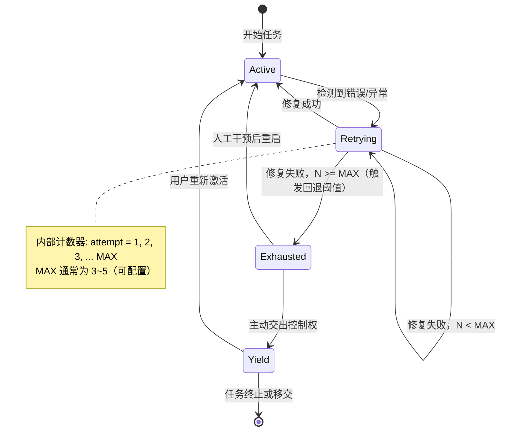
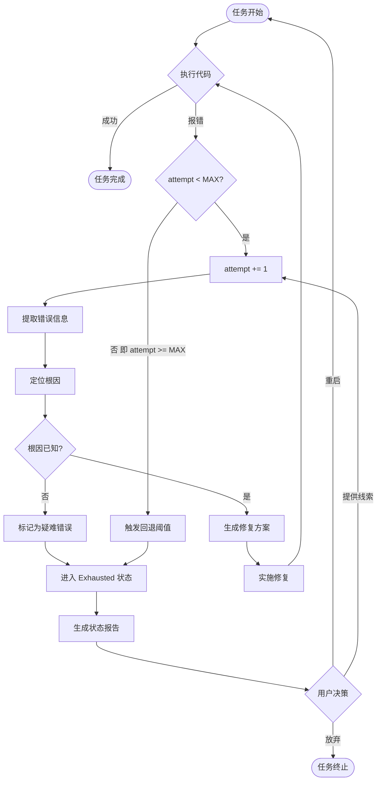
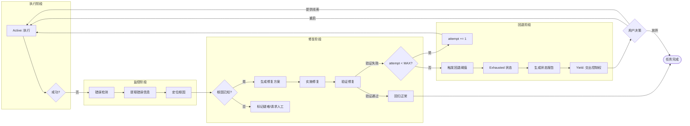
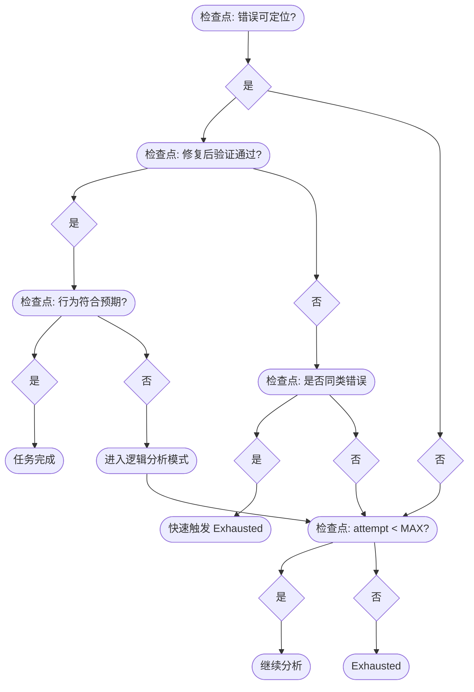
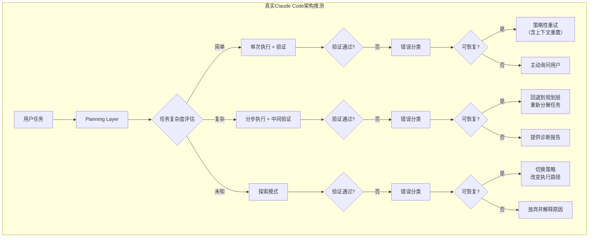

# §8 错误处理与纠错闭环

> 本章深度解构 Agent 的错误处理机制，特别是**回退阈值（Fallback Threshold）**机制的设计原理与实现逻辑。

---

## 8.1 死循环陷阱

### 8.1.1 问题本质

Agent 在执行代码任务时，最危险的失败模式不是"做不出来"，而是**陷入死循环**：

```
写错代码 → 触发编译器报错 → Agent 理解报错并修复 → 再次写错 → 再次报错 → ……
```

每轮循环消耗大量 Token，却没有任何实质性进展。这是一种**自我强化型失败**：

- **错误模式固化**：Agent 每次修复都基于上一轮的错误上下文，形成错误的"路径依赖"
- **Token 消耗黑洞**：每轮循环平均消耗 3,000～10,000 tokens，10 轮循环即可烧掉数十美元
- **心理盲区**：Agent 和用户都难以判断"已经卡住了"，因为每次都有"合理"的错误解释

### 8.1.2 触发条件

| 触发条件 | 典型场景 |
|----------|----------|
| 错误信息模糊 | 编译器报错行 ≠ 真实错误行（如 header 依赖链断裂） |
| 修复方向错误 | Agent 误读了报错，根据表象而非根因修复 |
| 上下文窗口污染 | 多轮错误后，上下文已被错误状态污染，Agent 无法清醒分析 |
| 循环验证不足 | Agent 自信修复后未实际运行验证，直接进入下一轮 |

### 8.1.3 Token 消耗模型

```
每轮消耗 = prompt_tokens（错误上下文） + completion_tokens（修复代码） + 编译/运行开销

典型数值（TypeScript/React 项目）：
- 第1轮: ~3,000 tokens
- 第2轮: ~4,500 tokens（错误上下文膨胀）
- 第3轮: ~6,000 tokens
- ……
- 第N轮: 指数增长 → 上下文窗口耗尽 → 彻底迷失
```

---

## 8.2 回退阈值（Fallback Threshold）机制

### 8.2.1 核心思想

> **连续 N 次修复失败后，强制挂起而非继续重试。**

这是打破死循环的关键机制：不是"一直重试直到成功"，而是"重试 N 次后承认失败，交由人类判断"。

### 8.2.2 状态机

Agent 在执行过程中遵循以下状态机：



**状态说明：**

| 状态 | 含义 | Agent 行为 |
|------|------|------------|
| `Active` | 正常执行 | 执行任务，监控输出 |
| `Retrying(N)` | 连续第 N 次修复失败 | 分析错误，准备第 N+1 次修复 |
| `Exhausted` | 达到回退阈值 | 停止自动修复，准备报告 |
| `Yield` | 交出控制权 | 向用户报告当前状态，请求人工决策 |

### 8.2.3 回退阈值流程图



### 8.2.4 配置参数

```typescript
interface FallbackConfig {
  maxRetries: number;        // 默认 3
  retryDelayMs: number;       // 重试间隔（防止过快循环）
  exhaustOnSameError: boolean; // 同类错误连续 MAX 次是否直接触发
  preserveContextOnExhaust: boolean; // Exhausted 时是否保留上下文供人工分析
}
```

---

## 8.3 编译器报错信息提取

### 8.3.1 问题：堆栈噪声

编译器报错（尤其是 TypeScript、Java、C++）往往产生大量噪声：

- **TypeScript**：冗长的类型推断过程、声明文件路径、泛型展开
- **Java**：超长的类名、jar 包路径、内部异常链
- **C++**：模板展开后的恐怖报错

一个 500 行的报错输出，可能只有 3 行是真正有用的。

### 8.3.2 提取策略

```typescript
interface ErrorExtractionResult {
  rootCause: string;        // 根因（一句话描述）
  errorLine: number;        // 真实错误行号（不是报错所在的转发行）
  file: string;             // 涉及的文件
  suggestion: string;       // 修复建议
}

// 提取流程：
// 1. 过滤：去除 node_modules、declaration files、框架内部堆栈
// 2. 定位：找到第一个业务代码中的错误位置
// 3. 解析：从编译器语言中提取人类可读的错误描述
// 4. 归类：判断错误类型（类型错误/语法错误/逻辑错误/环境错误）
```

### 8.3.3 错误类型分类与响应策略

| 错误类型 | 特征 | Agent 响应策略 |
|----------|------|----------------|
| **语法错误** | 编译器直接报位置 | 立即修复，通常 1 轮解决 |
| **类型错误** | TS/Java 类型不匹配 | 检查类型定义，可能涉及接口设计 |
| **导入错误** | Module not found / Cannot find | 检查路径、拼写、依赖安装 |
| **运行时错误** | 程序能跑，但行为异常 | 需要理解业务逻辑，最难修复 |
| **环境错误** | 依赖版本冲突、系统差异 | 可能需要修改配置，而非代码 |

---

## 8.4 纠错闭环图

### 8.4.1 完整闭环流程



### 8.4.2 关键检查点



---

## 8.5 与 Claude Code 架构对比

### 8.5.1 mini-claude-code 简化实现

参考 [mini-claude-code](https://github.com/mitmproxy/mini-claude-code) 项目，其错误处理实现极为精简：

```python
# 简化版错误处理伪代码
def execute_with_retry(code: str, max_retries: int = 3):
    attempt = 0
    while attempt < max_retries:
        result = run_code(code)
        if result.success:
            return result
        attempt += 1
        error_info = parse_error(result.stderr)
        code = fix_code(code, error_info)  # LLM 根据报错修复
    return {"status": "exhausted", "attempts": attempt}
```

**特点：**
- 无状态机，纯计数器
- 错误信息直接喂给 LLM 修复
- 无错误分类、无优先级、无差异化策略
- 适用于简单、独立的代码片段

### 8.5.2 真实 Claude Code 的设计推测

基于 Claude Code 的公开行为分析和架构论文，其错误处理机制远比 mini-claude-code 复杂：



**推测设计要点：**

| 维度 | mini-claude-code | 推测的 Claude Code |
|------|-----------------|-------------------|
| 重试策略 | 固定次数 | 动态次数（根据错误类型调整） |
| 上下文管理 | 累积污染 | 可能定期重置上下文 |
| 错误分类 | 无 | 多级分类 + 差异化策略 |
| 用户交互 | 最终一次性报告 | 持续可干预、可提供线索 |
| 任务分解 | 单次 | 根据失败动态重新分解 |
| 学习能力 | 无 | 可能记录同类错误的解决方案 |

### 8.5.3 关键差距

| 差距维度 | mini-claude-code | Claude Code 级别 |
|----------|-----------------|-----------------|
| **死循环防护** | 仅靠固定次数 | 动态检测 + 主动询问 |
| **错误理解深度** | 全文喂给 LLM | 提取根因 + 结构化分析 |
| **上下文隔离** | 全量累积 | 可能定期重置防止污染 |
| **用户价值** | 成或败两种结果 | 提供诊断 + 保留中间状态供人工分析 |
| **Token 效率** | 每次重试全量输入 | 可能的增量修复或上下文压缩 |

---

## 8.6 实践建议

### 8.6.1 实现优先级

1. **必须实现**：回退阈值（固定 MAX=3）+ Exhausted 状态报告
2. **应该实现**：错误信息提取（过滤噪声、定位根因）
3. **可以优化**：动态重试次数、错误分类差异化策略
4. **长期演进**：上下文重置机制、跨任务错误模式学习

### 8.6.2 配置建议

```typescript
const DEFAULT_FALLBACK_CONFIG = {
  maxRetries: 3,              // 简单任务可降至 2，复杂任务可升至 5
  retryDelayMs: 1000,         // 防抖动间隔
  exhaustOnSameError: true,   // 连续同类错误快速失败
  preserveContextOnExhaust: true, // 保留上下文供人工分析
  enableErrorClassification: true, // 启用错误分类
};
```

### 8.6.3 用户交互模板

当 Agent 进入 `Yield` 状态时，向用户呈现：

```
⚠️ 任务遇到困难（已尝试 N 次）

**当前状态**：[简要描述卡住的地方]
**已尝试的方案**：[列出已排除的方向]
**根因分析**：[一句话说明最可能的原因]

---

请选择：
1. 🔄 继续重试（提供新线索）
2. 🛠️ 我来手动修复
3. ⏸️ 暂停此任务
```

---

## 本章小结

| 概念 | 关键点 |
|------|--------|
| **死循环陷阱** | Token 消耗黑洞：错误模式固化 + 上下文污染 |
| **回退阈值** | MAX 次修复失败后强制挂起，打破无限循环 |
| **状态机** | Active → Retrying(N) → Exhausted → Yield |
| **错误信息提取** | 过滤噪声、定位根因、分类响应 |
| **纠错闭环** | 执行 → 监控 → 修复 → 验证 → 决策 |
| **架构对比** | mini-claude-code 简约但脆弱，Claude Code 级别需要动态策略与用户交互 |
