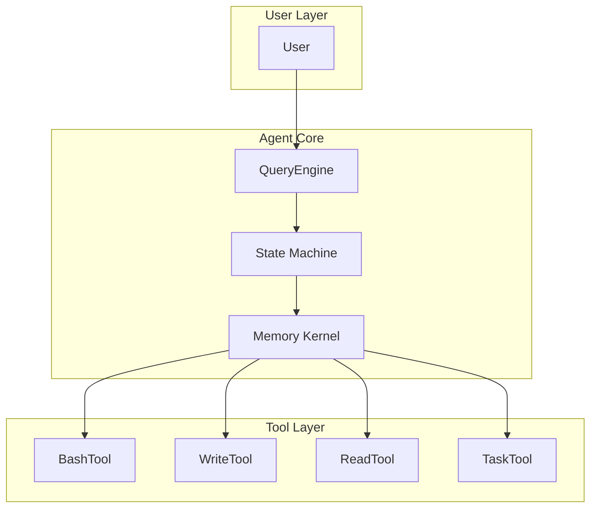
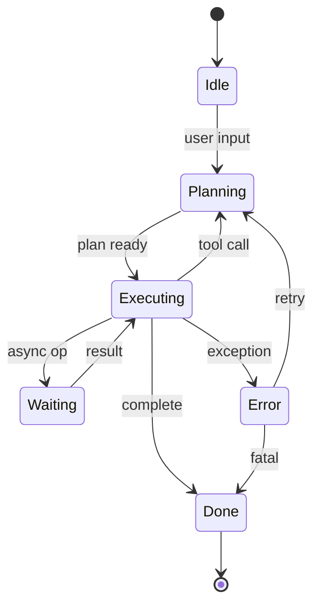
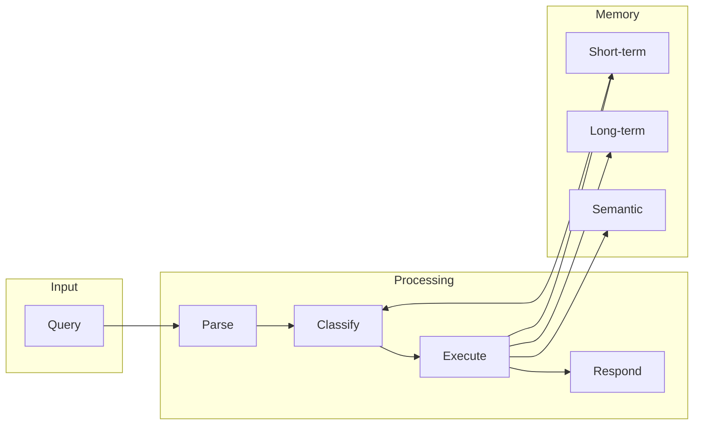
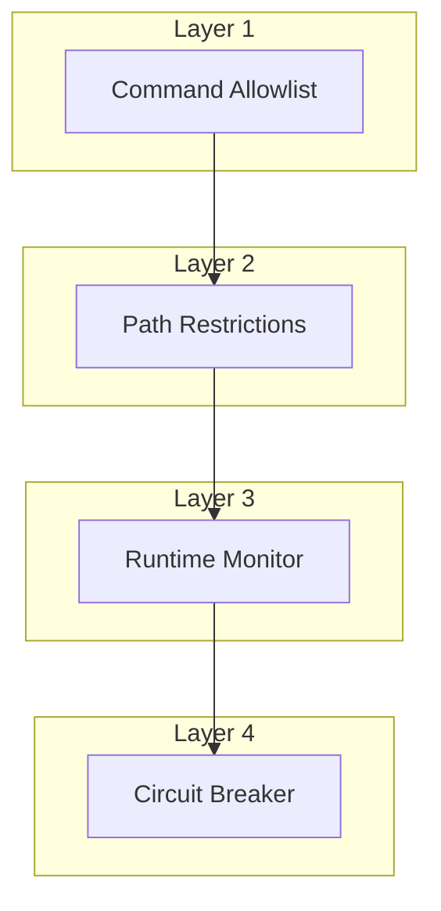
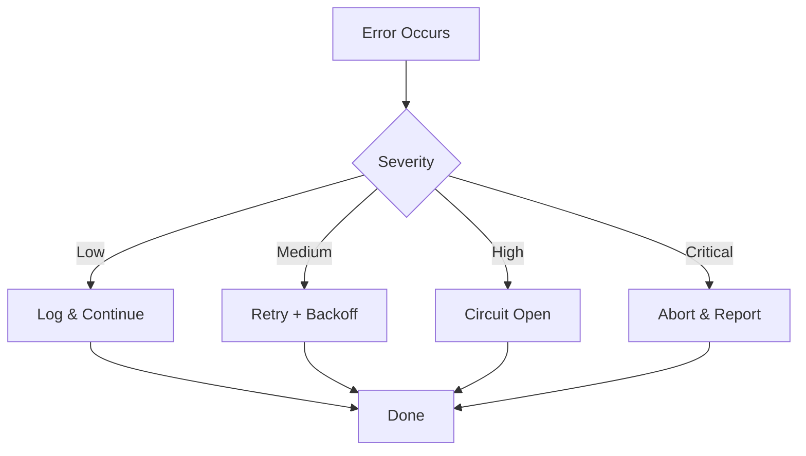

# Claude Code Deep Dive - 可视化汇总

本文档汇总了项目中使用的关键 Mermaid 图表，便于快速理解核心架构。

## 1. 系统架构图



## 2. Agent生命周期状态机



## 3. 数据流图



## 4. 权限安全四层模型



## 5. 错误处理流程



## 6. 使用场景决策矩阵

| 场景 | Claude Code | 传统IDE | 推荐度 |
|------|-------------|---------|--------|
| 大型重构 | ✅ | ⚠️ | ⭐⭐⭐⭐⭐ |
| 安全审计 | ✅ | ❌ | ⭐⭐⭐⭐⭐ |
| 实时调试 | ❌ | ✅ | ⭐⭐ |
| 快速原型 | ✅ | ⚠️ | ⭐⭐⭐⭐ |
| 精确计算 | ❌ | ✅ | ⭐ |

## 7. 能力雷达图

```mermaid
radar
    title: Claude Code 能力评估
    "代码生成": 0.85
    "代码审计": 0.90
    "重构优化": 0.80
    "Bug修复": 0.75
    "测试生成": 0.85
    "长上下文": 0.50
    "实时性能": 0.40
```

---

*本文档最后更新：2026-04-03 · v2.1*
